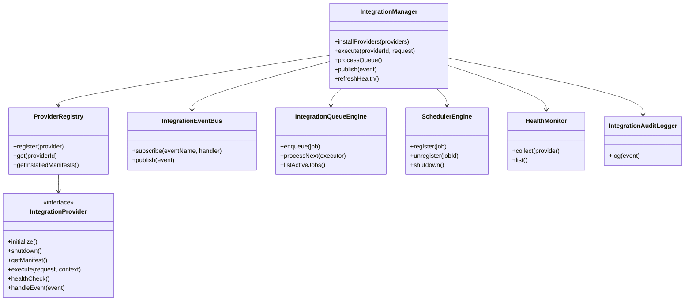
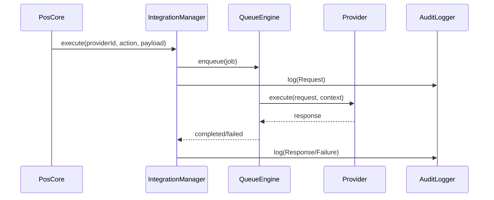
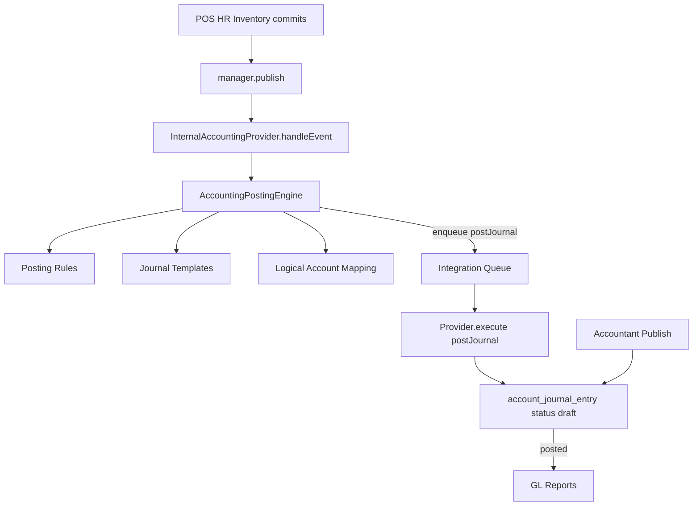

# Generic Integration Framework

## Overview

The Integration Framework is a core subsystem under `src/integrations` that allows external providers to be installed, configured, and executed without coupling provider logic to POS business flows.

Core principles:
- Provider/plugin based
- Event driven
- Offline first with persisted queue
- Capability-based contracts
- Manifest-driven configuration UI
- Health and audit visibility

## Package Structure

```text
src/integrations/
  core/
  events/
  registry/
  queue/
  scheduler/
  configuration/
  security/
  health/
  audit/
  transport/
  storage/
  accounting/          # posting engine (rules, templates, mapping) — not a provider
  providers/
    fiscal/
      fbr/
      pra/
    accounting/
      internal/        # thin InternalAccountingProvider
```

## Provider Lifecycle

1. Discover bundled providers (`BundledProviderDiscovery`)
2. Register provider in `ProviderRegistry`
3. Validate compatibility and capabilities
4. Initialize provider
5. Execute provider actions through queue jobs
6. Run health checks and publish status
7. Shutdown provider on app teardown

## Contracts

- `IntegrationProvider` defines all lifecycle and capability hooks.
- `ProviderManifest` defines metadata, compatibility, features, and dynamic settings schema.
- `IntegrationExecutionRequest/Response` define execution payloads.
- `IntegrationHealthSnapshot` standardizes monitoring.

## Class Diagram



## Sequence Diagram (Event to Provider Execution)



## Event Model

- Framework supports normalized events (`IntegrationEvent`) and provider subscriptions.
- POS publishes business events via `createPosEvent` + `IntegrationManager.publish` (optionally with a **stable event id** for idempotency).
- Public helpers live under `src/integrations/events/` (re-exported from accounting/inventory publish paths for compatibility).
- Providers handle events declared in `manifest.supportedEvents`, or `*` for all events. Fan-out skips disabled providers; handler failures are isolated per provider.
- Deep services can publish without React via `setIntegrationEventManager` / `getIntegrationEventManager` (wired by `IntegrationProvider`).

### Hybrid model

| Layer | Purpose | Consumer examples |
|-------|---------|-------------------|
| Typed business events | Money / stock / payroll / journals | Internal accounting, QuickBooks |
| `EntityChanged` | Master-data + entity CRUD / status | Future logger / webhook / audit |

#### `EntityChanged` payload

```ts
{
  domain: 'manage' | 'hr' | 'inventory' | 'accounts' | 'pos' | 'ops',
  table: string,
  entityId: string,
  action: 'create' | 'update' | 'delete' | 'deactivate' | 'status_change',
  before?: any | null,  // secrets redacted
  after?: any | null,
  changedBy?: string,
  source: string,
  correlationId?: string,
  label?: string,
}
```

Publish with `entityAfterWrite` / `emitEntityCrudSave` / `publishEntityChanged`.

#### Logger provider contract

- `supportedEvents: ['EntityChanged']` or `['*']`
- Implement `handleEvent(event)` — payload is self-describing; no domain coupling.
- Do not block the POS thread with slow I/O; prefer queue actions if needed.

### Built-in Event Logger (`provider:event-logger`)

Bundled provider under `src/integrations/providers/logging/`.

| Setting | Purpose |
|---------|---------|
| Destination | `console` (default) or `http` |
| Event filter | `all` · `entityOnly` · `businessOnly` |
| includePayload | Include full event payload in the log body |
| HTTP endpoint / method | Target URL (POST or PUT) |
| Auth type | `none` · `bearer` · `apiKey` · `basic` · `jwt` |

- Subscribes with `supportedEvents: ['*']` so every published integration event is eligible.
- Console path: `console.log('[EventLogger]', …)`.
- HTTP path: JSON body `{ event, loggedAt }` via `TransportRouter`, with auth headers from config. Failures are warned and health becomes `degraded`; they do not throw into POS flows.
- Enable from **Integrations** and save configuration. Secrets use encrypted password fields.

Emit with `entityAfterWrite` / other publishers remains independent of this sink.

### Emission matrix (selected)

| Event | Source hooks |
|-------|--------------|
| `EntityChanged` | settings forms, settings-delete, HR forms, labor-engine audit, inventory forms/posting, journals, closing |
| `SaleCompleted` / `InvoiceCreated` / `PaymentCompleted` | Payment settle, auto-check-close |
| `OrderCreated` / `CustomerCreated` | Order create / inline customer |
| `DayClosed` | Day closing complete |
| `StockCountCompleted` | Kitchen reconciliation stock counts |
| `JournalPosted` / `JournalReversed` | Journal publish / reverse |
| Inventory value events | Inventory posting service (unchanged) |
| `ApplicationStarted` / `ApplicationShutdown` | Integration provider bootstrap |

Accounting: Domain modules must **never** create journal entries directly. Prefer typed publishers from `src/integrations/events` or compat re-exports in `src/integrations/accounting/events/publish.ts`.

## Accounting integration (draft-first)



- Provider id: `provider:internal-accounting` (`category: accounting`)
- Posting logic lives in `src/integrations/accounting/` (engine handlers, rules, templates, mapping) — **outside** the provider.
- Provider only validates config, receives `postJournal`, and persists draft journals.
- Idempotency: stable event ids (e.g. `SaleCompleted:{orderId}`, `SaleRefunded:{refundId}`, `PayrollPosted:{runId}`, `PurchaseReceived:{documentId}`) → key `accounting:{eventId}`; duplicates return the existing entry.
- Default `autoPublish` is **off**; GL reports only include `status = 'posted'`.
- Configure account mappings (logical codes → COA) in Integrations → Configuration (`account` field type).

### Supported accounting business events

| Event | Source hook | Journal template |
|-------|-------------|------------------|
| `SaleCompleted` | Payment close / auto-check-close | Restaurant sale |
| `SaleRefunded` | Order refund modal | Restaurant sale reversal |
| `OrderCancelled` | Cancel modal **only if order was Paid** | Restaurant sale reversal |
| `PayrollPosted` | Payroll `approveRun` | Payroll expense / liability |
| `PurchaseReceived` | Inventory `postDocument(purchase)` | Inventory / AP |
| `PurchaseReturned` | Purchase return form save | AP / Inventory |
| `InventoryIssued` | Inventory `postDocument(issue)` | COGS / Inventory |
| `IssueReturned` | Issue return form save | Inventory / COGS |
| `WasteRecorded` | Waste form / production waste | Waste expense / Inventory |
| `InventoryAdjusted` | Inventory `postDocument(adjustment)` | Inventory / adjustment |
| `InventoryTransferred` | `createStockTransfer` | Inventory ↔ Inventory |
| `ProductionCompleted` | `completeProductionBatch` | Outputs / inputs / yield loss |
## Queue and Retry

- Queue states: `Pending`, `Running`, `Waiting`, `Completed`, `Failed`, `Cancelled`, `DeadLetter`
- Exponential backoff with optional jitter
- Dedupe support via `dedupeKey`
- IndexedDB persistence via `IndexedDbQueueStore`

## Scheduler

- Providers can register recurring jobs through `SchedulerEngine`
- Use for token refresh, heartbeat, sync, cleanup, and health polling

## Security Layer

- Secret abstraction: `SecretStore`
- Current implementation: `IndexedDbSecretStore`
- Supports auth modes in manifest: API key, OAuth, JWT, certificate, mTLS

## Health Monitoring

`HealthMonitor` collects:
- Connection/auth status
- Average response time
- Pending/failed jobs
- Last sync and cert expiry

## Audit Logging

`IntegrationAuditLogger` writes events to existing tracking pipeline (`postTracking`) for:
- Provider install/remove/update
- Request/response/retry/failure
- Auth and health changes

## Dynamic Settings Renderer

- UI uses `manifest.configurationSchema` to render fields dynamically.
- Supports types:
  - text, number, password
  - checkbox/switch
  - dropdown
  - account (chart of accounts picker)
  - certificate
  - json
  - dynamic (custom fallback)

## Database Design

Migration file: `migrations/2026_07_08_integrations_framework.surql`

Tables:
- `integration_provider`
- `integration_provider_config`
- `integration_installed_provider`
- `integration_queue`
- `integration_queue_attempt`
- `integration_provider_health`
- `integration_provider_secret`
- `integration_provider_certificate`
- `integration_provider_webhook`
- `integration_schedule`
- `integration_execution_history`

## Example Providers (Phase 1)

- `provider:fbr`
- `provider:pra`
- `provider:internal-accounting`

Both are fiscal providers with manifest-driven configuration and shared framework contracts.

### Provider-specific adapters (important)

Config parsing, invoice serialization, auth headers, and response parsing are **not** generic across authorities.

- Pakistan FBR/PRA share [`src/integrations/providers/fiscal/pk-fbr-pra/`](src/integrations/providers/fiscal/pk-fbr-pra/) (`serializePkFiscalInvoice`, `parsePkFiscalProviderConfig`, `submitPkFiscalInvoiceRequest`).
- Shared across all fiscal providers: settlement orchestration + junction QR storage + [`parseFiscalRuntimeConfig`](src/integrations/providers/fiscal/shared/runtime-config.ts) (`offlineBuffering`, `blockSettlementOnFailure`, timeout only).
- Settlement only requires `IntegrationExecutionResponse.data` shaped as `{ invoiceNumber?, qrcode?, code?, request?, response? }`.
- Future authorities (ZATCA, Kenya KRA/eTIMS) must add their own folder under `providers/fiscal/` with their own config/serialize/submit — do not extend the PK adapter.

### Fiscal settlement and final-print QR

When one or more fiscal providers are **enabled**, order settlement submits invoices before final print:

1. `OrderPaymentReceiving.closeOrder` (and auto-check-close) calls `submitFiscalInvoices`.
2. Each enabled fiscal provider runs `executeImmediate` with action `invoiceSubmission`.
3. FBR/PRA serialize the Pakistan JSON payload and POST with `Authorization: Bearer <bearerToken>`.
4. Success requires authority `Code == 100`; `InvoiceNumber` is stored and used as QR.
5. Successful submissions each contribute a printable QR; `qrPriority` controls print order (higher first). PRA defaults to `100`, FBR to `50`. One row may still be marked `selected_for_print` for bookkeeping.
6. Each attempt is stored as a row in `integration_order_fiscal` (junction), including `qr_priority`.
7. Final bill print resolves all successful QRs via `resolveFiscalQrcodesForPrint` (latest completed per provider, sorted by `qr_priority`) with provider authority labels, and passes `qrcodes` into `dispatchPrint` / `final-print.js`.

Junction table (migration `2026_07_11_order_fiscal_fields.surql`):
- `integration_order_fiscal`: `order`, `provider_id`, `invoice_number`, `qrcode`, `status`, `code`, `error`, `selected_for_print`, `qr_priority`, `request_payload`, `response_payload`, `submitted_at`
- Use `setFiscalSubmissionSelectedForPrint(db, orderId, submissionId)` to mark a preferred submission for bookkeeping; all successful QRs still print.

### Pakistan FBR/PRA config fields

| Field | Purpose |
|-------|---------|
| `apiBaseUrl` | Invoice POST endpoint |
| `bearerToken` | `Authorization: Bearer …` |
| `posId` | `POSID` |
| `defaultPctCode` | Line `PCTCode` for all items (Phase 1; no per-product PCT yet) |

Line items also send compulsory FBR/PRA `ItemCode` (dish `number`, else dish/order-item id) and `ItemName` (dish name).
| `invoiceType` | Default `1` |
| `offlineBuffering` | Shared runtime: queue failed immediate submits |
| `blockSettlementOnFailure` | Shared runtime: abort Paid until fiscal succeeds |
| `qrPriority` | Shared runtime: higher value prints first when multiple fiscal QRs succeed (PRA default `100`, FBR default `50`) |
| `punjabMode` (FBR only) | Line `TotalAmount = Quantity × SaleValue` |

FBR also requires `sellerNtn`. USIN uses `order.invoice_number`.

### Manager APIs

- `execute(providerId, request)` — enqueue only (async)
- `executeImmediate(providerId, request)` — sync execute for settlement/QR; on failure + offline buffering, also enqueues retry

## Unit Test Strategy

1. Contract validation for provider manifest/capabilities
2. Queue transitions and retry delay calculations
3. Registry version compatibility checks
4. Manager execution path (enqueue + process)
5. Fiscal serializer (PRA/FBR TotalAmount + Punjab mode) and PRA-preferred QR selection
6. FBR HTTP execute with Bearer auth and Code 100 parsing

## Integration Test Strategy

1. Boot manager with multiple providers and process queued jobs
2. Offline simulation with waiting jobs and delayed retries
3. Health collection and audit emission during execution lifecycle

## Provider Catalog vs Runtime State

- `PROVIDER_CATALOG` is the code-level provider registry. Adding a new provider here requires a rebuild.
- `integration_installed_provider` is runtime state. Toggling `enabled` here does not require any rebuild.
- New catalog providers are synced as `enabled: false` by default until an admin enables them.
- Configure credentials (including `bearerToken`) before enabling; enable runs `validate()` against saved settings.

## Provider Migration Guide (Add New Provider)

1. Create provider class implementing `IntegrationProvider`.
2. Define `ProviderManifest` and `configurationSchema`.
3. Add provider factory to `PROVIDER_CATALOG`.
4. Implement `execute`, `healthCheck`, and event handlers as needed.
5. Add provider compliance tests (manifest + execute + health).
6. Enable the provider from Integrations admin and validate dynamic settings.
7. Run `npm run test` and `npm run lint` before release.
