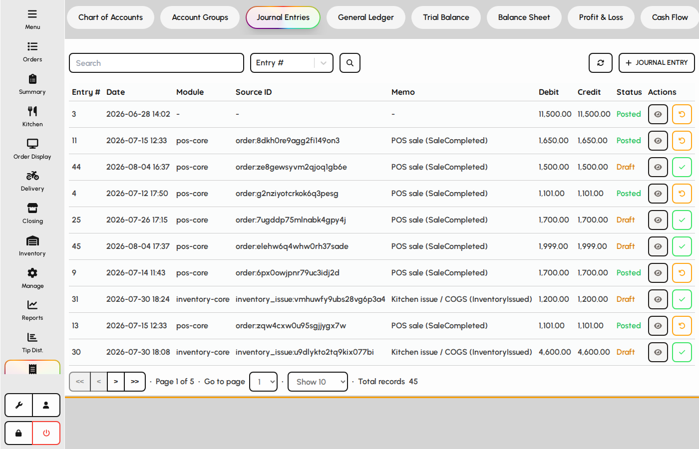
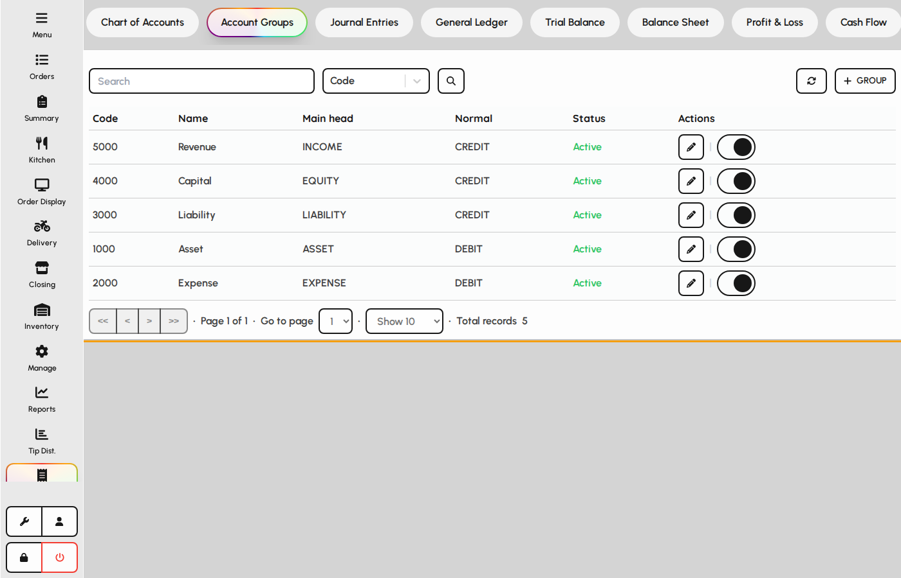

# Journal entries and account groups

Post financial transactions with journal entries, and organize the chart using account groups. Day-to-day cash expenses at closing are separate from these GL journals.

### Journal entries

1. Open the Journal entries tab.
2. Create balanced debit/credit lines for the transaction.
3. Save to post into the general ledger (approval rules may apply).

*Journal entries tab.*

### Account groups

Groups help organize accounts for statements and reporting rollups.

1. Open the Account groups tab.
2. Create groups that match your reporting structure.
3. Assign accounts to groups from the chart or group forms.

*Account groups tab.*
