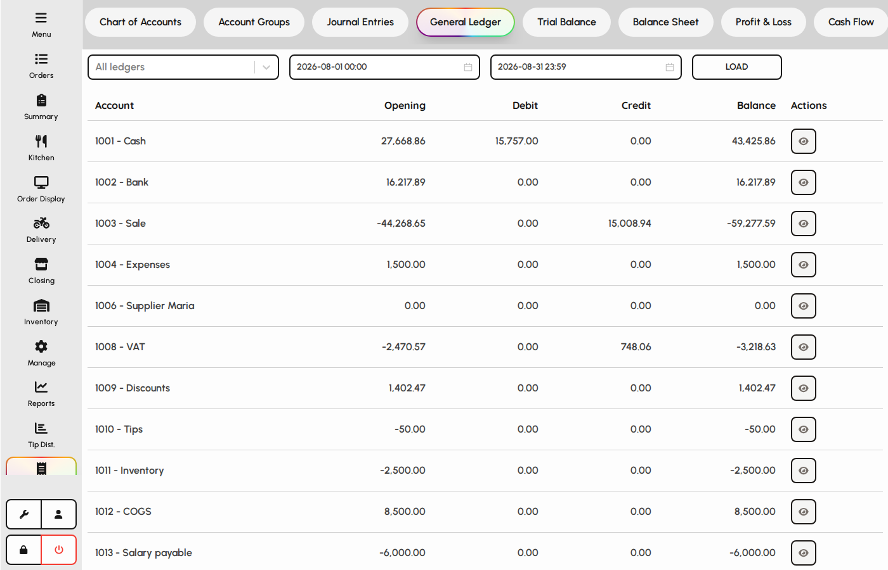
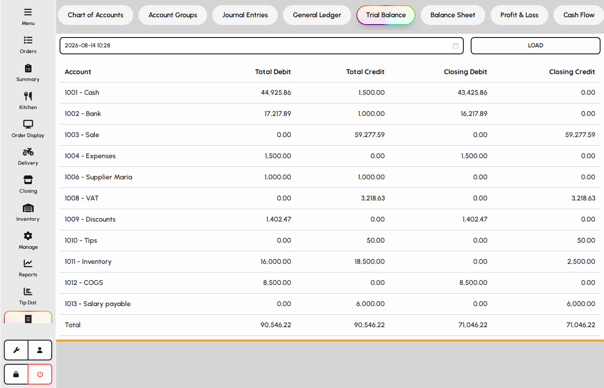
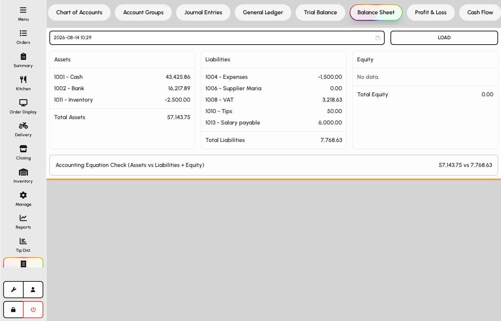
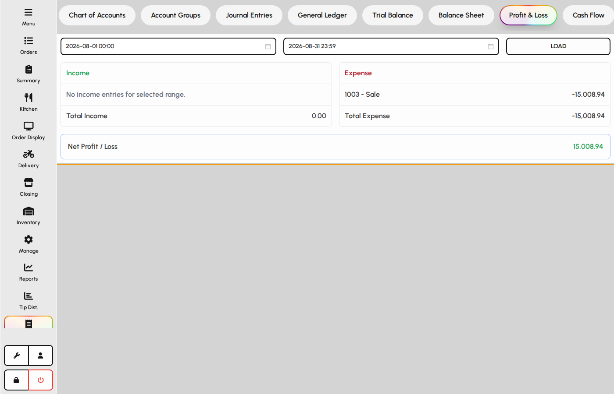
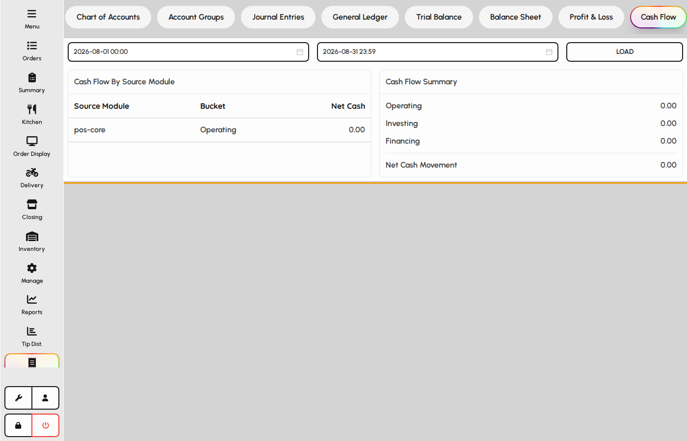

# Ledgers, P&L, and cash flow

Review posted activity and period balances: general ledger detail, trial balance, and balance sheet.

### General ledger

1. Open the General ledger tab.
2. Filter by account and date range to inspect posted lines.
3. Use this view to drill into journal activity for an account.

*General ledger tab.*

### Trial balance

Trial balance lists debit and credit totals by account for a period.

1. Open the Trial balance tab.
2. Choose the period or as-of date your venue uses.
3. Confirm debits equal credits before relying on statements.

*Trial balance tab.*

### Balance sheet

1. Open the Balance sheet tab.
2. Review assets, liabilities, and equity for the selected date.
3. Other statement tabs (Profit & loss, Cash flow) follow the same pattern.

*Balance sheet tab.*

### Profit & loss

Income statement for the selected period: revenue, cost of sales, and operating expenses.

1. Open Accounts and the Profit & loss tab.
2. Set the date range or period to match your reporting cycle.
3. Expand account groups to review category totals.
4. Export or print when the period is closed.

*Profit & loss statement tab.*

### Cash flow

Summarizes cash movement from operations, investing, and financing for the period.

1. Open the Cash flow tab in Accounts.
2. Choose the same period used for other statements.
3. Review opening balance, net change, and closing cash position.
4. Use alongside P&L to explain cash vs. accrual differences.

*Cash flow statement tab.*
