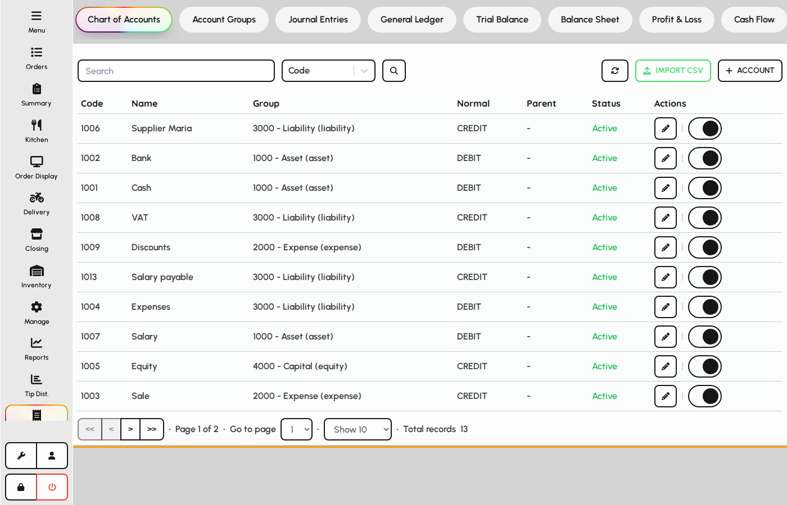
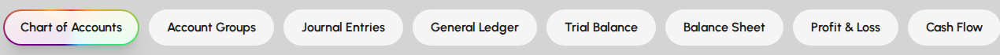
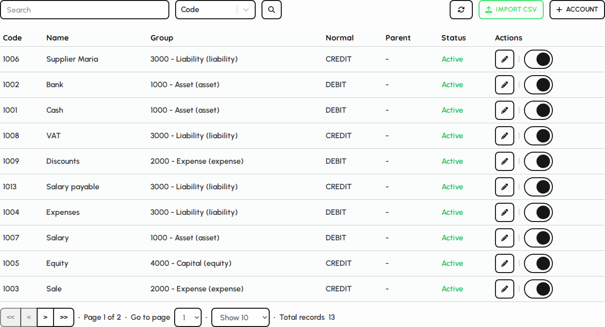

# Accounts overview

Accounts is the financial hub for the chart of accounts, journals, ledgers, and statements. Open it from the sidebar when your role includes accounts access.

### Open Accounts

1. Sign in with a user that has accounts access.
2. Tap Accounts in the sidebar.
3. The screen opens on Chart of accounts by default.

*Accounts screen with tab bar and chart of accounts.*

### Tab navigation

Tabs group setup, posting, and reporting. Switching tabs may require manager PIN approval depending on your role.

1. Scroll the tab bar horizontally when many tabs are visible.
2. Setup tabs: Chart of accounts and Account groups.
3. Reporting tabs: General ledger, Trial balance, Balance sheet, and more.

*Accounts tab bar.*

### Chart of accounts

1. Maintain GL accounts used by journals and reports.
2. Add or edit accounts with codes, names, and types.
3. Account structure drives ledgers, trial balance, and statements.

*Chart of accounts panel.*
