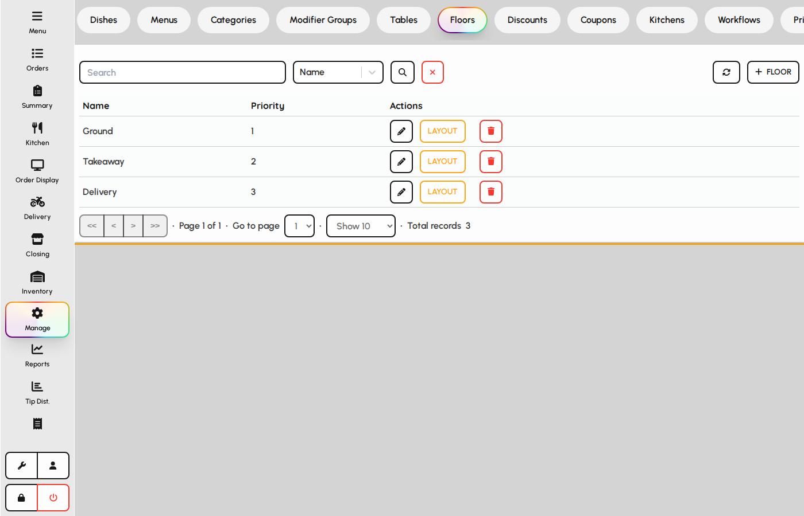
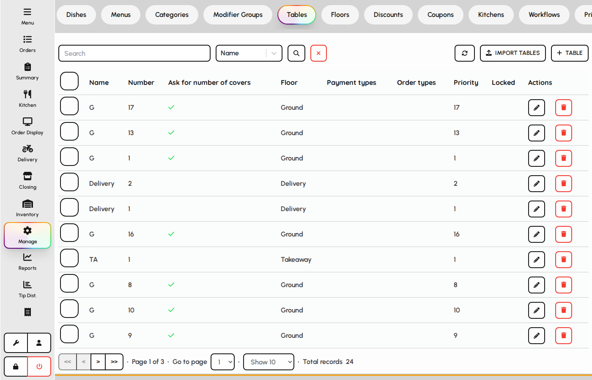
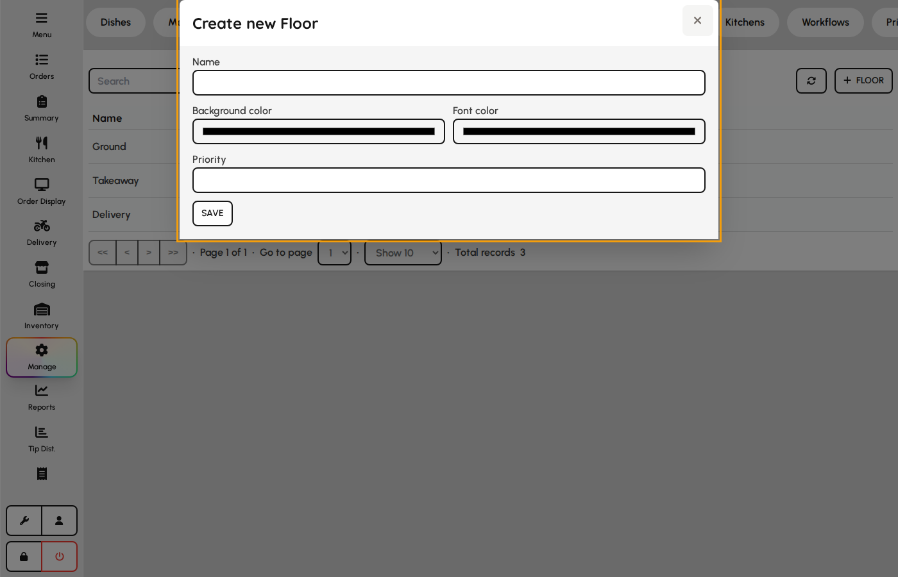
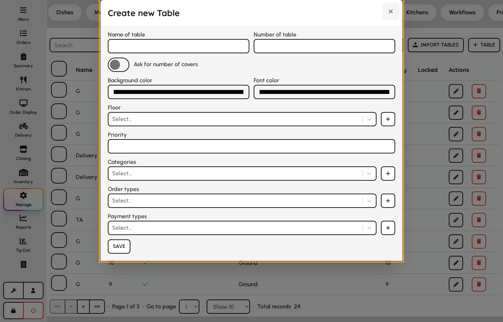

# Floors and tables

Floors and tables define the dine-in layout used when staff select a table before taking orders.

### Floors

1. Open the Floors tab.
2. Create floor plans for each dining area (e.g. Main, Patio).
3. Floors appear on the table-selection step when floor mode is enabled.

*Floors tab.*

### Tables

Each table belongs to a floor and carries a name or number used on checks and kitchen tickets.

1. Open the Tables tab.
2. Add tables with capacity and floor assignment.
3. Edit or deactivate tables when the floor plan changes.

*Tables tab.*

### Floor form

1. Open Admin → Floors and add or edit a floor.
2. Set name, priority, and tile colors.
3. Save — floor appears on the floor plan switcher.

**Fields**

- **Name** — Floor label on POS floor picker.
- **Priority** — Sort order in the floor list.
- **Background / color** — Default tile styling on the floor plan canvas.

*Floor form.*

### Table form

Tables belong to a floor and may restrict categories, order types, and payment types.

1. Select a floor and add or edit a table.
2. Set number, name, colors, and floor.
3. Optionally limit categories, order types, and payment types.
4. Toggle ask-for-covers if guests should be prompted on seat.

**Fields**

- **Name / number** — Table label on floor plan and checks.
- **Floor** — Parent floor plan containing the table.
- **Priority** — Sort order on dense floor layouts.
- **Categories / order types / payment types** — Optional restrictions for this table.
- **Ask for covers** — Prompts for guest count when opening the table.

*Table form.*
