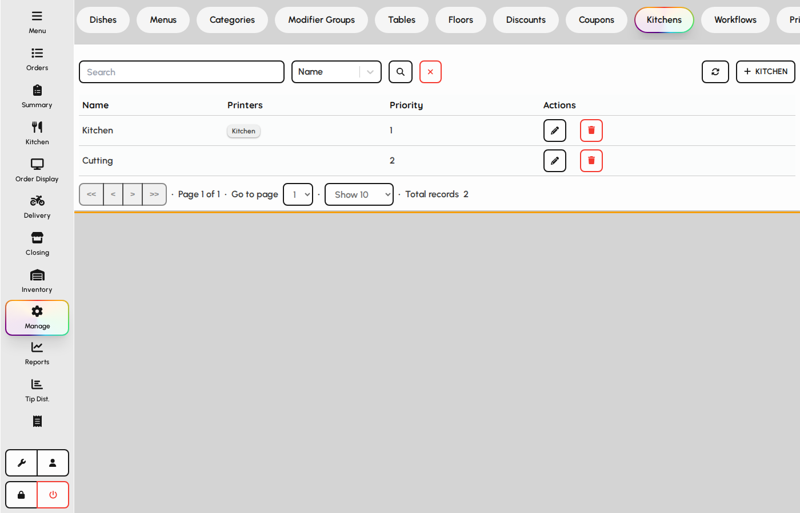
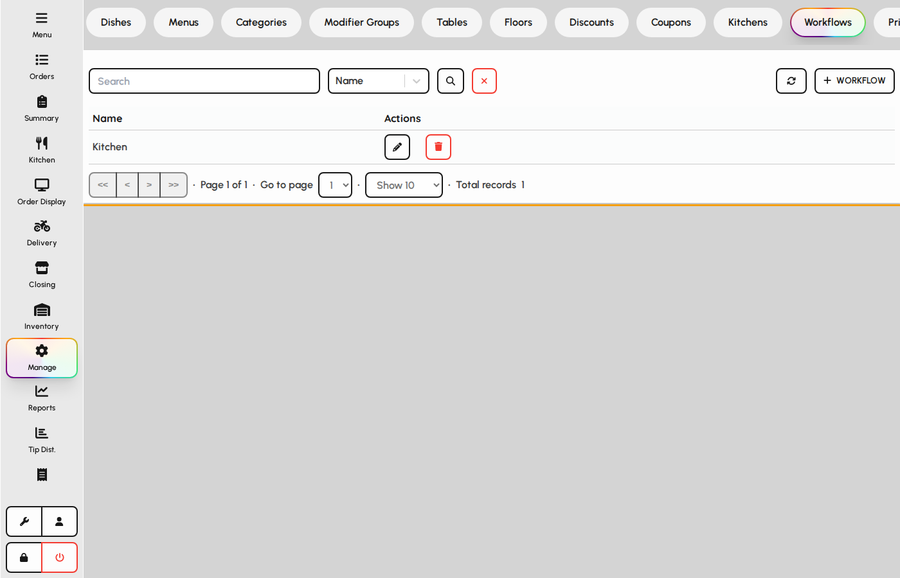
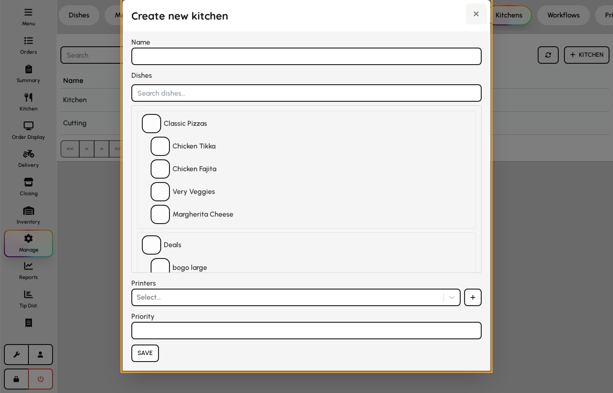
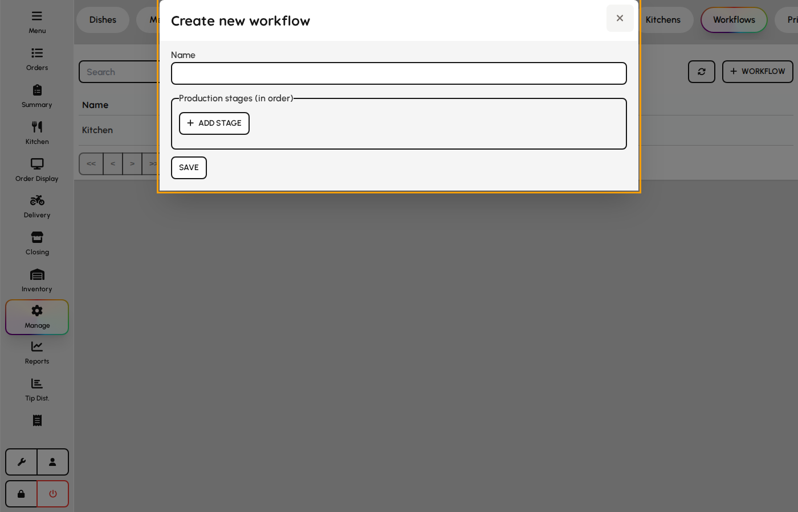

# Kitchens and workflows

Route fired items to the right kitchen stations and define how orders move through preparation stages.

### Kitchens

Kitchens group dishes and link to printers for kitchen tickets.

1. Open the Kitchens tab.
2. Create kitchen stations (e.g. Grill, Bar, Pastry).
3. Assign dishes and printers so tickets route to the correct station.

*Kitchens maintenance table.*

### Workflows

Workflows define order-status steps used by kitchen and order-display screens.

1. Open the Workflows tab.
2. Create or edit workflow steps and transitions.
3. Link workflows to order types or kitchens as required by your venue setup.

*Workflows tab.*

### Kitchen form

Kitchens route dishes to printers and inventory locations.

1. Open Admin → Kitchen → Kitchens.
2. Add name, priority, linked printers, and dishes.
3. Save — new items print to this station when assigned on dishes.

**Fields**

- **Name** — Station label on KOT and order display.
- **Priority** — Order when multiple kitchens match.
- **Printers** — Devices that print tickets for this kitchen.
- **Items (dishes)** — Dishes routed to this station.

*Kitchen station form.*

### Workflow form

Workflows chain kitchen stages for order display and bump bars.

1. Open Kitchen → Workflows.
2. Name the workflow and add ordered stages.
3. Assign a kitchen to each stage.
4. Link workflow on dishes that need multi-step prep.

**Fields**

- **Name** — Workflow identifier on dishes and displays.
- **Stages** — Ordered prep steps (e.g. Grill → Expo).
- **Stage kitchen** — Which station owns each stage for routing and KPIs.

*Workflow stages editor.*
