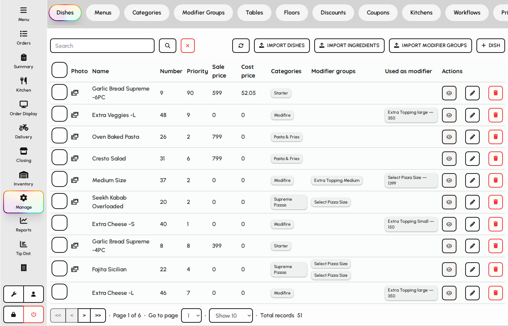
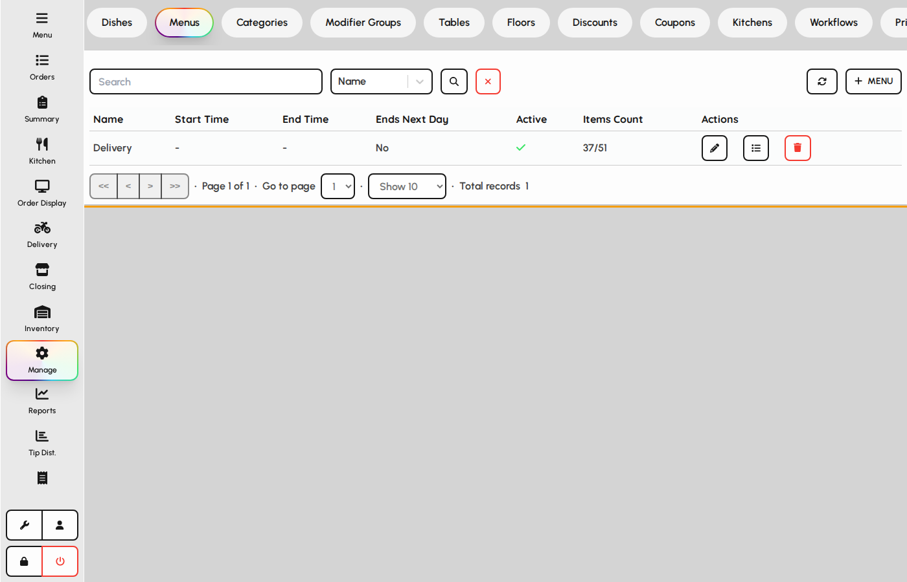
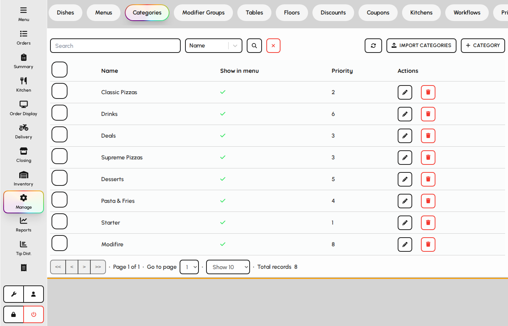
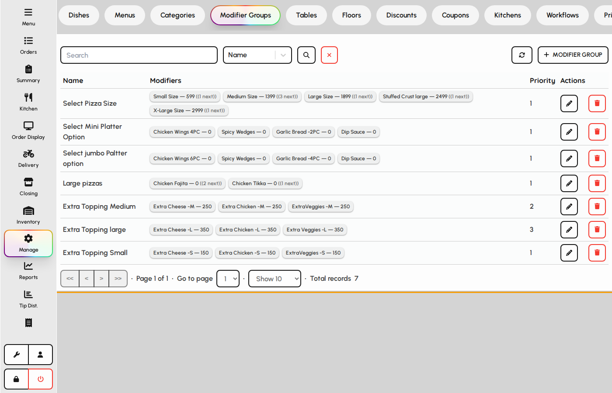
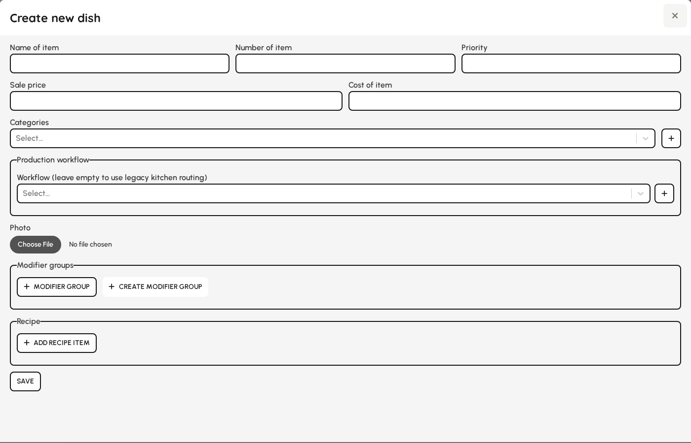
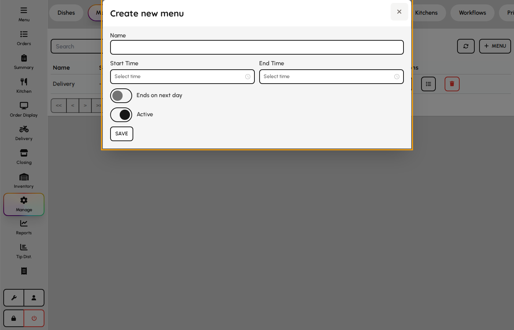
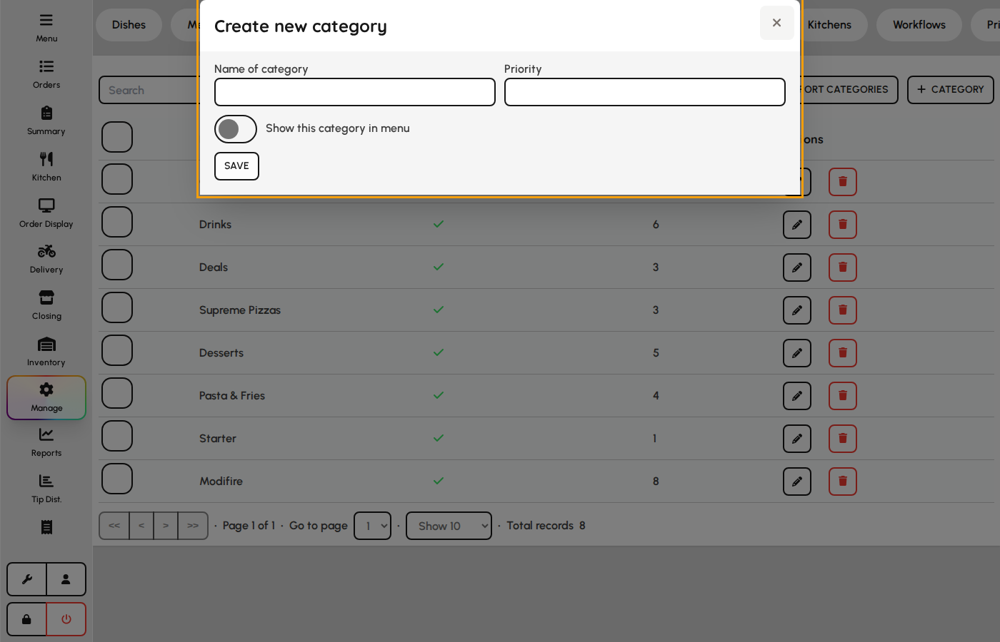
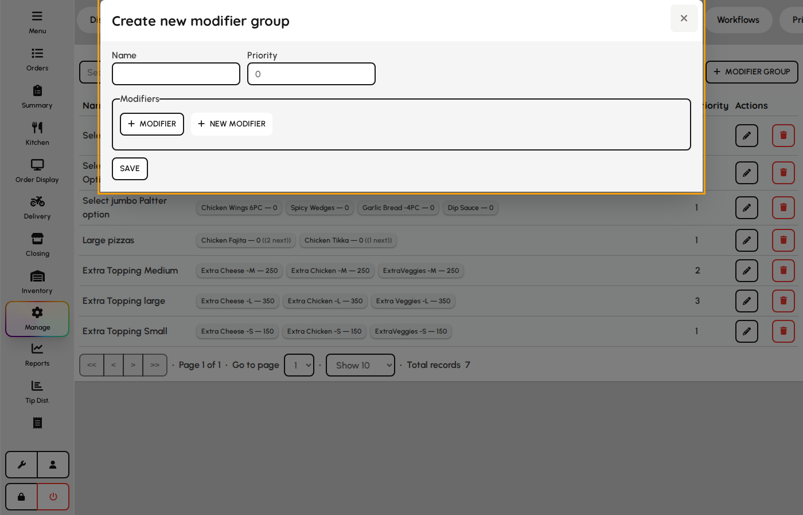

# Menus, categories, and dishes

Configure what appears on the ordering screen: dishes, menu groupings, and categories.

### Dishes

1. Open the Dishes tab.
2. Create or edit dishes with price, categories, modifiers, and recipes.
3. Import CSV files for bulk dish or ingredient updates when needed.

*Dishes tab.*

### Menus

Menus control which dishes are visible on each service period or channel.

1. Open the Menus tab.
2. Assign dishes to menus and set availability windows.
3. Save changes so floor staff see updated items on the Menu screen.

*Menus tab.*

### Categories

1. Open the Categories tab.
2. Group dishes for navigation on the ordering screen.
3. Reorder categories to match how staff browse the menu.

*Categories tab.*

### Modifier groups

Modifier groups define optional add-ons, sizes, and nested choices shown when staff customize a dish.

1. Open the Modifier groups tab.
2. Create groups with modifiers, prices, and optional next-group rules.
3. Assign groups to dishes so the cart shows the correct customization flow.

*Modifier groups tab.*

### Dish form

Dishes are sellable items with price, categories, modifiers, recipes, and kitchen routing.

1. Open Admin → Menus → Dishes and add or edit.
2. Set number, name, price, cost, and categories.
3. Attach modifier groups, inventory recipe lines, kitchen, and workflow.
4. Save — dish appears on menus and POS immediately when active.

**Fields**

- **Number / name** — POS identifier and display name.
- **Price / cost** — Selling price and theoretical food cost.
- **Categories** — Menu grouping and discount targeting.
- **Modifier groups** — Customization flow with required/optional rules.
- **Recipe lines** — Inventory depletion when the dish is sold.
- **Kitchen / workflow** — Routes KOT printing and prep stages.

*Dish maintenance form.*

### Menu form

Menus time-box which categories appear on POS (e.g. lunch vs. dinner).

1. Open Menus tab and add or edit.
2. Set name and optional start/end times.
3. Toggle active and ends-on-next-day for overnight menus.
4. Assign categories on the Menus list after saving.

**Fields**

- **Name** — Menu label on POS switcher.
- **Start from / end time** — Automatic availability window.
- **Ends on next day** — Allows service past midnight into the next calendar day.
- **Active** — Inactive menus are hidden from POS.

*Menu form with service hours.*

### Category form

1. Open Categories and add or edit.
2. Set name, sort priority, and show-in-menu flag.
3. Save — assign dishes and link to menus.

**Fields**

- **Name** — Category header on POS and reports.
- **Priority** — Sort order among sibling categories.
- **Show in menu** — When off, category is hidden from customer-facing menu views.

*Category form.*

### Modifier group form

Groups define modifiers, prices, and nested follow-up groups per choice.

1. Open Modifier groups and add or edit.
2. Set name, priority, and modifier lines with prices.
3. For each modifier configure allowed next groups.
4. Use next group overrides to hide or reprice nested modifiers.
5. Save and attach the group to dishes.

**Fields**

- **Name / priority** — Group label and order when multiple groups attach to a dish.
- **Modifier** — Selectable option (often a dish used as add-on).
- **Price** — Extra charge when the modifier is chosen.
- **Allowed next groups** — Which modifier groups open after this choice (nested flow).
- **Next group overrides** — Per nested group: override nested modifier price or hide items.

*Modifier group form with nested groups.*
