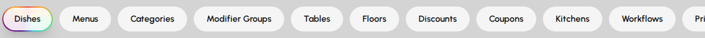
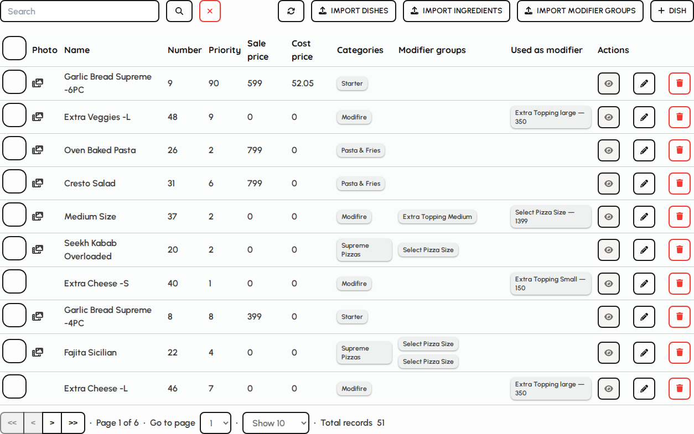

# Manage overview

Manage is the administrator hub for venue configuration. Open it from the sidebar to maintain dishes, menus, floors, users, taxes, discounts, kitchens, printers, and more.

### Open Manage

1. Sign in with a user that has administrator access.
2. Tap Manage in the sidebar (gear icon area for admin roles).
3. The screen opens on the Dishes tab by default.

*Manage screen with tab bar and content panel.*

### Tab navigation

Tabs group related settings. Switching tabs may require manager PIN approval depending on your role.

1. Scroll the tab bar horizontally when many tabs are visible.
2. Tabs cover menus, floor plan, promotions, kitchen routing, printing, payments, and users.
3. Each tab opens its own maintenance table or form list.
4. The selected tab is highlighted with the primary gradient.

*Manage tab bar.*

### Dishes tab (default)

1. Dishes lists every sellable item with number, name, and price.
2. Use Add, Edit, Import, or bulk actions when your role allows.
3. Search and pagination help find items in large menus.

*Dishes maintenance table.*
