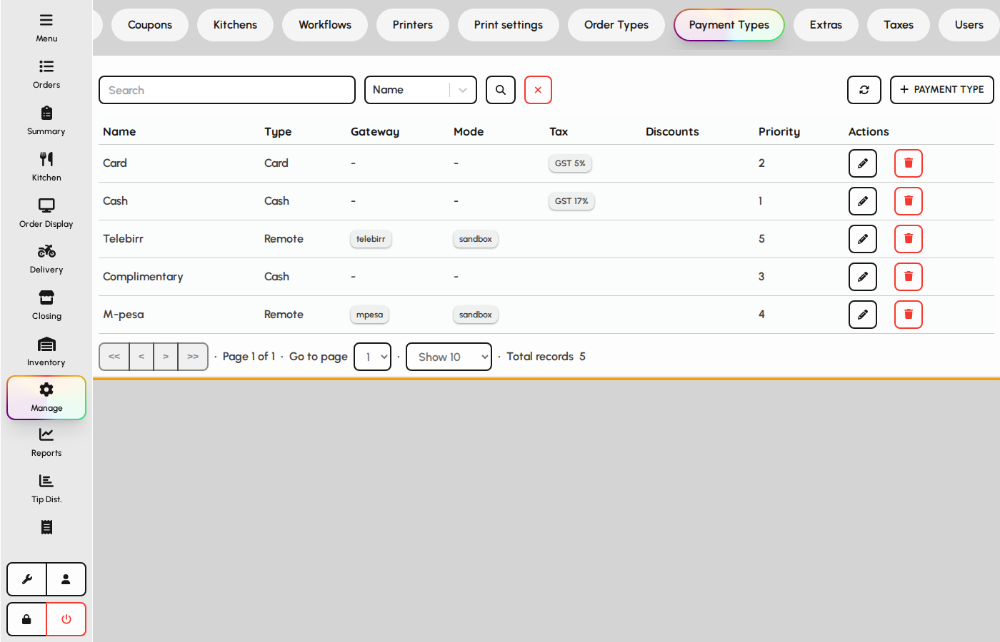
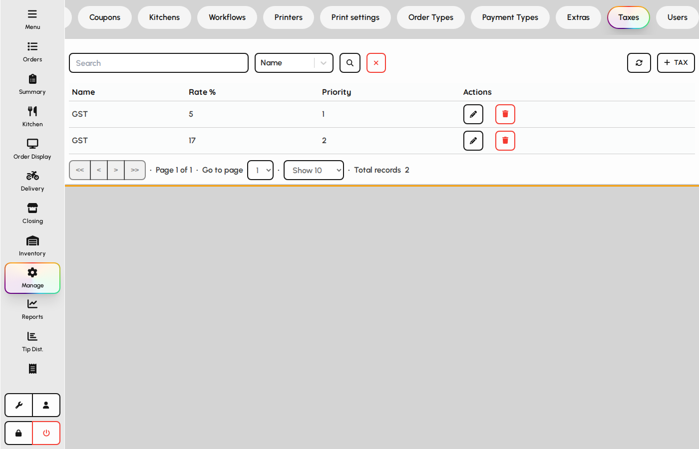
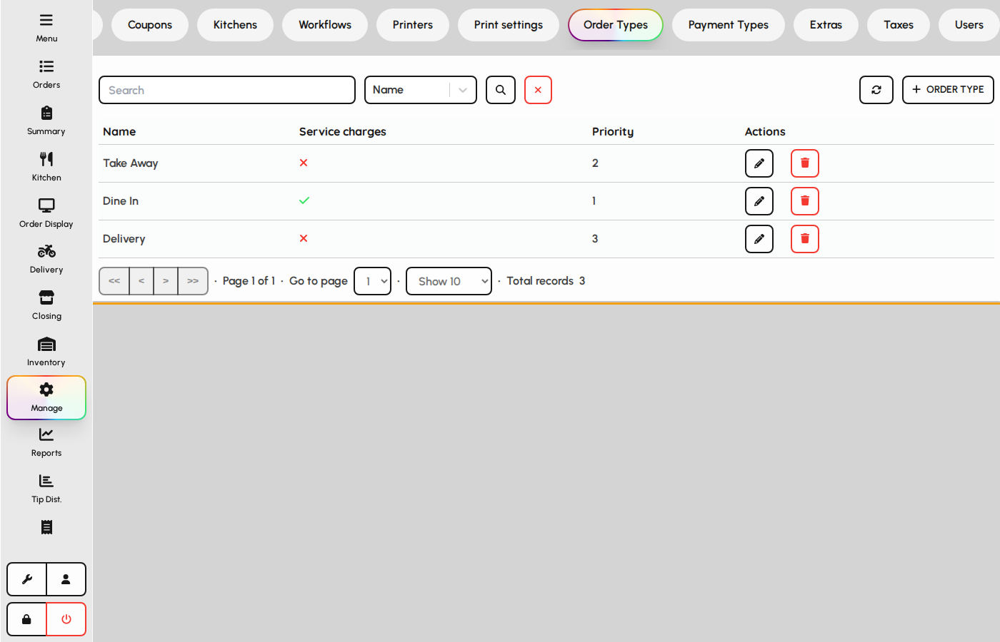
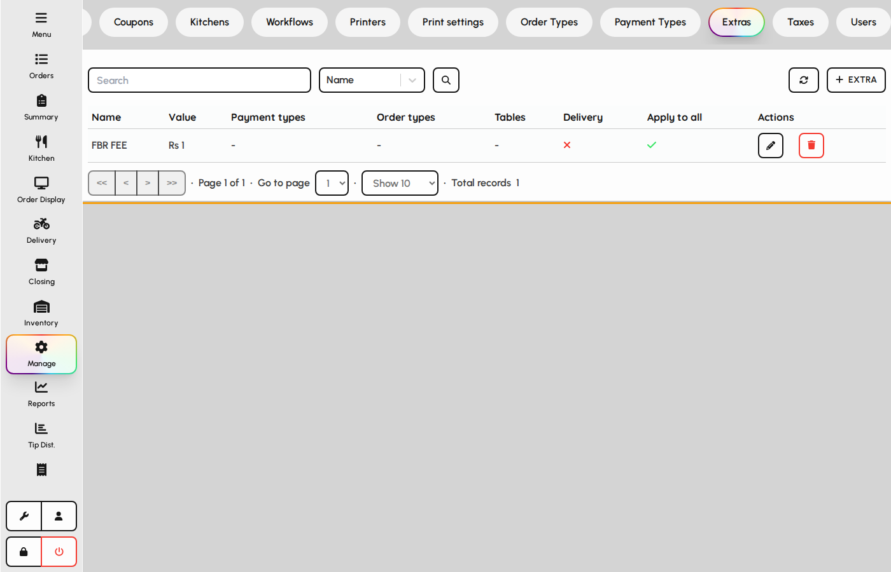
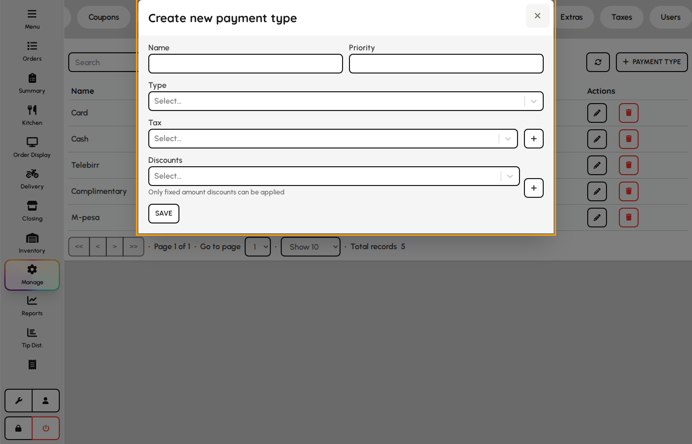
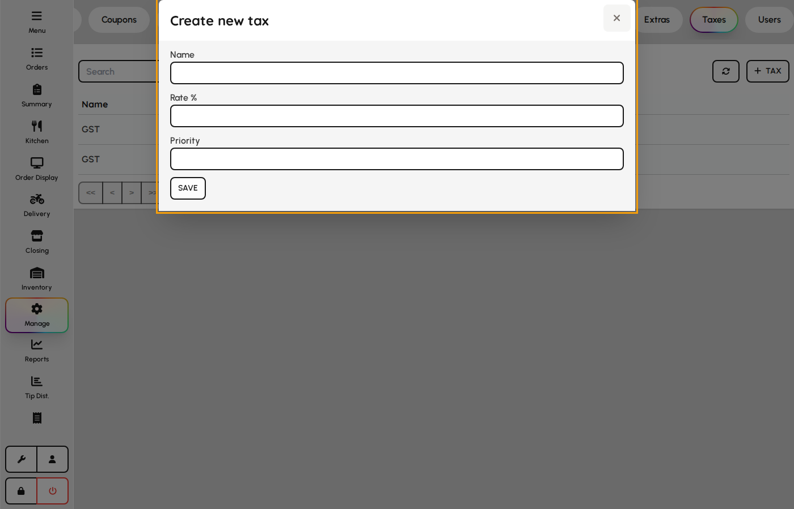
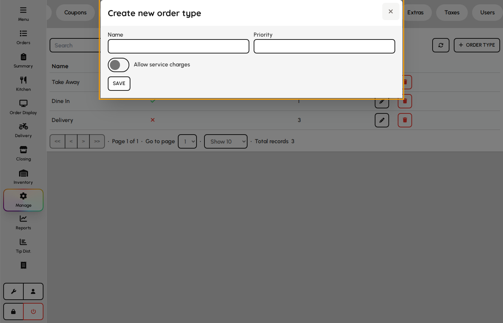
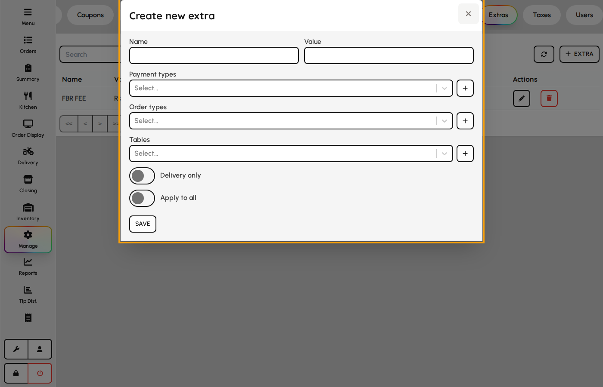

# Payment types, taxes, and order types

Configure how orders are classified and settled: payment methods, tax rules, and service types (dine-in, delivery, etc.).

### Payment types

1. Open the Payment types tab.
2. Define Cash, Card, and custom tenders shown on the payment screen.
3. Set sort order and whether a type requires reference or change calculation.

*Payment types tab.*

### Taxes

Taxes apply to dishes and appear on receipts and reports.

1. Open the Taxes tab.
2. Create tax rates and link them to applicable items or order types.
3. Save so new orders calculate tax correctly.

*Taxes tab.*

### Order types

1. Open the Order types tab.
2. Configure dine-in, takeaway, delivery, and other service modes.
3. Order types drive kitchen routing, reporting, and default behaviors.

*Order types tab.*

### Extras

Extras are automatic surcharges linked to payment types, order types, or tables (e.g. service fees or cover charges).

1. Open the Extras tab.
2. Create extras with name, amount, and applicability rules.
3. Save so qualifying orders include the surcharge on payment.

*Extras tab.*

### Payment type form

Payment types include local methods and Remote gateway types that delegate to Stripe, PayPal, etc.

1. Open Admin → Payments → Types.
2. Add name, priority, and type (Cash, Card, Remote, …).
3. For Remote: pick gateway provider, mode (test/live), and API keys.
4. Optionally link tax and automatic discounts.
5. Save — type appears on payment screen and table restrictions.

**Fields**

- **Name** — Label on payment screen buttons.
- **Priority** — Sort order among payment methods.
- **Type** — Behavior profile — choose Remote to enable gateway fields.
- **Gateway provider** — Stripe, PayPal, or other integrated processor.
- **Gateway mode** — Test vs. live credentials.
- **public_key** — Client-side or publishable API key for the gateway.
- **secret_key** — Server-side secret used to capture charges.
- **webhook_secret** — Validates asynchronous payment callbacks.
- **client_id / client_secret** — OAuth-style gateways that use paired credentials.
- **merchant_id / integrity_salt** — Provider-specific merchant and hash fields.
- **Tax** — Default tax rule applied when this type is used.
- **Discounts** — Auto-applied discount rules tied to the payment method.

*Payment type form with remote gateway.*

### Tax form

1. Open Payments → Taxes.
2. Define name, rate, and inclusive/exclusive behavior.
3. Save — assign to payment types or order defaults.

**Fields**

- **Name** — Tax label on receipts.
- **Rate** — Percentage applied to taxable amounts.
- **Inclusive** — When true, tax is embedded in displayed prices.

*Tax form.*

### Order type form

1. Open Payments → Order types.
2. Set name and behavior flags (dine-in, takeaway, delivery).
3. Save — used on tables, POS, and reporting.

**Fields**

- **Name** — Order type shown on checks and filters.
- **Priority** — Sort order in selectors.
- **Default** — Pre-selected type for new orders when applicable.

*Order type form.*

### Extra (service charge) form

Extras add automatic surcharges (service charge, coperto) by payment or order context.

1. Open Payments → Extras.
2. Name the charge and set amount or percent.
3. Configure when it applies (order type, payment type, etc.).
4. Save — qualifying orders include the surcharge.

**Fields**

- **Name** — Surcharge label on guest receipt.
- **Amount / rate** — Fixed currency or percent of eligible total.
- **Taxable** — Whether tax is calculated on the surcharge.
- **Auto apply rules** — Links to order types, payment types, or floors.

*Extra surcharge form.*
