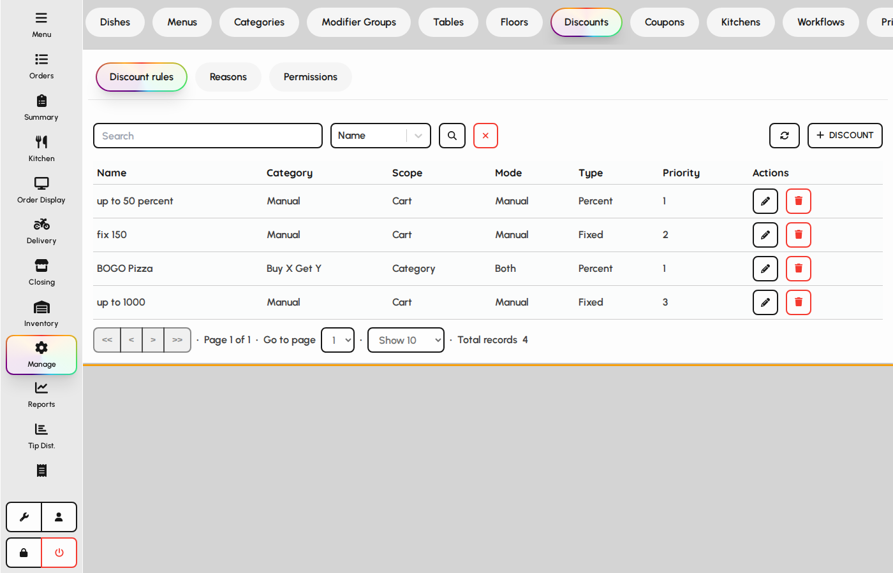
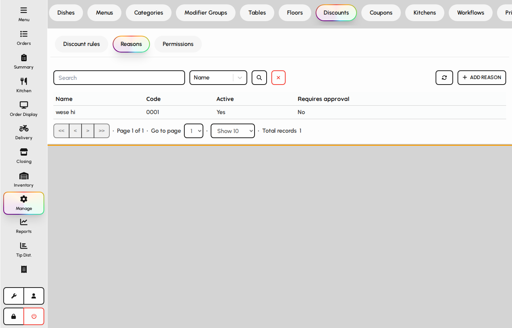
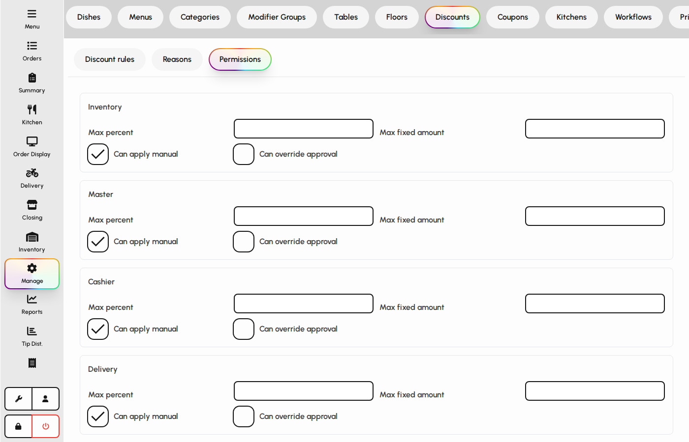
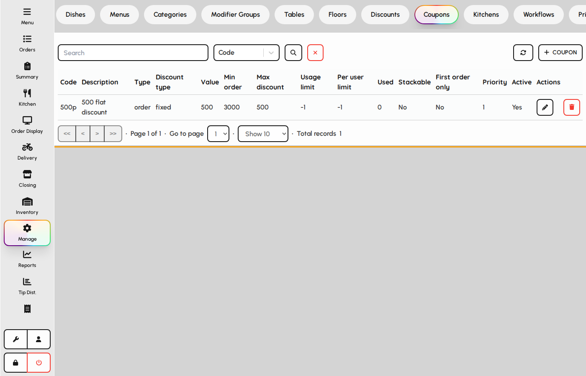
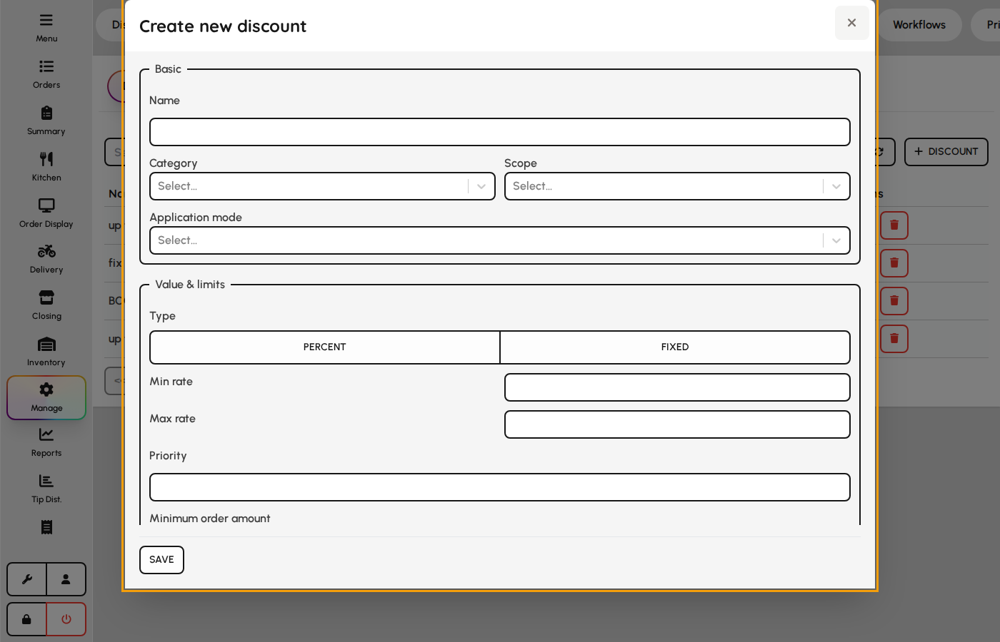
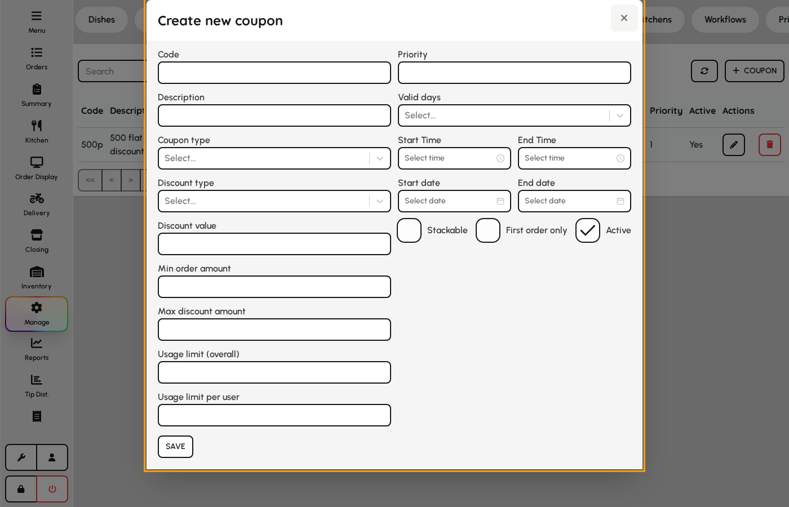

# Discounts and coupons

Configure promotional pricing: discount rules with reasons and role permissions, plus coupon codes staff can apply at payment.

### Discount rules

Discount rules define automatic or manual reductions by category, scope, and eligibility.

1. Open the Discounts tab in Manage.
2. Select the Rules sub-tab.
3. Add or edit rules; set type, value, scope, and when the discount applies.

*Discount rules list.*

### Discount reasons

Reasons appear when staff apply manual discounts so reporting can track why a reduction was given.

1. Open Discounts and switch to the Reasons sub-tab.
2. Create reasons staff can pick at the payment or cart screen.
3. Deactivate reasons you no longer want offered.

*Discount reasons maintenance.*

### Discount permissions

Control which roles may apply each discount type or exceed limits without manager approval.

1. Open Discounts and switch to the Permissions sub-tab.
2. Review the matrix of roles versus discount capabilities.
3. Adjust permissions so only authorized roles can grant large or sensitive discounts.

*Discount permission matrix.*

### Coupons

1. Open the Coupons tab.
2. Create coupon codes with value, validity window, and usage limits.
3. Staff enter coupons on the payment screen when the order qualifies.

*Coupons tab.*

### Discount rule form

Categories classify rules for permissions and reporting: manager, staff, vip, corporate, happy_hour, category, product, floor, damage_wastage, service_recovery, bulk_order, manual, scheduled, buy_x_get_y. Scope sets whether discounts apply to items, categories, cart, customers, or floors. Buy X Get Y uses the conditions editor instead of simple targets.

1. Open Admin → Promotions → Discounts → Rules.
2. Set name, category, scope, and application mode (manual, automatic, or both).
3. Configure targets for the chosen scope.
4. Set percent or fixed value range, priority, schedules, and stacking.
5. Save — cache refreshes and the rule is available in POS/discount engine.

**Fields**

- **Category** — One of 14 types — manager, staff, vip, corporate, happy_hour, category, product, floor, damage_wastage, service_recovery, bulk_order, manual, scheduled, buy_x_get_y — used for permissions and analytics.
- **Scope** — item, category, cart, customer, or floor — determines target editor.
- **Application mode** — manual (cashier applies), automatic (engine applies), or both.
- **Targets** — Specific items, categories, customers, or floors eligible for the rule.
- **Type (percent / fixed)** — Whether min/max rates are percentages or currency amounts.
- **Min / max rate** — Allowed discount range for manual entry or auto calculation.
- **Max cap** — Percent discounts only — upper currency limit per application.
- **Priority** — Order when multiple automatic rules compete.
- **Min order amount** — Cart subtotal required before the rule can apply.
- **Stacking mode** — allow, prevent, highest_wins, or priority vs. other discounts.
- **Tax treatment** — tax_before_discount, tax_after_discount, inclusive, or exclusive.
- **Schedules** — Day/time windows for scheduled and happy_hour categories.
- **Conditions** — Buy X Get Y thresholds and free-item logic.
- **Requires reason / approval** — Forces reason pick or manager PIN when applied manually.

*Discount rule form with category and targets.*

### Coupon form

1. Open Promotions → Coupons.
2. Set code, discount type/value, and usage limits.
3. Configure valid days, time window, and date range.
4. Save — cashiers enter the code at payment.

**Fields**

- **Code** — String customers or staff enter at checkout.
- **Coupon type** — Single-use, multi-use, or other coupon behavior.
- **Discount type / value** — Percent or fixed amount taken off the order.
- **Min order amount** — Minimum subtotal before the coupon applies.
- **Max discount amount** — Cap on percent-based coupon savings.
- **Usage limit** — Total redemptions allowed across all customers.
- **Usage limit per user** — Redemptions allowed per customer profile.
- **Valid days / start & end time** — Restricts coupon to certain weekdays and hours.
- **Start / end date** — Overall validity window.
- **Stackable / first order only** — Combining rules with other discounts or new customers only.

*Coupon form.*
