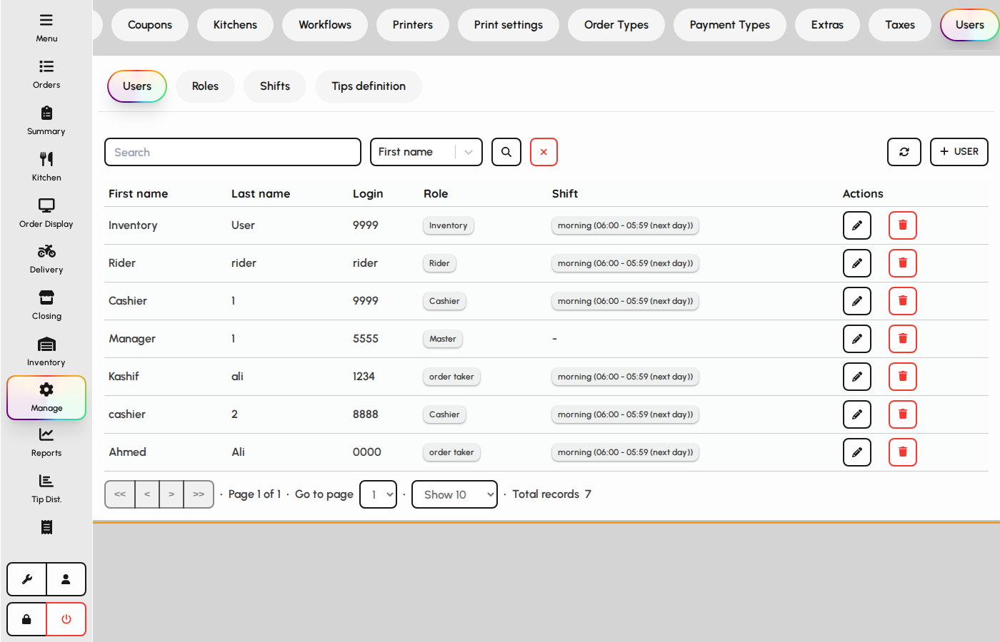
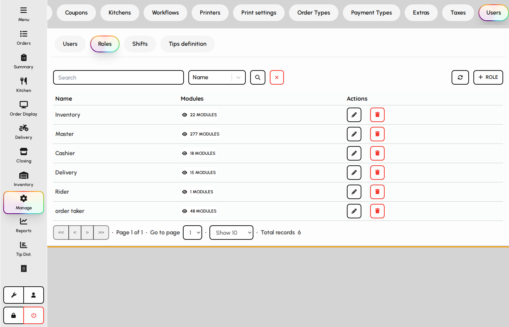
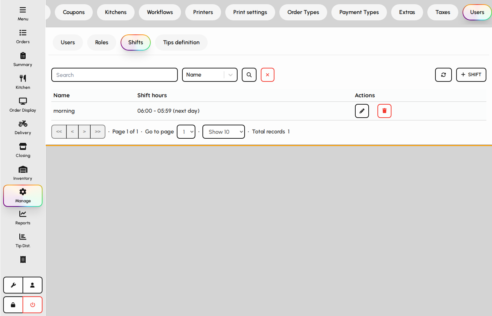
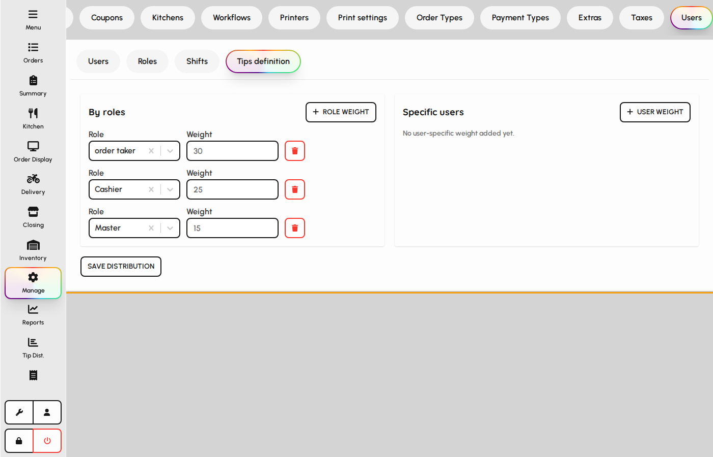
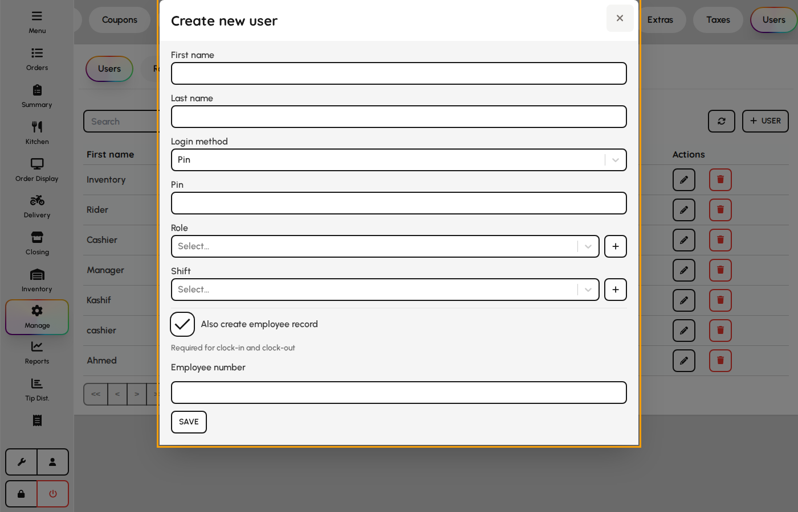
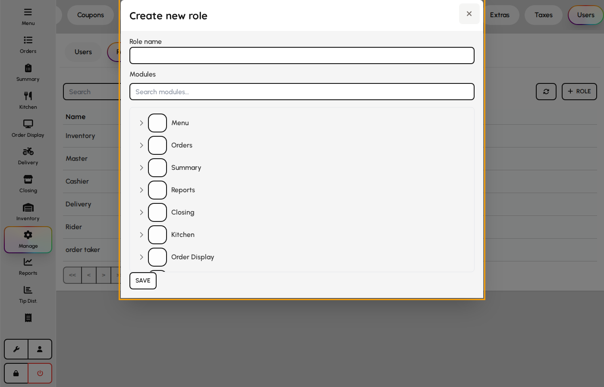
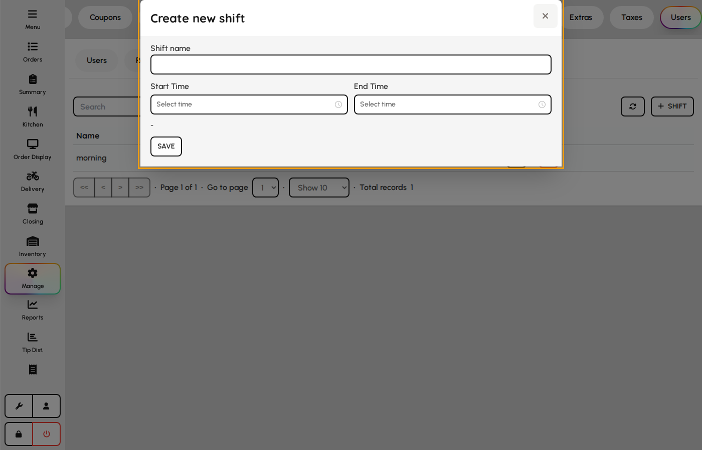

# Users and roles

Manage staff accounts, PINs, role permissions, shifts, and tip-pool definitions that control who can access each screen and tab.

### User list

1. Open the Users tab.
2. Browse active users with name, role, and contact fields.
3. Use Add user to create a new account or Edit to update an existing one.

*Users maintenance table.*

### Roles

Roles bundle permission modules that gate sidebar screens, Manage tabs, and protected actions.

1. Switch to the Roles sub-tab under Users.
2. Create roles and open the module list to enable or disable access.
3. Assign roles to users so permissions stay consistent across staff.

*Roles sub-tab.*

### Shifts

Shifts define work windows used for labor reporting and automatic clock-out rules.

1. Switch to the Shifts sub-tab.
2. Add shift names with start and end times.
3. Assign shifts to users for scheduling and tip-distribution context.

*Shifts sub-tab.*

### Tip definition

Tip definition sets pool weights and rules used when managers run tip distribution (see HR Guide → Tip distribution for payout runs).

1. Switch to the Tip definition sub-tab.
2. Configure how tips are pooled and weighted by role or shift.
3. Save so tip distribution calculations use the latest rules.

*Tip definition sub-tab.*

### User form

POS operators log in with PIN or password and inherit role permissions.

1. Open Admin → Users and add or edit.
2. Set login method, name, credentials, role, and shift.
3. Optionally create a linked HR employee record.
4. Save — user can sign in on terminals with assigned permissions.

**Fields**

- **Login method** — PIN (4 digits) or password authentication.
- **First / last name** — Displayed name on checks and reports.
- **Login / PIN** — Credential used at sign-in.
- **Password** — Required when login method is password.
- **User role** — Permission bundle controlling modules and actions.
- **User shift** — Default work shift for labor reporting.
- **Create employee** — Auto-creates linked HR employee with employee number.

*User account form.*

### Role form

Roles grant module and action access checked by protectAction throughout the app.

1. Open Users → Roles.
2. Name the role and search the module tree.
3. Check parent modules or individual actions.
4. Save — assign the role on user records.

**Fields**

- **Name** — Role label on user form.
- **Module permissions** — Hierarchical checkboxes for screens and sub-actions.

*Role permissions editor.*

### Shift template form

Shifts in Admin → Users define named time windows for user default shift and schedule templates.

1. Open Users → Shifts.
2. Enter name, start time, and end time.
3. Overnight shifts set ends_next_day automatically.
4. Save — selectable on users and HR schedule forms.

**Fields**

- **Name** — Shift label (e.g. Morning, Close).
- **Start time** — Scheduled shift start.
- **End time** — Scheduled shift end; may roll to next calendar day.

*Shift template form.*
