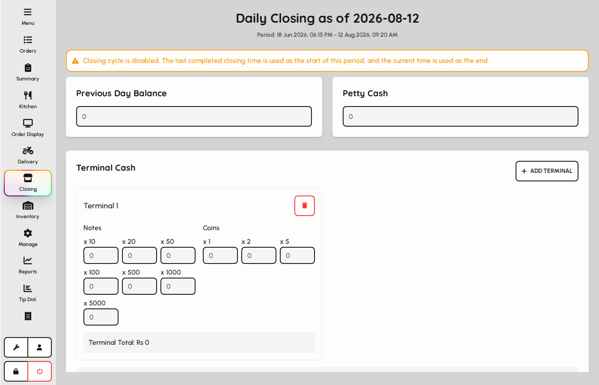
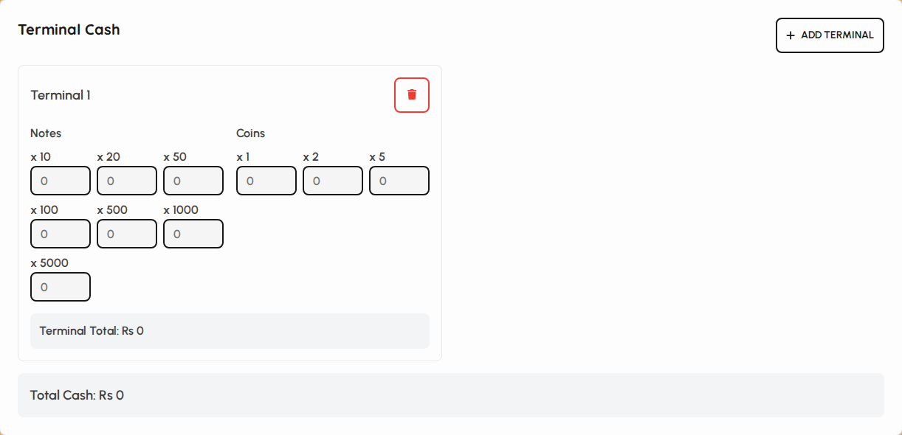
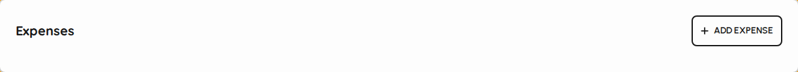

# Closing

Closing is the end-of-day cash and payment reconciliation screen. Count terminal cash, record expenses, review payment totals, then save a draft or complete the closing cycle.

### Closing overview

1. Tap Closing in the sidebar.
2. The title shows today’s date and the active closing window (business day cycle).
3. Alerts warn if the cycle is disabled or already completed.

*Closing screen header and cycle window.*

### Balances and terminal cash

1. Enter previous day balance and petty cash added today.
2. For each terminal, count notes and coins or enter a total cash amount.
3. Add or remove terminals with the Add terminal control.

*Terminal cash counting section.*

### Payments and expenses

1. Payment summary lists each payment type with system totals (editable when not completed).
2. Add expenses with description, category, and amount.
3. Net amount summarizes cash, other payments, expenses, and balances.

*Payment summaries and expenses.*

### Save, complete, and print

1. Save closing stores a draft without locking the day.
2. Close closing completes the cycle (open orders in the cycle must be settled first).
3. Print closing sends a summary slip to the printer.
4. Reopen appears after completion if your role can edit closings.

*Save, close, print, and reopen actions.*
