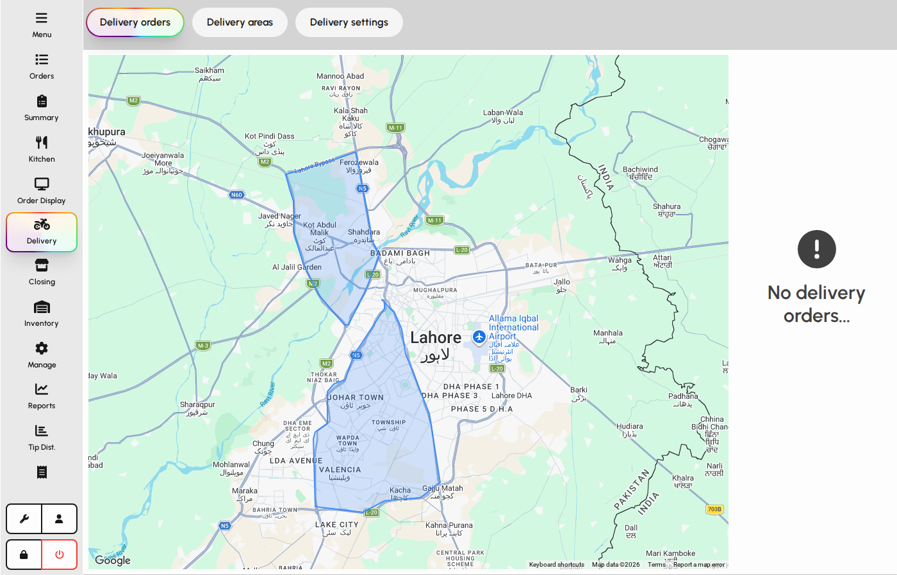
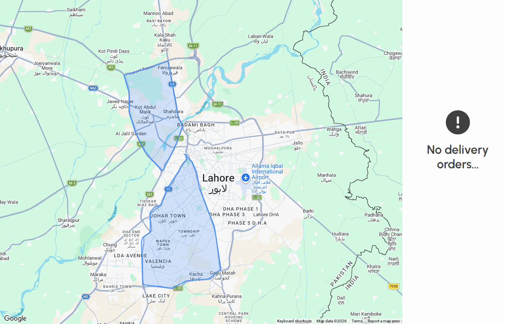
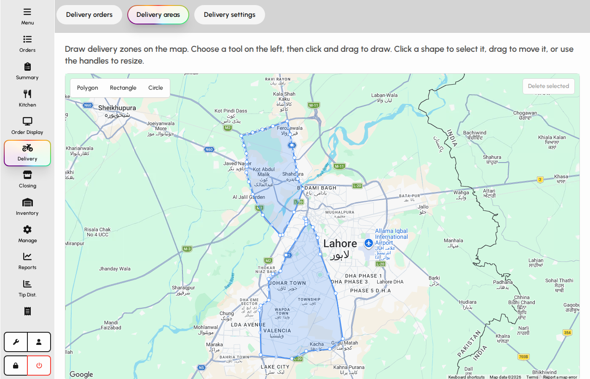
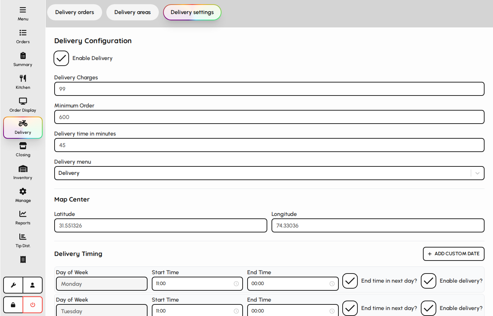

# Delivery

Delivery helps managers track outbound orders on a map, manage delivery areas, and configure delivery settings.

### Delivery hub

1. Tap Delivery in the sidebar.
2. Tabs at the top switch between Delivery orders, Areas, and Settings.
3. The Delivery tab shows a map and a list of active delivery orders.

*Delivery screen with tabs.*

### Map and order list

1. The map shows delivery zones and order markers when coordinates exist.
2. Click a marker or list row to open the order popup.
3. When no delivery orders are open, the list shows an empty state.

*Delivery map and order sidebar.*

### Delivery areas

Define geographic zones used for delivery routing and reporting.

1. Open the Areas tab.
2. Draw or manage polygons on the map for each delivery zone.
3. Save area changes when your role allows editing.

*Delivery areas tab.*

### Delivery settings

1. Open the Settings tab.
2. Configure map center, fees, and other delivery options for the venue.
3. Save when finished (manager approval may be required).

*Delivery settings tab.*
