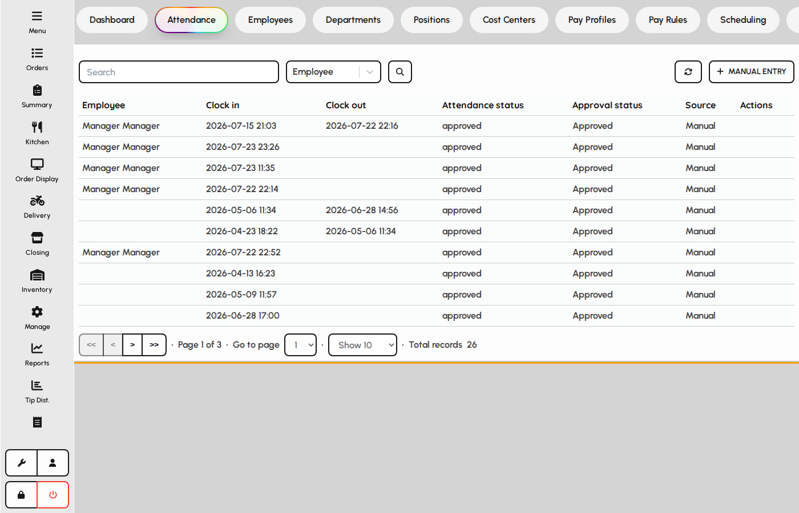
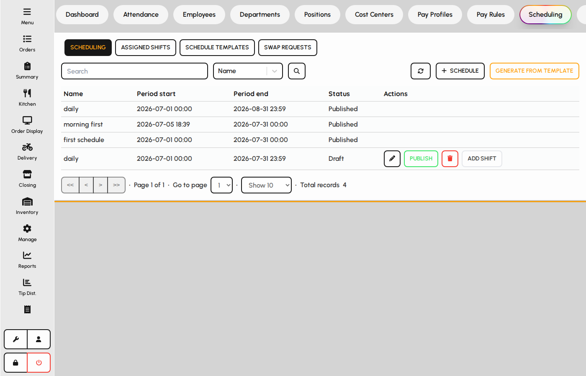
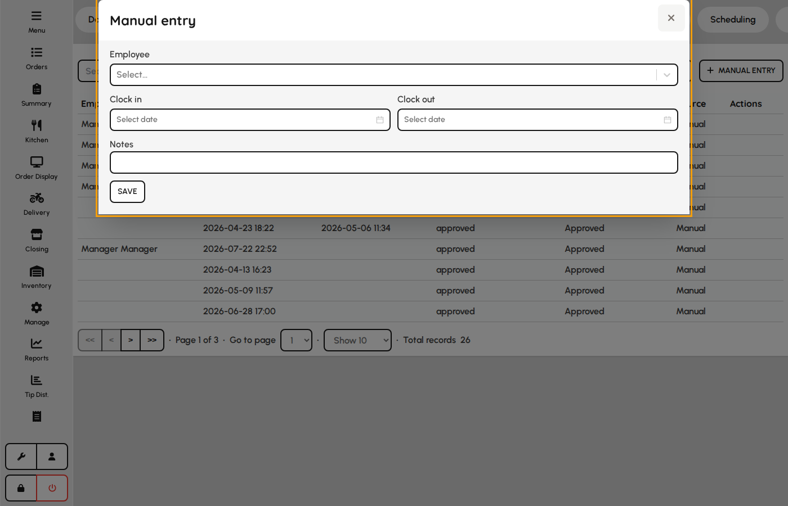
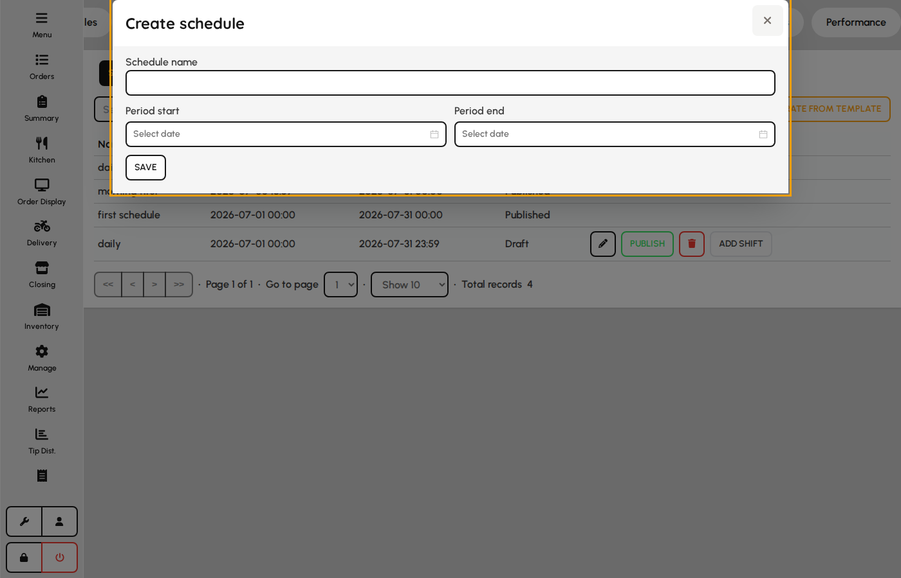
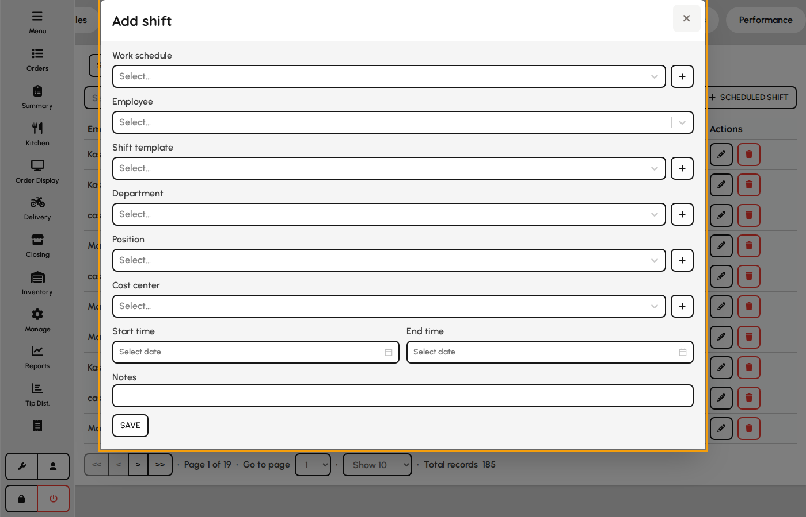
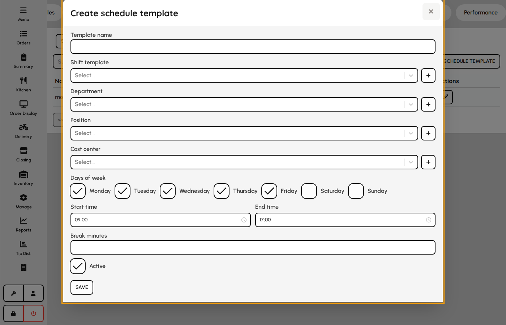
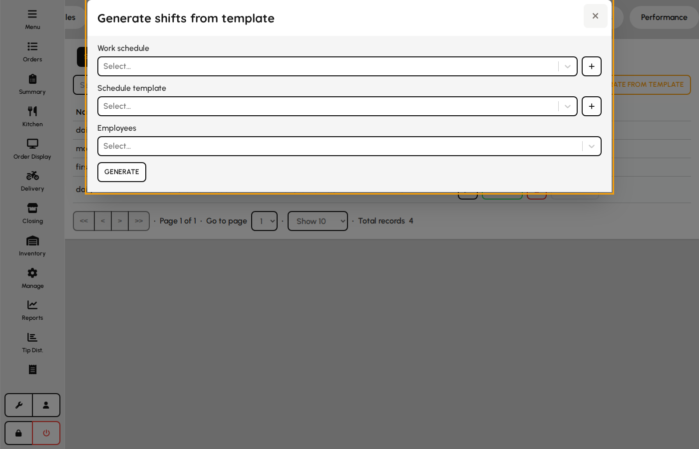
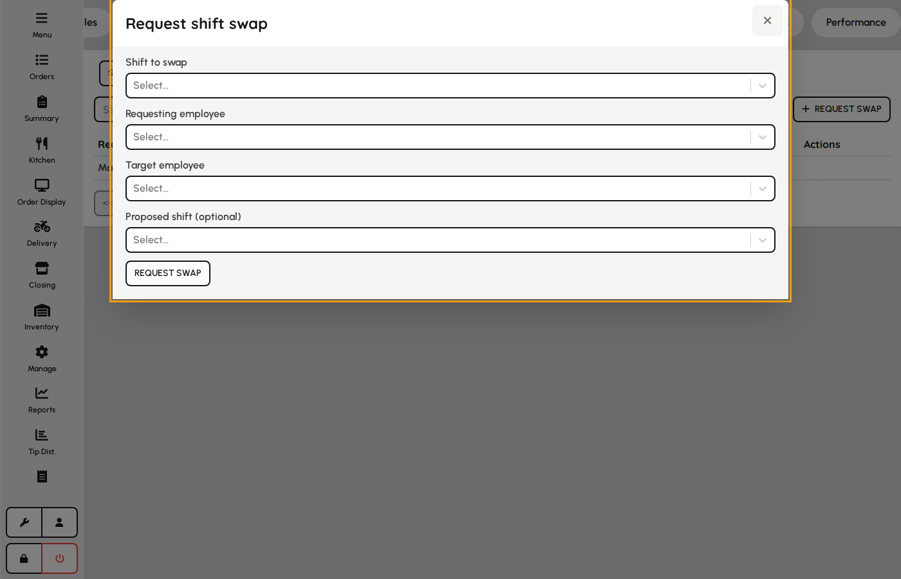

# Attendance

Track clock times and build schedules so labor hours stay accurate for payroll and reporting.

### Attendance records

1. Open the Attendance tab.
2. Review clock-in and clock-out events for staff.
3. Correct or approve exceptions when your role allows.

*Attendance tab.*

### Scheduling

Schedules plan who works which shifts.

1. Open the Scheduling tab.
2. Build or adjust shifts for upcoming days.
3. Published schedules guide floor staffing and attendance expectations.

*Scheduling tab.*

### Manual attendance entry

Correct missing punches or backfill time when terminals were unavailable.

1. On Attendance tab click Manual entry.
2. Select employee and enter clock-in and clock-out datetimes.
3. Add notes and save — hours feed payroll and reports.

**Fields**

- **Employee** — Whose time record is being created or corrected.
- **Clock in** — Start of the worked interval.
- **Clock out** — End of the worked interval; must be after clock in.
- **Notes** — Reason for manual entry on audit trail.

*Manual attendance entry modal.*

### Work schedule form

A schedule is a named date range containing draft or published shifts.

1. Open Scheduling and add a schedule.
2. Set name, period start, and period end.
3. Add shifts or generate from templates while status is draft.

**Fields**

- **Name** — Label for the schedule period (e.g. Week 12).
- **Period start** — First datetime covered by the schedule.
- **Period end** — Last datetime covered by the schedule.

*Work schedule form.*

### Scheduled shift form

Assigns one employee to a time block within a draft schedule.

1. From a draft schedule click Add shift.
2. Pick work schedule, employee, and start/end times.
3. Optionally apply shift template, department, position, and cost center.
4. Save — conflicts warn if overlaps exist.

**Fields**

- **Work schedule** — Parent schedule that must be in draft to edit.
- **Employee** — Staff assigned to the shift.
- **Shift template** — Optional preset from Admin → Users → Shifts.
- **Department / position / cost center** — Override org tags for this shift.
- **Start at / end at** — Scheduled clock window.

*Scheduled shift form.*

### Schedule template form

Reusable weekly pattern used to bulk-generate shifts.

1. Open Templates under Scheduling.
2. Name the template and pick weekdays with start/end times.
3. Optionally link shift template and org defaults.
4. Save for use with Generate schedule.

**Fields**

- **Name** — Template label in generate dialog.
- **Days of week** — Which weekdays receive shifts.
- **Start / end time** — Daily shift window applied on selected days.
- **Break minutes** — Unpaid break duration subtracted from scheduled hours.
- **Shift template** — Links to POS shift definition for reporting.

*Schedule template form.*

### Generate schedule from template

1. Click Generate on Scheduling.
2. Select draft work schedule and template.
3. Multi-select employees to receive generated shifts.
4. Generate — creates shifts, skipping conflicts where configured.

**Fields**

- **Work schedule** — Target draft schedule receiving new shifts.
- **Template** — Weekly pattern defining days and times.
- **Employees** — Staff who each get a copy of the template shifts.

*Generate schedule dialog.*

### Shift swap request

1. Click Request swap on Scheduling.
2. Select the scheduled shift and requesting employee.
3. Optionally name a target employee and proposed swap shift.
4. Submit — creates a pending swap for manager approval.

**Fields**

- **Scheduled shift** — Shift the requester wants to give up or exchange.
- **Requesting employee** — Employee initiating the swap.
- **Target employee** — Optional coworker to take or exchange the shift.
- **Proposed shift** — Optional counter-shift offered in exchange.

*Shift swap request form.*
