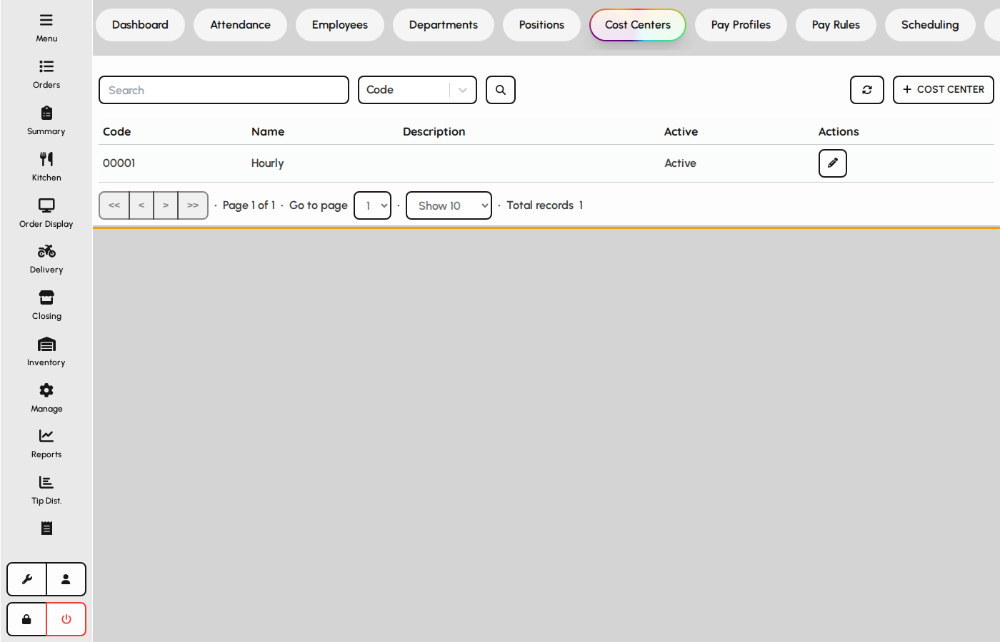
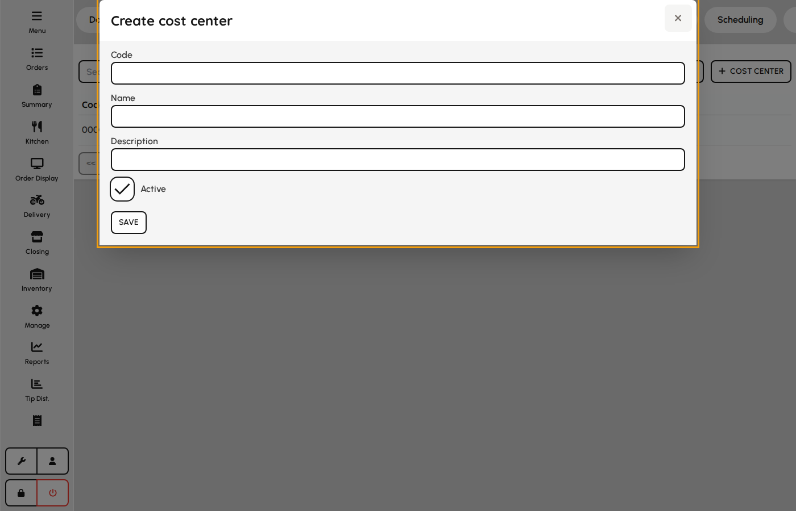

# Cost centers

Cost centers tag labor and payroll to venues, departments, or GL segments for reporting.

### Cost center list

1. Open HR → Cost centers.
2. Review codes used on employees, positions, and schedules.
3. Add or edit centers before assigning them on employee records.

*Cost centers tab.*

### Cost center form

1. Click Add or edit a row.
2. Enter code, name, and optional description.
3. Toggle active to retire a center without deleting history.
4. Save — the center appears on employee and scheduling forms.

**Fields**

- **Code** — Short unique identifier used in exports and integrations.
- **Name** — Human-readable label in dropdowns.
- **Description** — Optional notes for administrators.
- **Is active** — Inactive centers cannot be selected on new records.

*Cost center create/edit modal.*
