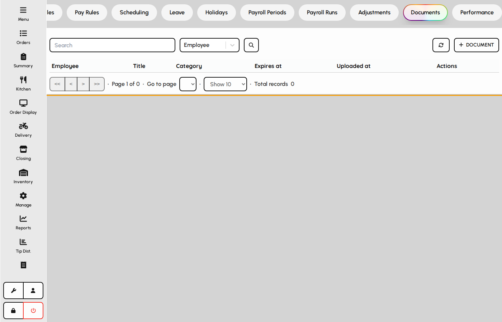
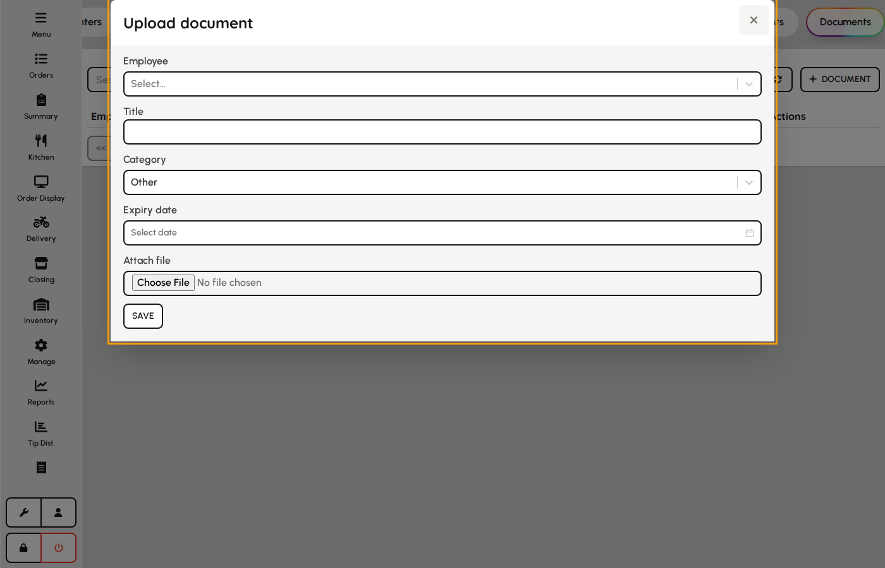

# Employee documents

Store contracts, IDs, licenses, and other files against employee records with expiry tracking.

### Documents list

1. Open HR → Documents.
2. Filter by employee or category.
3. Upload new files or update metadata on existing documents.

*Employee documents tab.*

### Document form

1. Click Add document.
2. Select employee, title, and category.
3. Attach the file and set expiry if applicable.
4. Save — file is stored and linked to the employee profile.

**Fields**

- **Employee** — Owner of the document record.
- **Title** — Display name in lists and reminders.
- **Category** — Contract, certificate, license, ID, medical, warning, or other.
- **Expires at** — Optional date for renewal alerts.
- **Attach file** — Required on create; stores the binary in the document library.

*Employee document upload form.*
