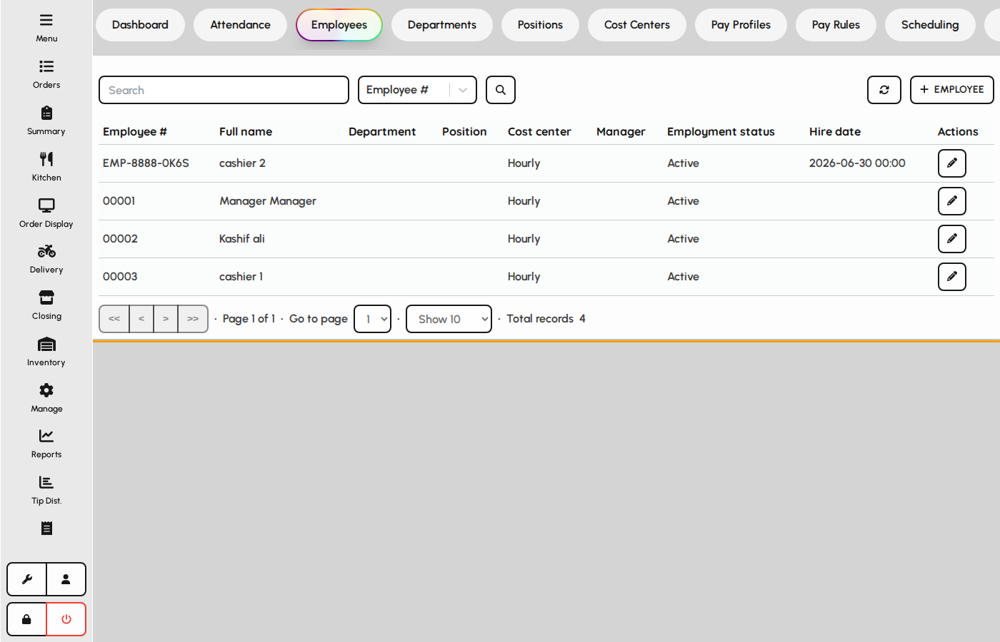
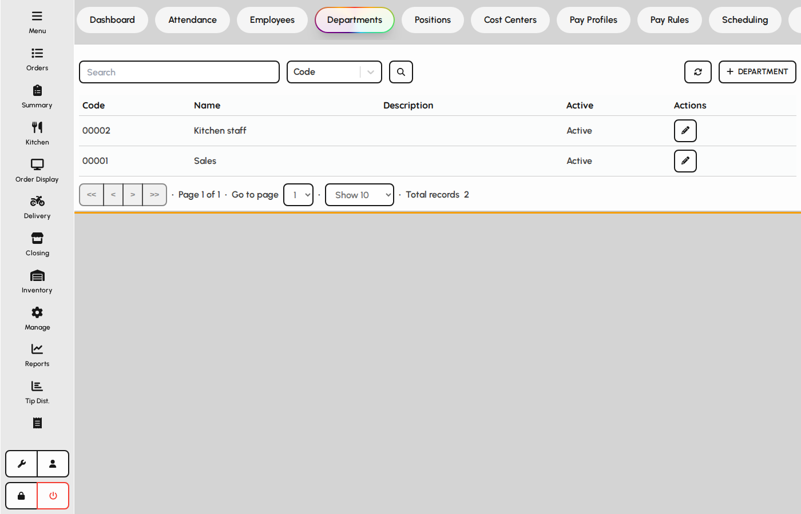
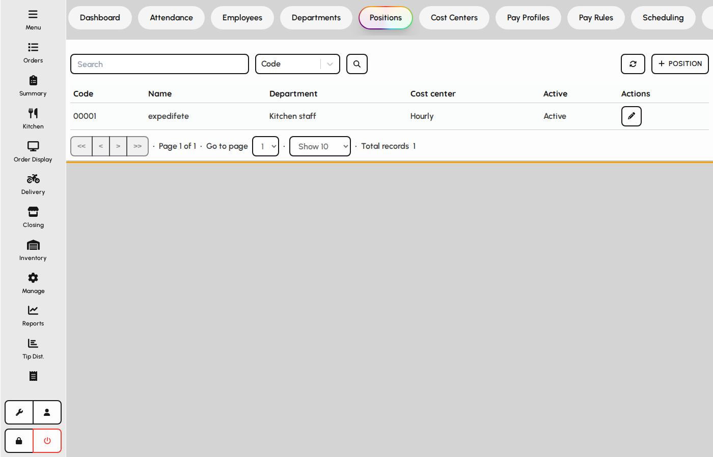
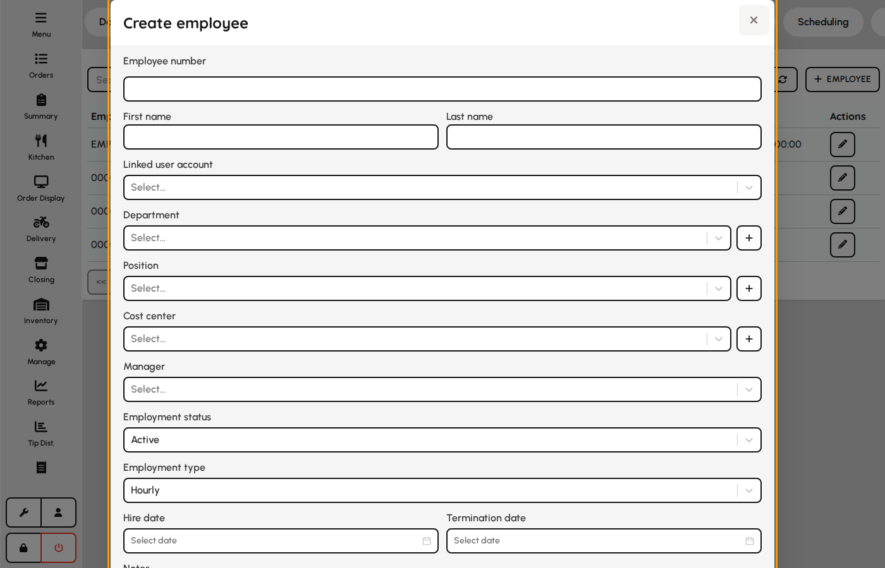
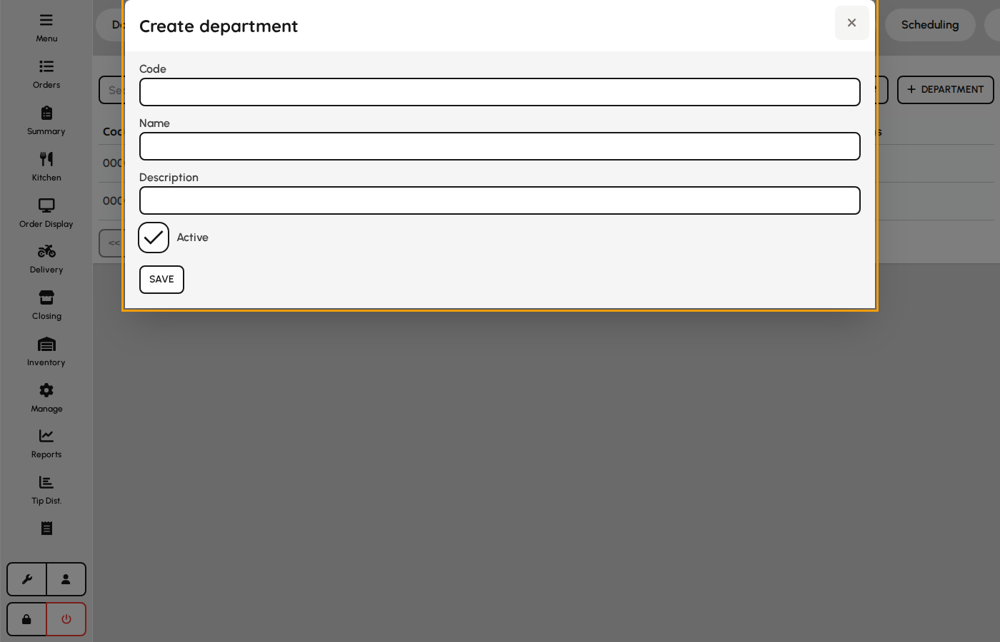
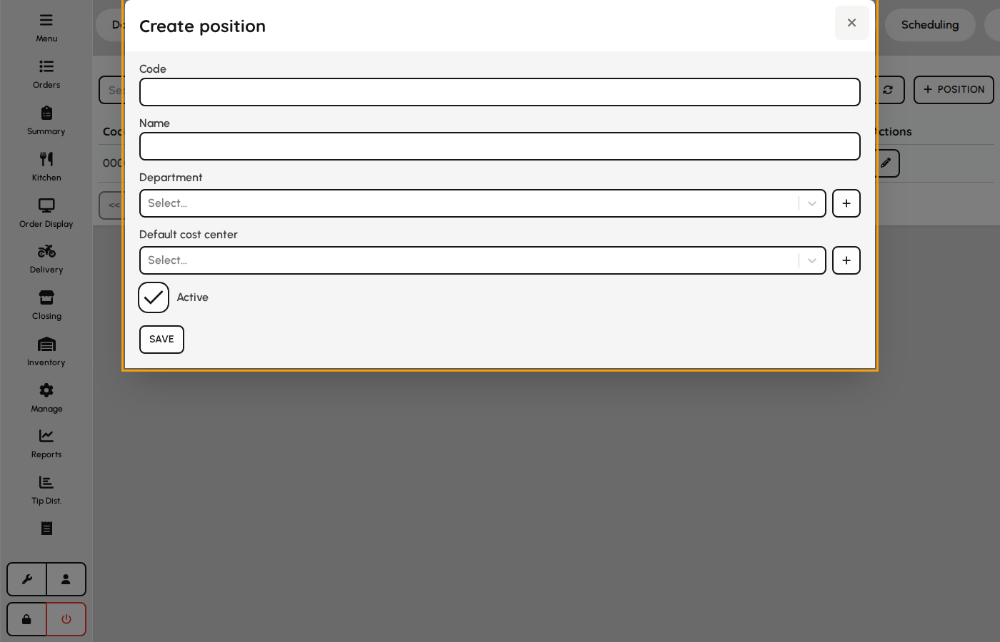

# Employees

Maintain employee records and the organizational structure: departments and positions.

### Employee list

1. Open the Employees tab.
2. Add or edit employees with role, department, and contact details.
3. Employee records feed attendance, leave, and payroll tabs.

*Employees tab.*

### Departments

Departments group staff for reporting and cost allocation.

1. Open the Departments tab.
2. Create departments that match how the venue organizes teams.
3. Assign employees to departments on their employee form.

*Departments tab.*

### Positions

1. Open the Positions tab.
2. Define job titles used on employee records and schedules.
3. Keep positions aligned with pay profiles when payroll is enabled.

*Positions tab.*

### Employee form

Core HR record linking POS user, org structure, and employment dates.

1. From Employees tab click Add or edit a row.
2. Complete employee number, name, and employment details.
3. Link POS user, department, position, cost center, and manager.
4. Save — record feeds attendance, leave, and payroll.

**Fields**

- **Employee number** — Unique staff identifier on schedules and exports.
- **First / last name** — Legal or preferred name on HR documents.
- **Linked user** — Optional POS login tied to this employee for clock-in.
- **Department** — Organizational unit for reporting.
- **Position** — Job title used on schedules and pay rules.
- **Cost center** — Default labor cost allocation.
- **Manager** — Reporting line for approvals.
- **Employment status** — Active, inactive, terminated, on leave, or suspended.
- **Employment type** — Hourly, salary, contract, etc. — aligns with pay profiles.
- **Hire / termination date** — Service dates for tenure and eligibility.

*Employee create/edit modal.*

### Department form

1. From Departments or inline Add on employee form.
2. Enter code, name, and description.
3. Save — department appears on employees and positions.

**Fields**

- **Code** — Short identifier for integrations.
- **Name** — Display name in dropdowns.
- **Description** — Optional admin notes.
- **Is active** — Inactive departments are hidden from new assignments.

*Department form.*

### Position form

1. From Positions or inline Add on employee form.
2. Define code, name, department, and default cost center.
3. Save — position is selectable on employees and schedules.

**Fields**

- **Code** — Job code for payroll exports.
- **Name** — Job title shown in HR and scheduling.
- **Department** — Default org unit for this role.
- **Default cost center** — Pre-filled on schedules for this position.
- **Is active** — Retire titles no longer hired against.

*Position form.*
