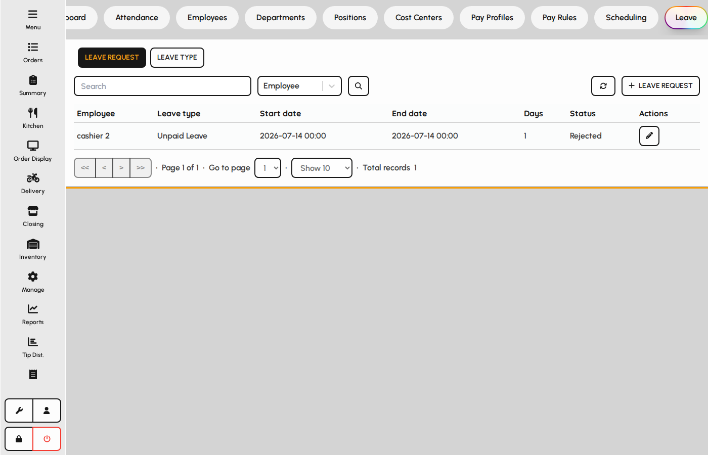
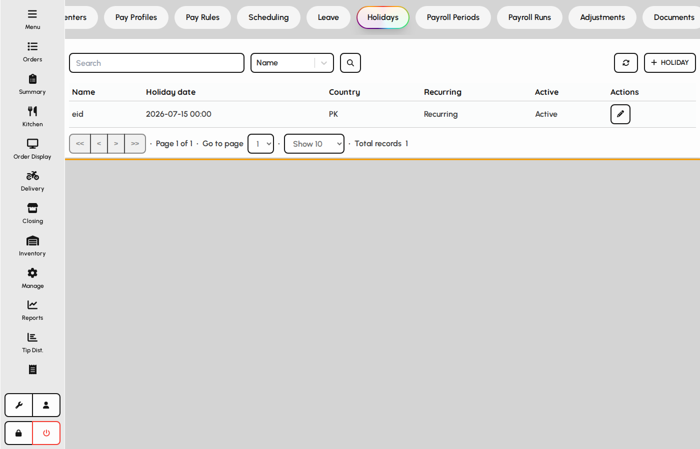
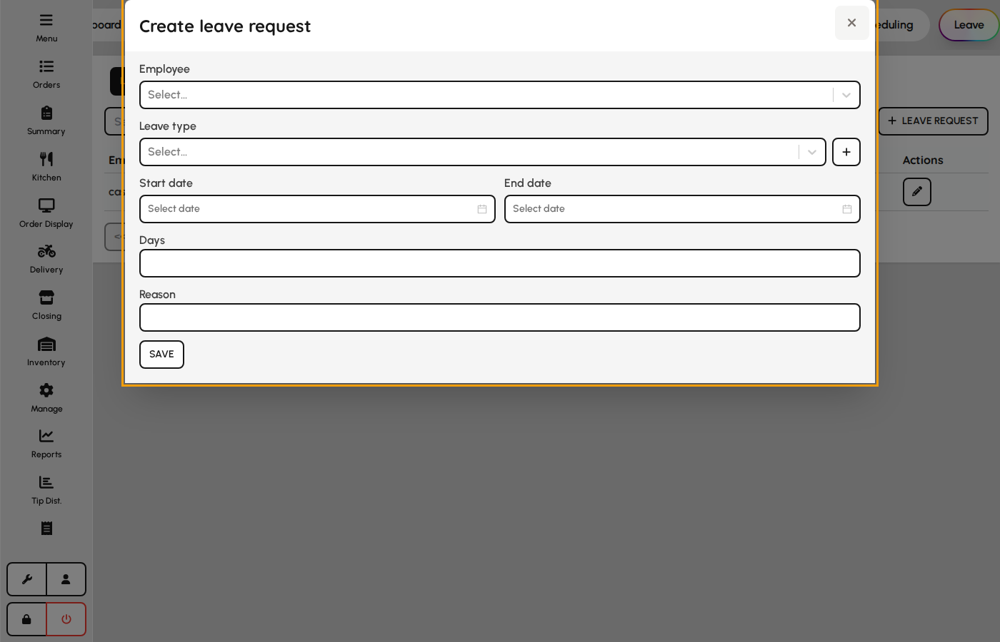
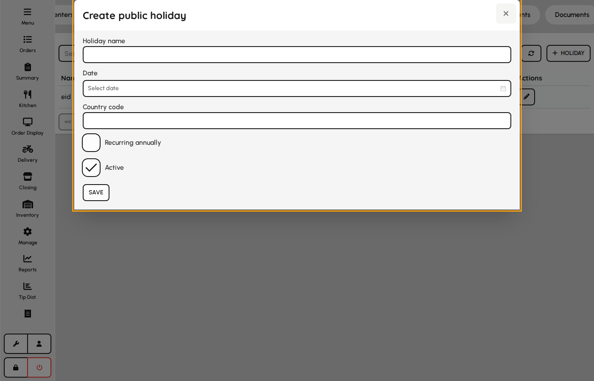

# Leave

Manage time-off requests and public holidays that affect schedules and payroll.

### Leave requests

1. Open the Leave tab.
2. Review pending and approved leave for employees.
3. Approve or reject requests according to your HR role.

*Leave tab.*

### Holidays

Holidays mark non-working or premium-pay calendar days for the venue.

1. Open the Holidays tab.
2. Add venue holidays for the year.
3. Holiday dates feed scheduling and pay-rule calculations when configured.

*Holidays tab.*

### Leave request form

Submit or edit time-off requests against configured leave types.

1. On Leave tab click Add request.
2. Select employee, leave type, and date range.
3. Enter day count and reason if required by the type.
4. Save — routes for approval when the type requires it.

**Fields**

- **Employee** — Staff requesting time off.
- **Leave type** — Determines paid/unpaid, approval, and accrual rules.
- **Start / end date** — Inclusive dates of the absence.
- **Days** — Working days consumed (may auto-calculate).
- **Reason** — Optional note for approvers.

*Leave request form.*

### Public holiday form

Public holidays interact with pay rules and scheduling.

1. Open Holidays under Leave.
2. Add name, date, and country code.
3. Mark recurring for annual fixed dates.
4. Save — holiday appears in pay rule filters.

**Fields**

- **Name** — Holiday label in calendars and rules.
- **Date** — Calendar date observed.
- **Country code** — Optional ISO code for multi-country venues.
- **Is recurring** — Repeats every year on the same month/day.
- **Is active** — Inactive holidays are ignored by new rules.

*Public holiday form.*
