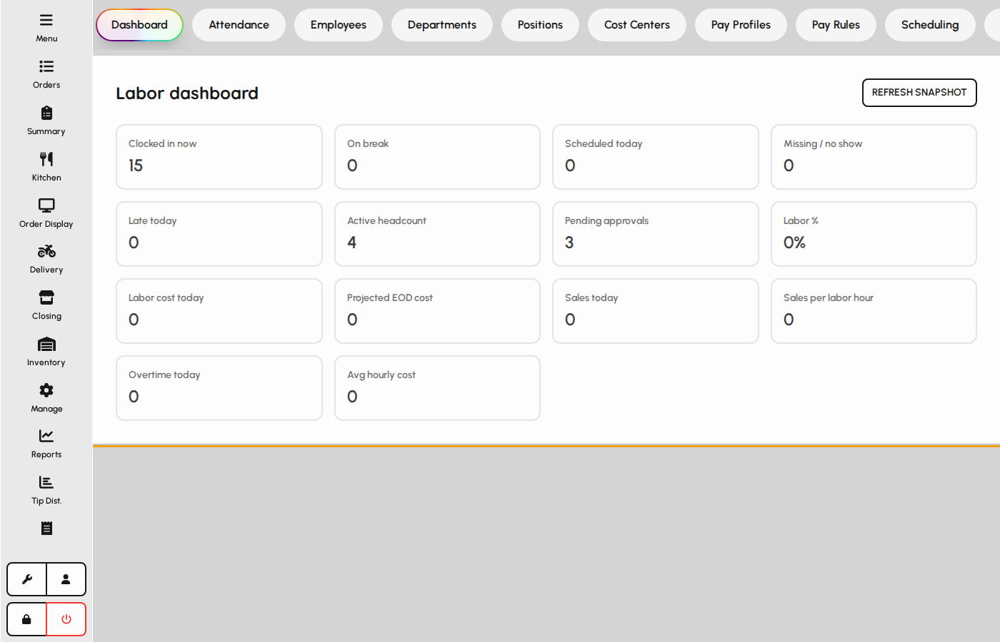
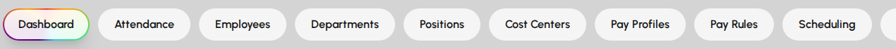
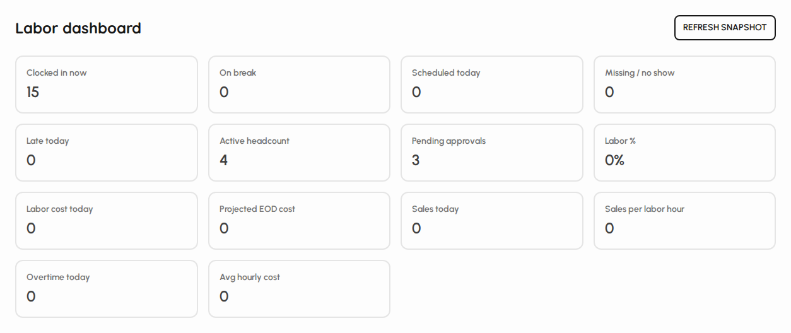

# HR overview

HR covers people operations: employees, attendance, leave, scheduling, and payroll-related tabs. Open it from the sidebar when your role includes HR access.

### Open HR

1. Sign in with a user that has HR access.
2. Tap HR in the sidebar.
3. The screen opens on the Dashboard tab by default.

*HR screen with tab bar and dashboard.*

### Tab navigation

Tabs group workforce setup and day-to-day people processes. Switching may require manager PIN approval.

1. Scroll the tab bar horizontally when many tabs are visible.
2. People tabs include Employees, Departments, and Positions.
3. Time tabs include Attendance, Scheduling, Leave, and Holidays.

*HR tab bar.*

### Dashboard

1. The Dashboard summarizes key HR metrics for the venue.
2. Use it as a starting point before opening detailed tabs.
3. Other tabs manage master data and transactional HR work.

*HR dashboard panel.*
