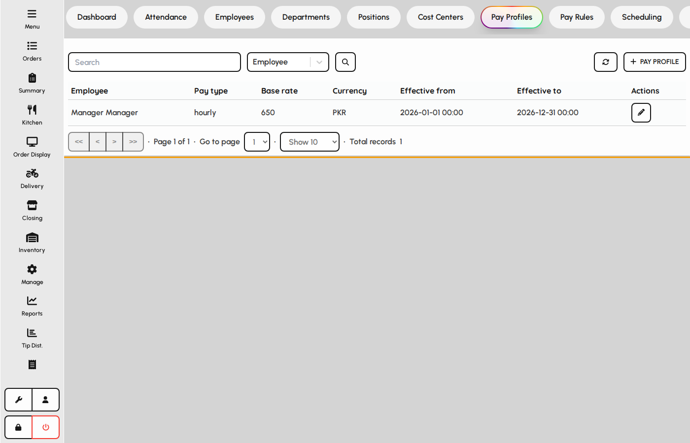
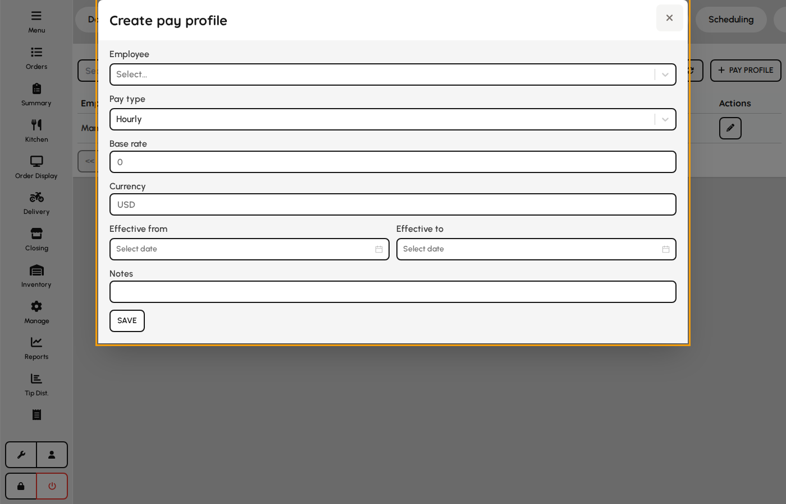
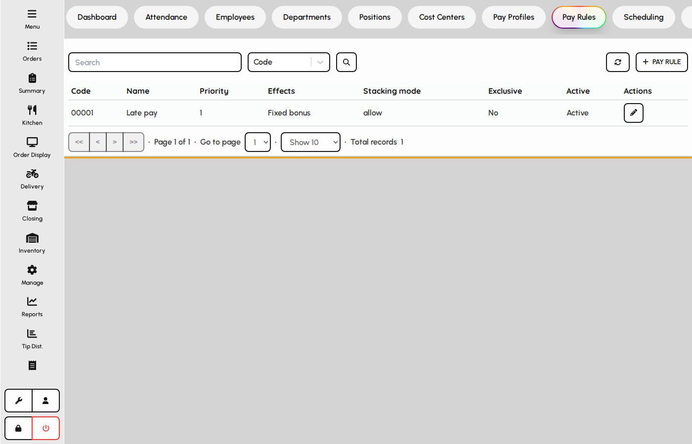
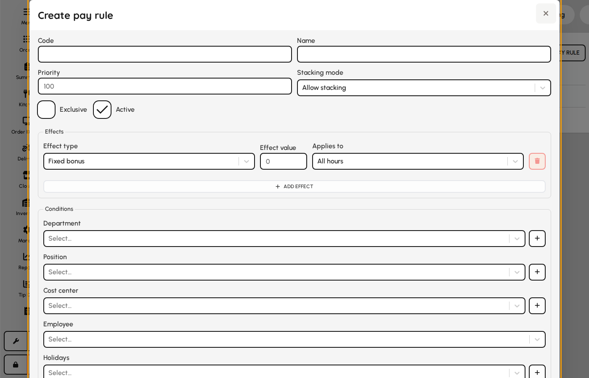

# Pay profiles & rules

Pay profiles store base rates per employee; pay rules apply premiums, bonuses, and deductions by schedule or context.

### Pay profiles

1. Open HR → Pay → Profiles.
2. Maintain effective-dated base pay per employee.
3. Profiles feed payroll calculation for the active period.

*Employee pay profiles list.*

### Pay profile form

1. Add or edit a profile for an employee.
2. Choose pay type and base rate with effective dates.
3. Save — payroll uses the profile valid on each work date.

**Fields**

- **Employee** — Staff member receiving this base compensation.
- **Pay type** — Hourly, salary, contract, commission, or mixed — drives payroll math.
- **Base rate** — Primary rate or salary amount in the chosen currency.
- **Currency** — ISO currency for the rate.
- **Effective from** — First day this profile applies.
- **Effective to** — Optional end date when superseded by a newer profile.

*Pay profile form.*

### Pay rules

1. Open Pay → Rules.
2. Rules stack by priority with modes: allow, prevent, highest wins, or priority.
3. Target employees, departments, holidays, or time windows.

*Labor pay rules list.*

### Pay rule form

Each rule has one or more effects (multiplier, fixed bonus/deduction, percent bonus/deduction) and eligibility filters.

1. Add or edit a rule with code and name.
2. Define effects and whether they apply to regular, overtime, or all hours.
3. Set date, time, weekday, and holiday filters.
4. Assign employees, departments, positions, or cost centers.
5. Save — the payroll engine evaluates rules when clocked hours are calculated.

**Fields**

- **Code** — Unique rule identifier for exports.
- **Name** — Descriptive label in admin lists.
- **Priority** — Order when stacking mode is priority.
- **Stacking mode** — How this rule interacts with other matching rules.
- **Effects** — Multiplier or amount adjustments applied to qualifying hours.
- **Employee / department / position / cost center filters** — Limits which staff the rule can affect.
- **Date and time window** — Optional start/end date and daily time range.
- **Days of week / months** — Restricts rule to selected calendar patterns.
- **Holidays** — Apply only on selected public holidays.
- **After hours (day/week)** — Triggers when daily or weekly hour thresholds are exceeded.

*Pay rule form with effects and filters.*
