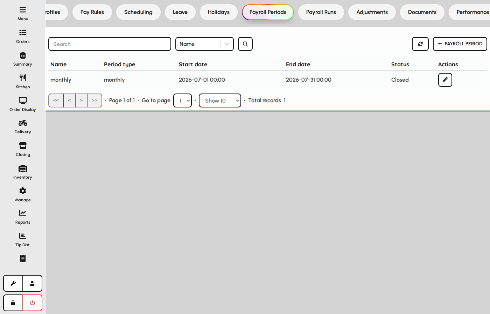
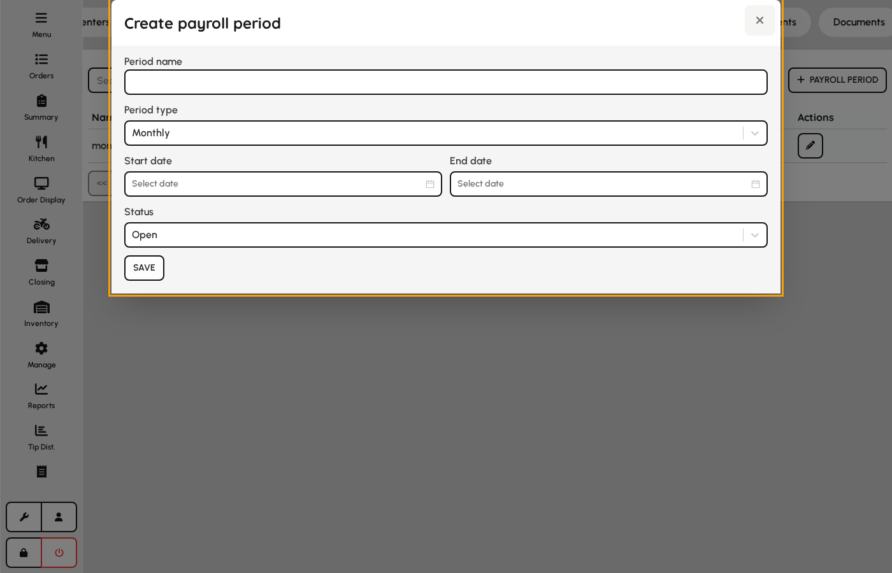
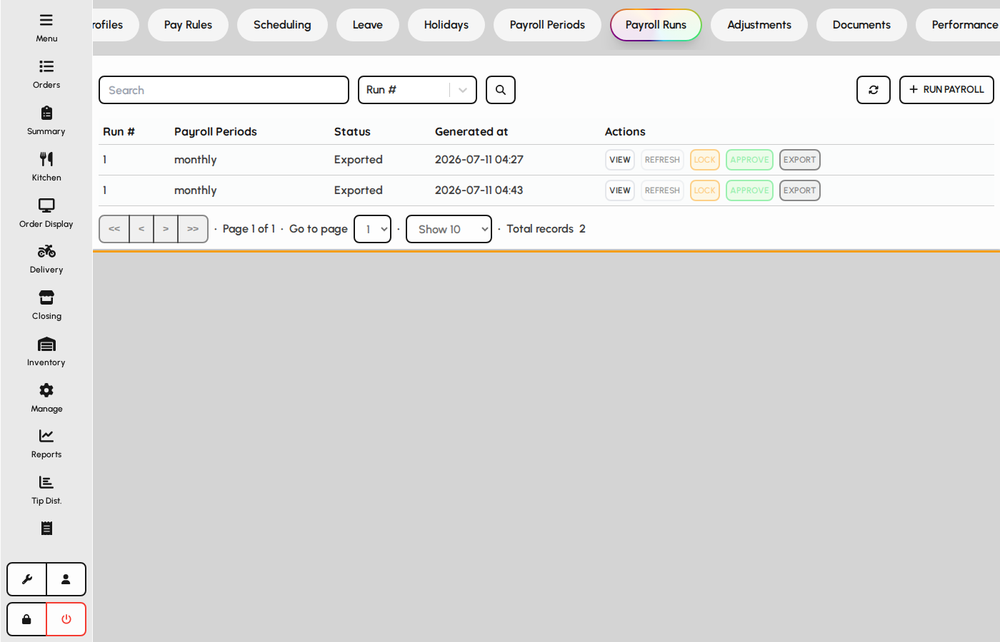
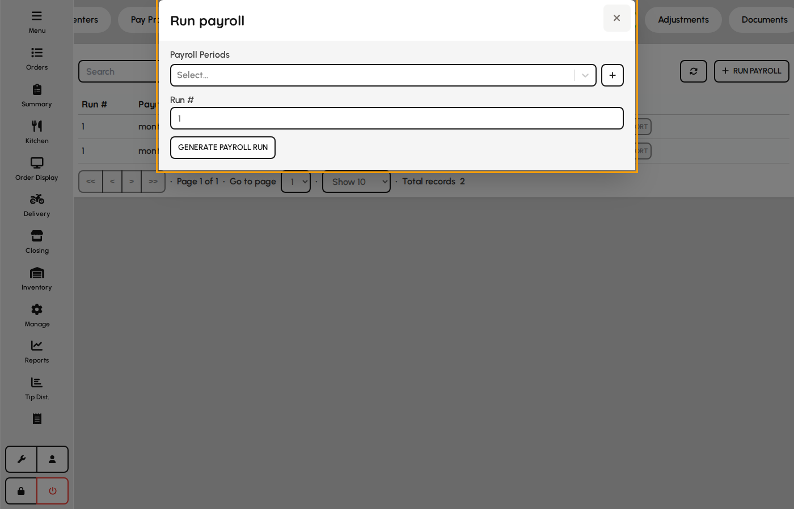
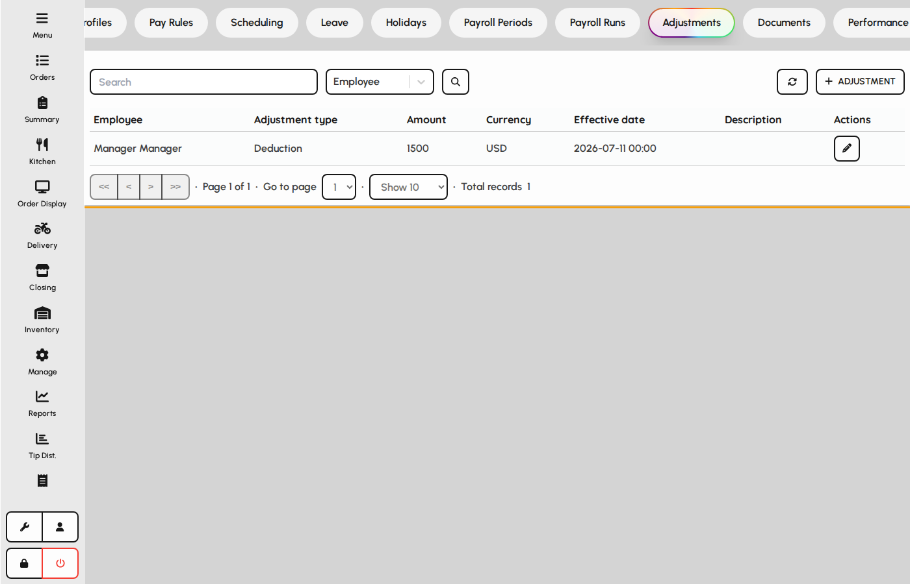
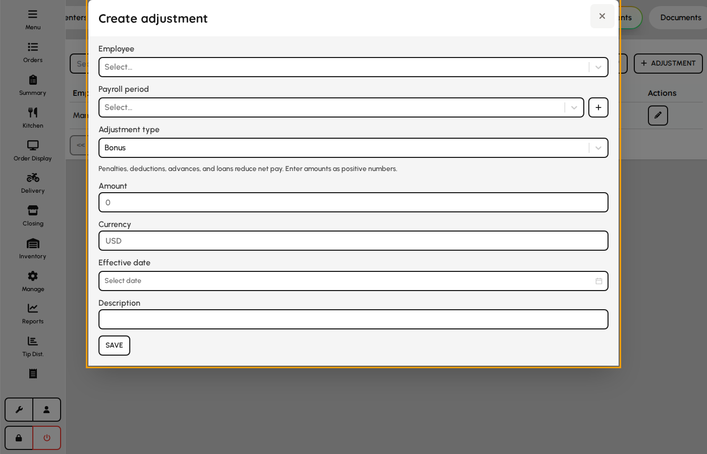

# Payroll periods & runs

Close labor into payroll periods, generate runs with previews, and post adjustments.

### Payroll periods

1. Open HR → Payroll → Periods.
2. Create periods matching your pay cycle (weekly, biweekly, monthly, custom).
3. Lock or close periods before final runs.

*Payroll periods list.*

### Payroll period form

1. Add a period with name, type, and date range.
2. Leave status Open while collecting time and adjustments.
3. Change to Locked/Closed/Paid as the cycle progresses.

**Fields**

- **Period name** — Label shown on runs and payslip exports.
- **Period type** — Weekly, biweekly, monthly, or custom cadence.
- **Start date** — First day included in the period.
- **End date** — Last day included in the period.
- **Status** — Open allows edits; locked/closed restrict changes; paid marks completion.

*Payroll period form.*

### Payroll runs

1. Open Payroll → Runs for an open period.
2. Generate a run to preview gross pay from attendance and rules.
3. Review snapshots before marking the run complete.

*Payroll runs for a period.*

### Generate payroll run

1. Click New run and select an open payroll period.
2. Confirm the auto-suggested run number.
3. Generate preview to calculate lines from time, profiles, and rules.

**Fields**

- **Payroll period** — Date range and status governing which hours and adjustments are included.
- **Run number** — Sequential identifier for multiple previews within the same period.

*New payroll run form.*

### Payroll adjustments

1. Open Payroll → Adjustments.
2. Add bonuses, penalties, allowances, or corrections per employee.
3. Link to a payroll period when the amount should appear on a run.

*Labor adjustments list.*

### Adjustment form

1. Choose employee, type, amount, and effective date.
2. Optionally tie to a payroll period.
3. Save — included on the next run covering that date.

**Fields**

- **Employee** — Staff receiving the adjustment.
- **Payroll period** — Optional link so the amount rolls into a specific run.
- **Type** — Bonus, penalty, allowance, reimbursement, advance, loan, correction, or deduction.
- **Amount** — Currency value added or subtracted from gross pay.
- **Effective date** — Date used to determine which run picks up the adjustment.
- **Description** — Explanation on payslip detail and audit trail.

*Payroll adjustment form.*
