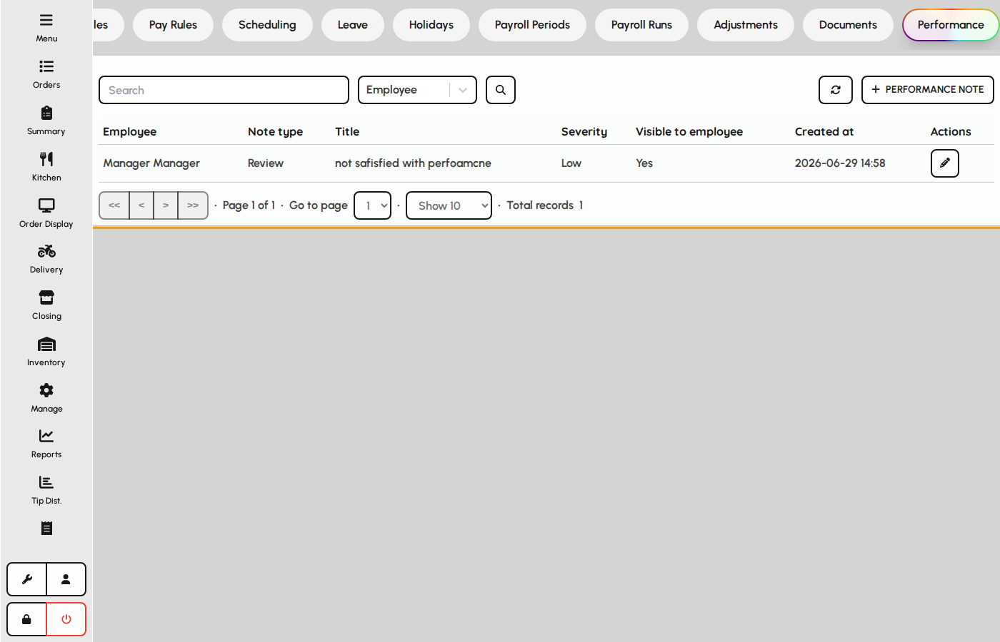
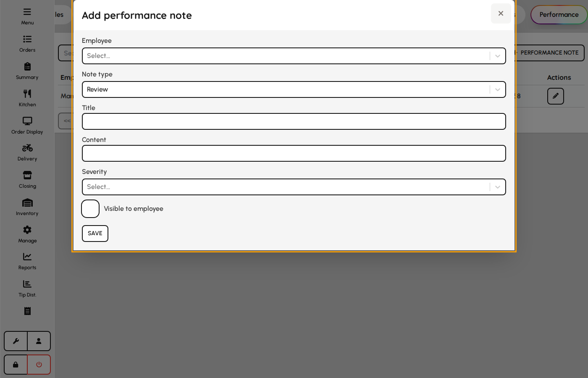

# Performance notes

Record warnings, compliments, reviews, and incidents on employee files.

### Performance list

1. Open HR → Performance.
2. Browse notes by employee, type, and severity.
3. Add entries after incidents or scheduled reviews.

*Performance notes tab.*

### Performance note form

1. Choose employee, type, title, and body text.
2. Set severity for incidents and warnings.
3. Toggle visible to employee if staff may view the note in self-service.
4. Save to append the note to the HR file.

**Fields**

- **Employee** — Subject of the note.
- **Type** — Warning, compliment, review, or incident.
- **Title** — Short summary in lists.
- **Content** — Full narrative of the event or review.
- **Severity** — Low, medium, high, or critical — mainly for warnings and incidents.
- **Visible to employee** — When enabled, the note may be shown to the employee user.

*Performance note form.*
