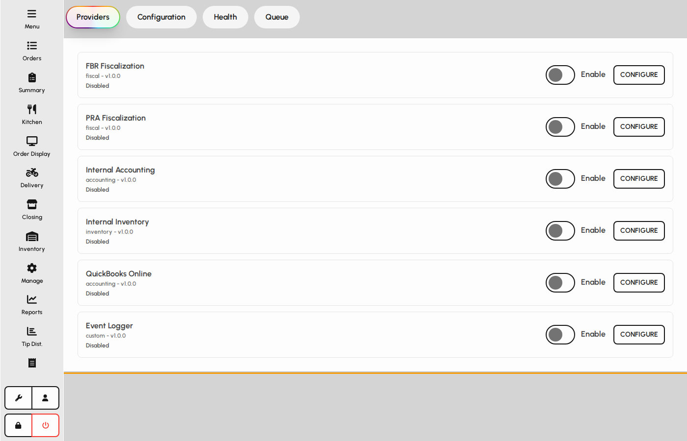
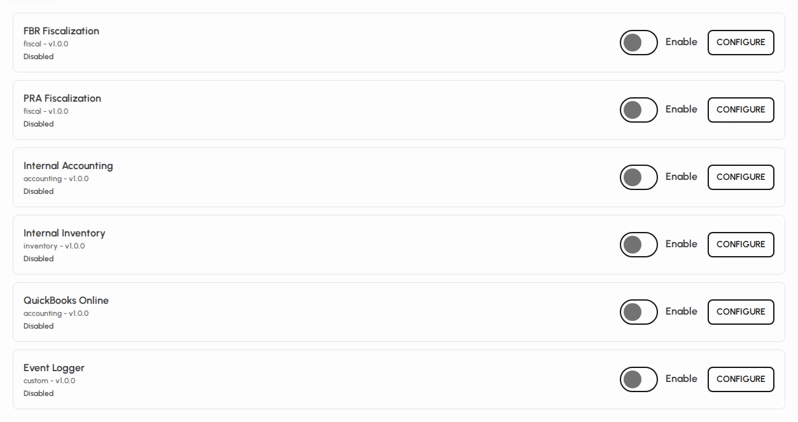
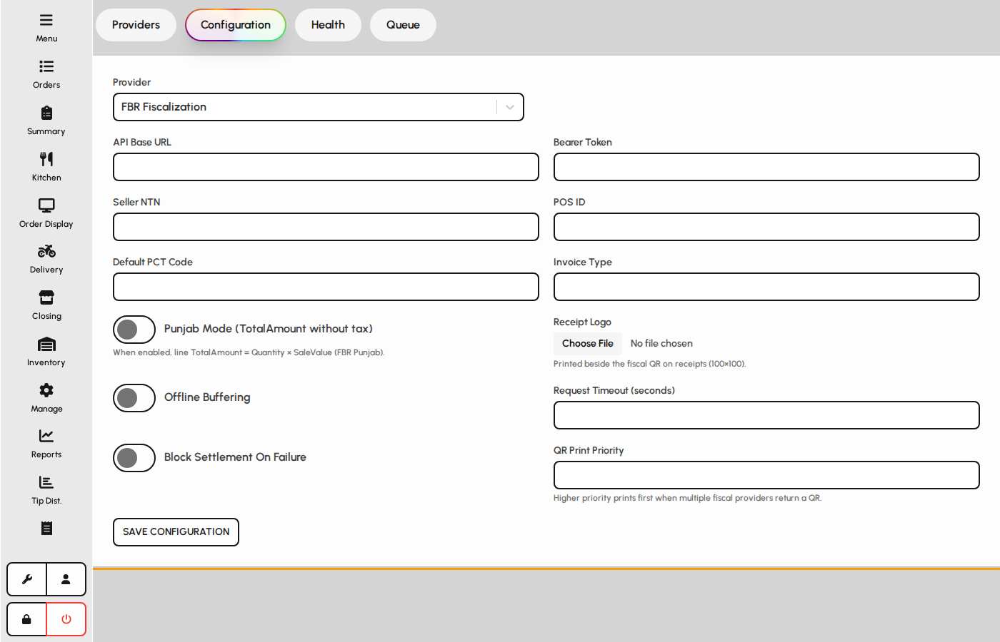
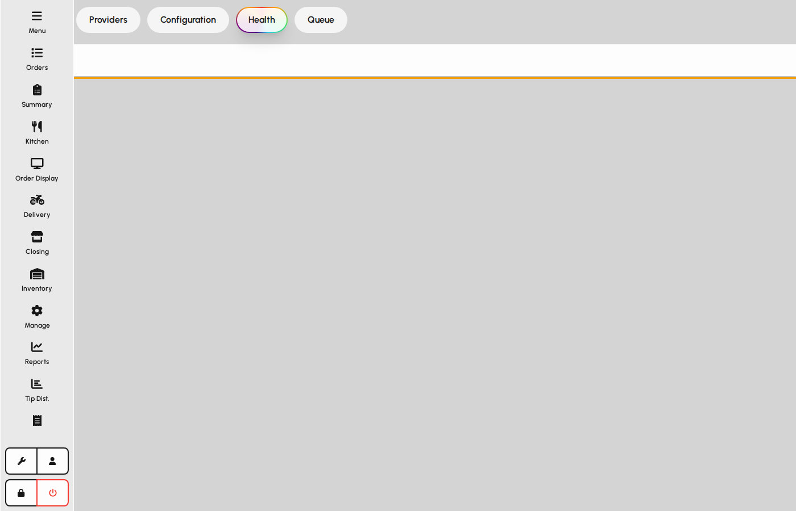
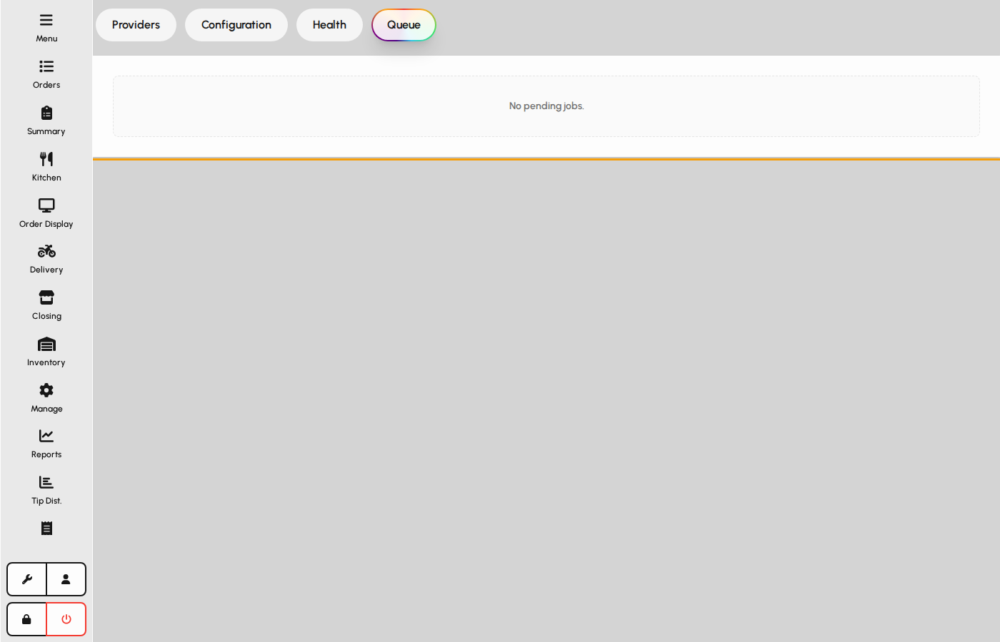

# Integrations

Integrations connect POSR to external accounting, fiscal, logging, and inventory providers. Enable providers, configure credentials, and monitor health and the outbound queue.

### Open Integrations

1. Sign in with a user that has integrations access.
2. Tap Integrations in the sidebar.
3. The screen opens on the Providers tab by default.

*Integrations screen with tabs and providers list.*

### Tab navigation

Tabs cover provider list, configuration, health checks, and the sync queue. Switching tabs may require manager PIN approval.

1. Providers lists available connectors and enable/disable switches.
2. Configuration holds credentials and provider-specific settings.
3. Health and Queue show runtime status and pending jobs.

*Integrations tab bar.*

### Providers

1. Review each provider card: name, category, version, and enabled state.
2. Use the switch to enable or disable a provider (approval may be required).
3. Tap Configure to open that provider on the Configuration tab.

*Providers list with enable switches.*

### Configuration

Configuration stores secrets and mapping options for the selected provider.

1. Select a provider from the dropdown or arrive via Configure.
2. Fill required fields (API keys, company IDs, account mappings, etc.).
3. Connect or run initial sync when the provider supports OAuth or bulk sync.

*Configuration panel for a provider.*

### Health

1. Open the Health tab to see provider status snapshots.
2. Healthy providers can send events; failing ones need configuration or network checks.
3. Refresh happens when you open Integrations or after enable/disable.

*Health status panel.*

### Queue

The queue holds outbound jobs waiting to sync to external systems.

1. Open the Queue tab to inspect pending, retrying, or failed jobs.
2. Jobs update automatically while the tab is open.
3. Failed jobs usually clear after fixing configuration and retrying.

*Integration queue panel.*
