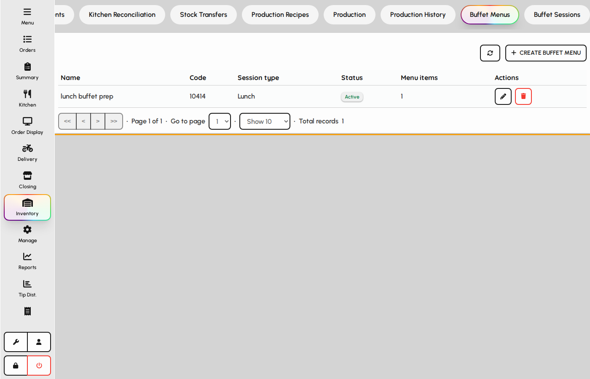
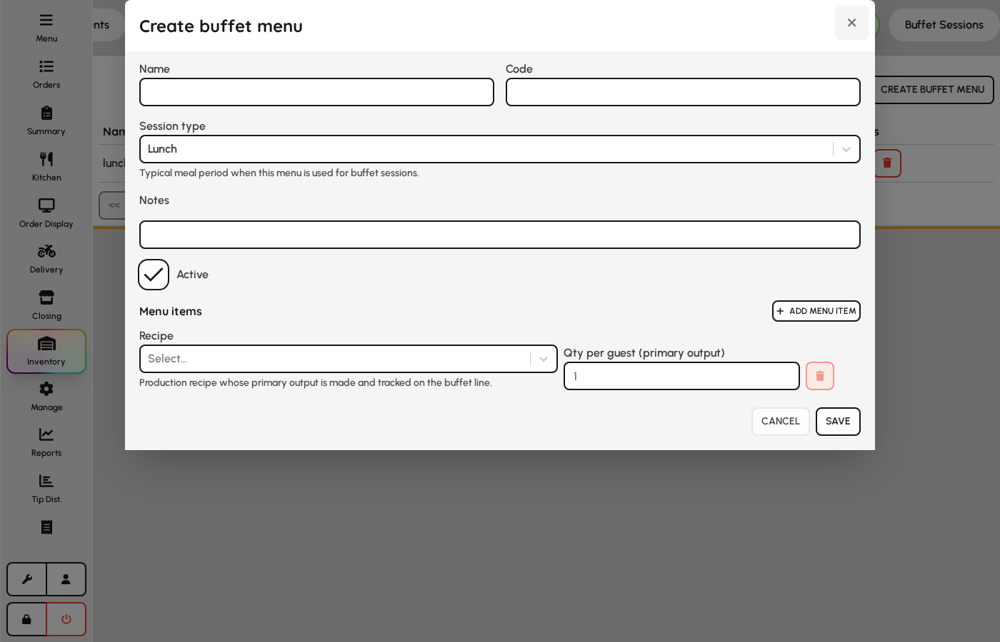
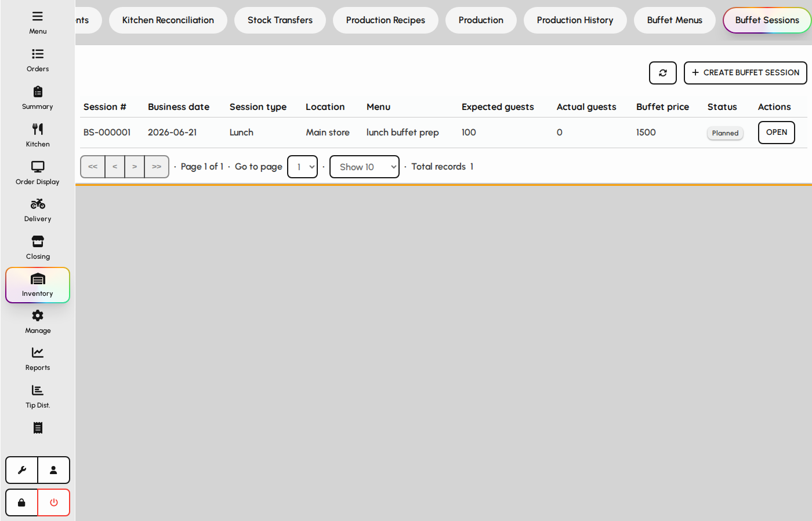
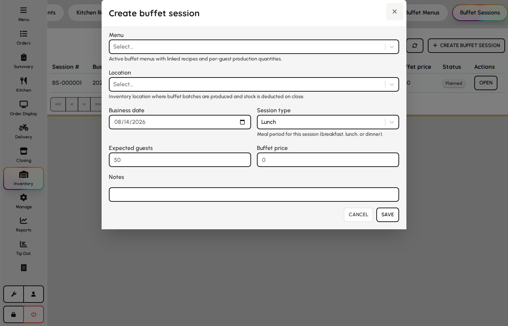

# Buffet menus & sessions

Plan per-guest recipes for buffet service and run sessions that forecast usage, track guests, and close with waste and cost.

### Buffet menus

1. Open Inventory → Buffet → Menus.
2. Maintain menu templates tied to breakfast, lunch, or dinner.
3. Each menu lists recipes with per-guest quantities.

*Buffet menus list.*

### Buffet menu form

1. Add or edit a buffet menu.
2. Set session type and add recipe lines with per-guest qty.
3. Save active menus for use when opening sessions.

**Fields**

- **Name** — Menu label shown when starting a session.
- **Code** — Optional kitchen shorthand.
- **Session type** — Breakfast, lunch, or dinner — filters compatible sessions.
- **Recipe lines** — Each line links a recipe and quantity expected per guest.
- **Is active** — Only active menus appear in session setup.

*Buffet menu form.*

### Buffet sessions

1. Open Buffet → Sessions.
2. Start a session from a menu with expected guests and price.
3. Monitor production vs. forecast during service.
4. Close the session to record waste, leftovers, and final cost.

*Buffet sessions dashboard.*

### Start buffet session

1. Click New session.
2. Pick menu, location, business date, and session type.
3. Enter expected guests and buffet price per guest.
4. Save to open the live session dashboard.

**Fields**

- **Menu** — Loads recipe lines and per-guest forecasts.
- **Location** — Kitchen store receiving inventory movements.
- **Business date** — Trading day attributed to the session.
- **Session type** — Must align with the selected menu service period.
- **Expected guests** — Drives initial quantity forecasts for each recipe.
- **Buffet price** — Revenue per guest used in session reporting.

*New buffet session form.*
