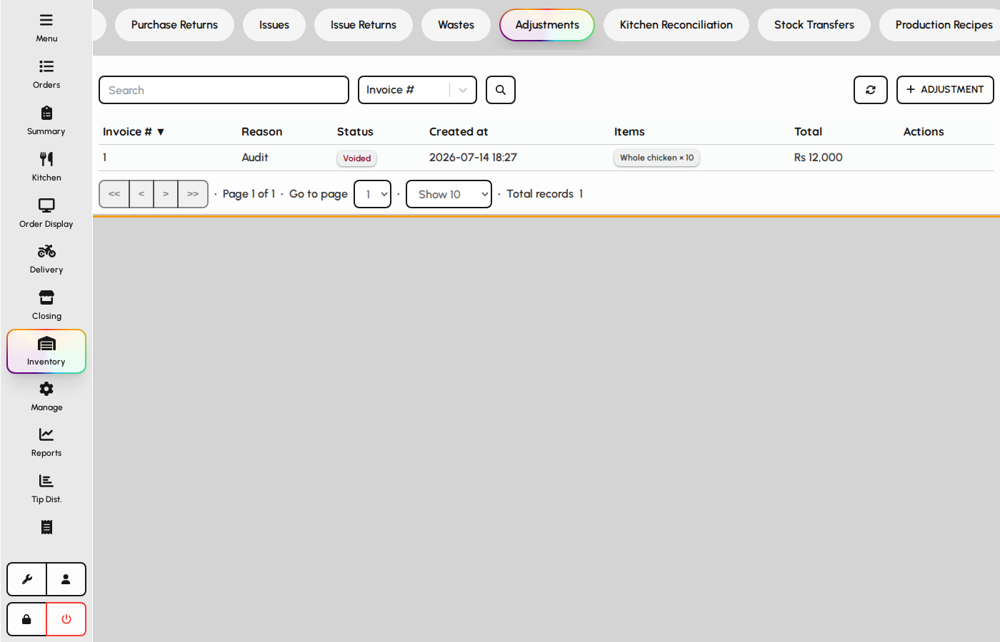
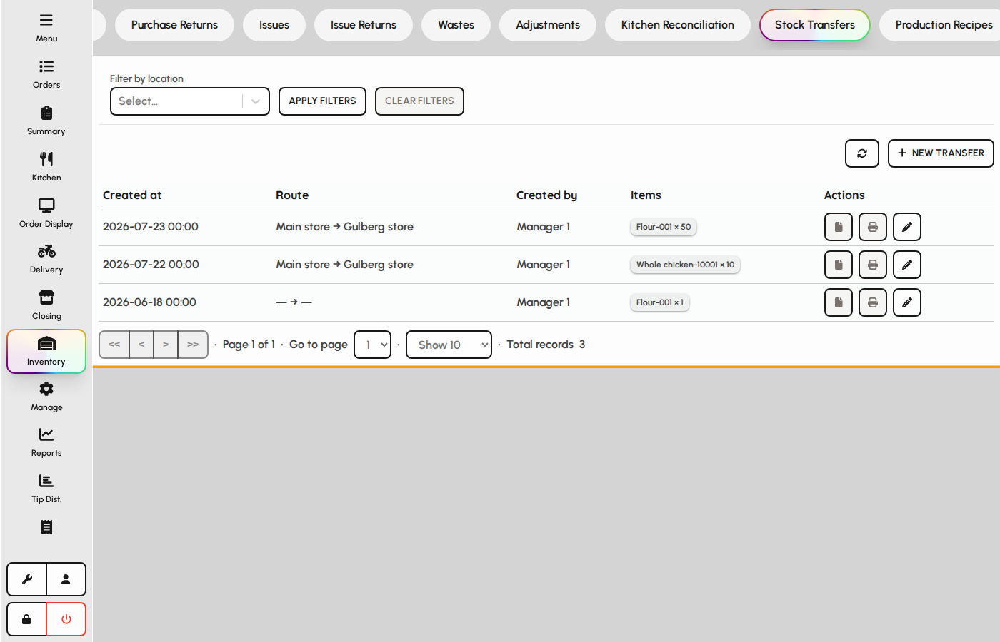

# Stock counts and transfers

Reconcile physical counts with system stock using adjustments, and move stock between locations with transfers.

### Adjustments (counts)

1. Open the Adjustments tab.
2. Enter counted quantities by item and location.
3. Submit, approve, and post according to your role so variances update inventory.

*Adjustments (stock count) list.*

### Stock transfers

Move stock from one location to another without changing total company quantity.

1. Open the Stock Transfers tab.
2. Choose source and destination locations and transfer lines.
3. Save to decrease source and increase destination quantities.

*Stock transfers tab.*
