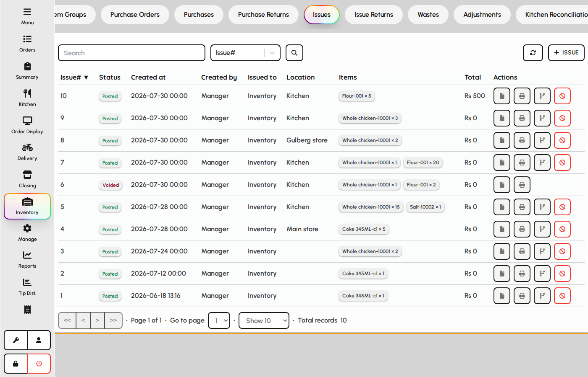
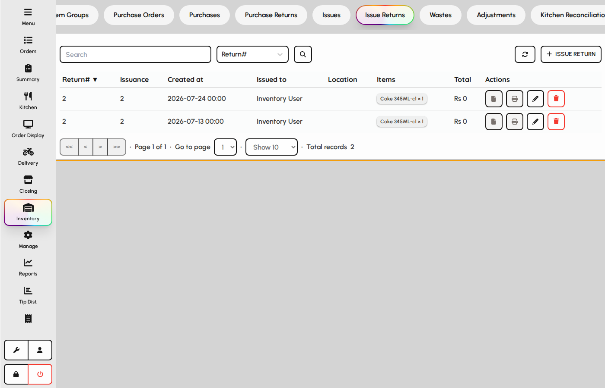

# Issues and returns

Issue stock from storage to kitchens or cost centers, and return unused stock back to inventory.

### Issues

1. Open the Issues tab.
2. Create an issue document with destination (kitchen or department) and lines.
3. Saving removes quantity from the source location.

*Issues list.*

### Issue returns

Return unused issued items so stock is available again.

1. Open the Issue Returns tab.
2. Select the original issue or enter return lines.
3. Saving adds quantity back to the inventory location.

*Issue returns tab.*
