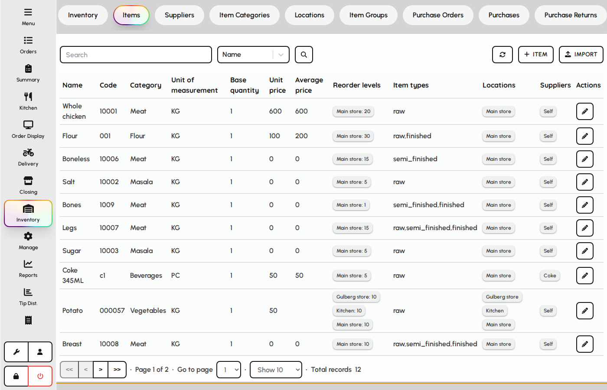
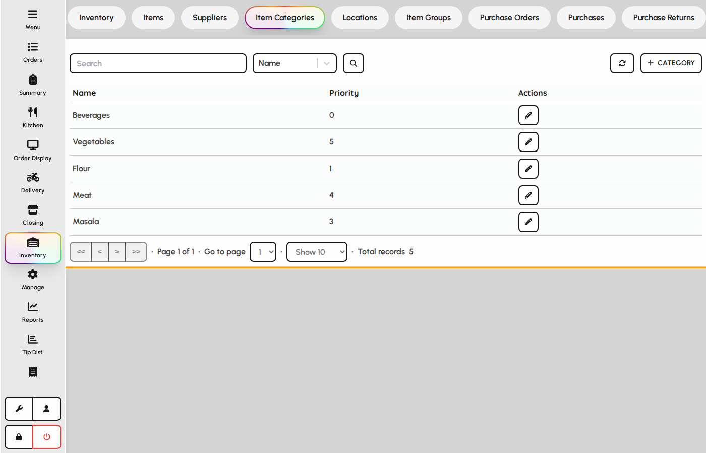
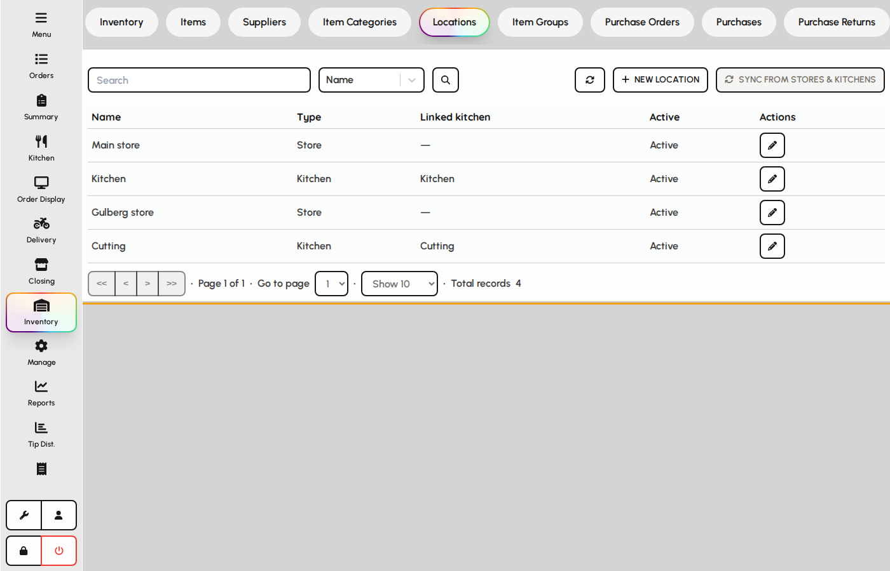

# Items and stock master data

Maintain inventory items, categories, and storage locations that drive stock valuation and documents.

### Items

1. Open the Items tab.
2. Create or edit items with code, unit of measure, reorder levels, and suppliers.
3. Items appear on purchases, issues, recipes, and the current inventory summary.

*Items maintenance table.*

### Item categories

Categories group items for filtering and reporting.

1. Open the Item Categories tab.
2. Add categories that match how the kitchen and warehouse organize stock.
3. Assign categories on each item form.

*Item categories tab.*

### Locations

1. Open the Locations tab.
2. Define stores, fridges, or kitchens where stock is held.
3. Documents (purchases, transfers, issues) always reference a location.

*Locations tab.*
