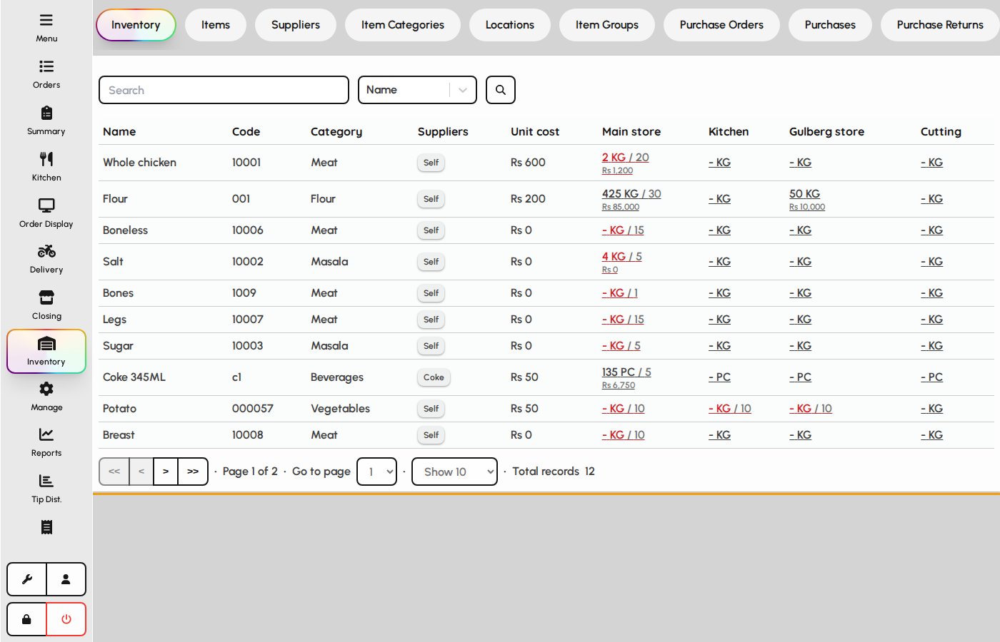
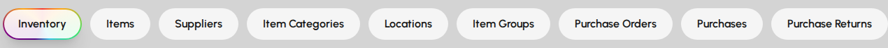
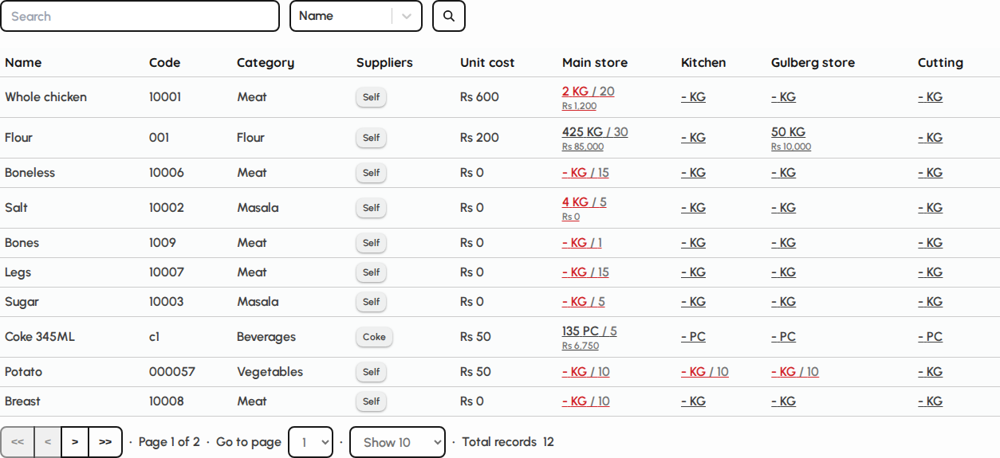

# Inventory overview

Inventory is the warehouse hub for stock levels, items, purchases, issues, wastes, and counts. Open it from the sidebar when your role includes inventory access.

### Open Inventory

1. Sign in with a user that has inventory (warehouse) access.
2. Tap Inventory in the sidebar.
3. The screen opens on the current stock summary tab by default.

*Inventory screen with tab bar and summary panel.*

### Tab navigation

Tabs group master data and stock documents. Switching tabs may require manager PIN approval depending on your role.

1. Scroll the tab bar horizontally when many tabs are visible.
2. Each tab opens its own list or form for that inventory process.
3. The selected tab is highlighted with the primary gradient.

*Inventory tab bar.*

### Current inventory summary

1. The Inventory tab shows on-hand quantities by item and location.
2. Use search and filters to find low-stock or specific items.
3. Other tabs handle purchases, issues, wastes, and adjustments.

*Current inventory summary table.*
