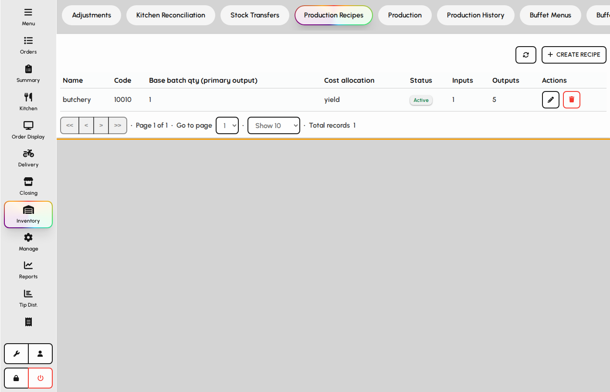
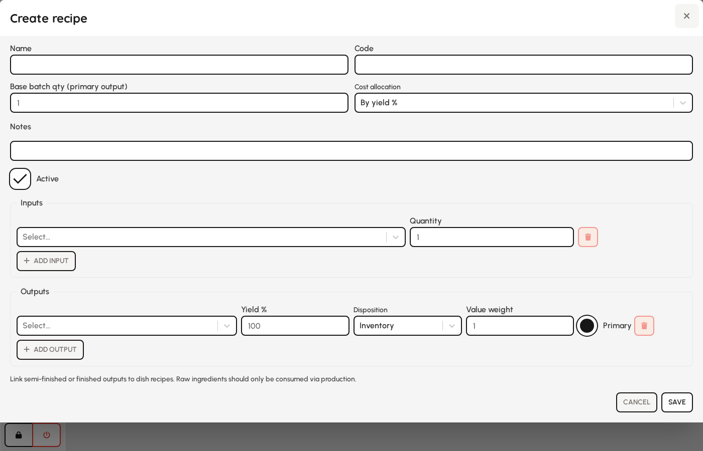
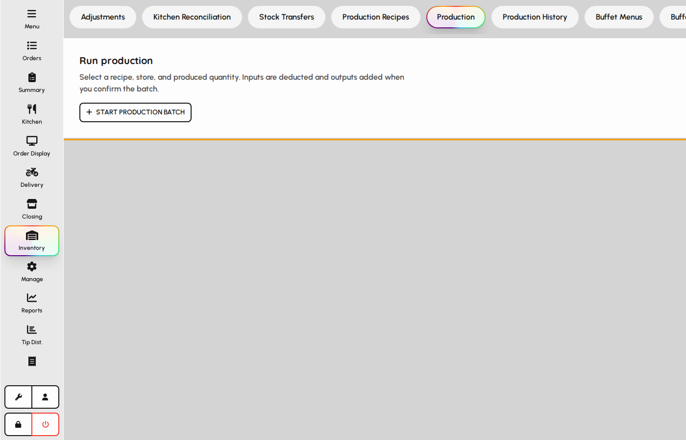
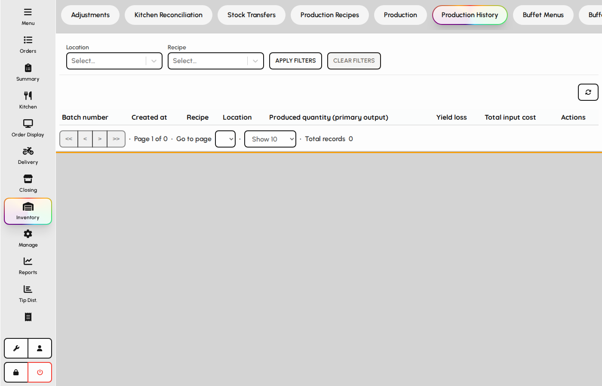

# Recipes & production

Define batch recipes, run production to consume inputs and create outputs, and review production history.

### Recipes list

1. Open Inventory → Recipes.
2. Browse active recipes with batch size and output items.
3. Add or edit recipes that drive kitchen prep and costing.

*Recipes maintenance tab.*

### Recipe form

A recipe defines input items, output yields, and how cost is allocated across outputs.

1. Click Add recipe or edit an existing row.
2. Enter name, code, and base batch quantity.
3. Add input lines with item and quantity.
4. Add output lines with yield percent, disposition, and primary flag.
5. Save to use the recipe in production batches.

**Fields**

- **Name** — Display name shown in production and reports.
- **Code** — Optional short code for kitchen reference.
- **Base batch qty** — Standard batch size used to scale ingredient quantities.
- **Cost allocation** — Method for spreading input cost across multiple outputs.
- **Input items** — Inventory items and quantities consumed per batch.
- **Output items** — Items produced, with yield % and which output is primary.
- **Is active** — Inactive recipes are hidden from new production runs.

*Recipe form with inputs and outputs.*

### Production runs

1. Open the Production tab.
2. Start a new batch from an active recipe.
3. Preview scaled ingredients, then complete to post inventory movements.

*Production tab with batch list.*

### Production batch form

Completing a batch deducts inputs and adds outputs at the chosen location.

1. Click New production.
2. Select recipe, location, and produced quantity.
3. Review the preview of scaled inputs and outputs.
4. Optionally update item cost from the batch.
5. Complete to post the batch and write production history.

**Fields**

- **Recipe** — Determines ingredients and outputs for the batch.
- **Location** — Store where stock is consumed and produced.
- **Produced qty** — Scales the recipe from base batch size to this quantity.
- **Batch number** — Optional reference printed on labels or history.
- **Update item cost** — When checked, recalculates output item cost from batch totals.
- **Notes** — Free-text note stored on the production record.

*Production batch form with preview.*

### Production history

1. Open Production history to audit completed batches.
2. Filter by date, recipe, or location.
3. Open a row to view inputs, outputs, and who posted the batch.

*Production history list.*
