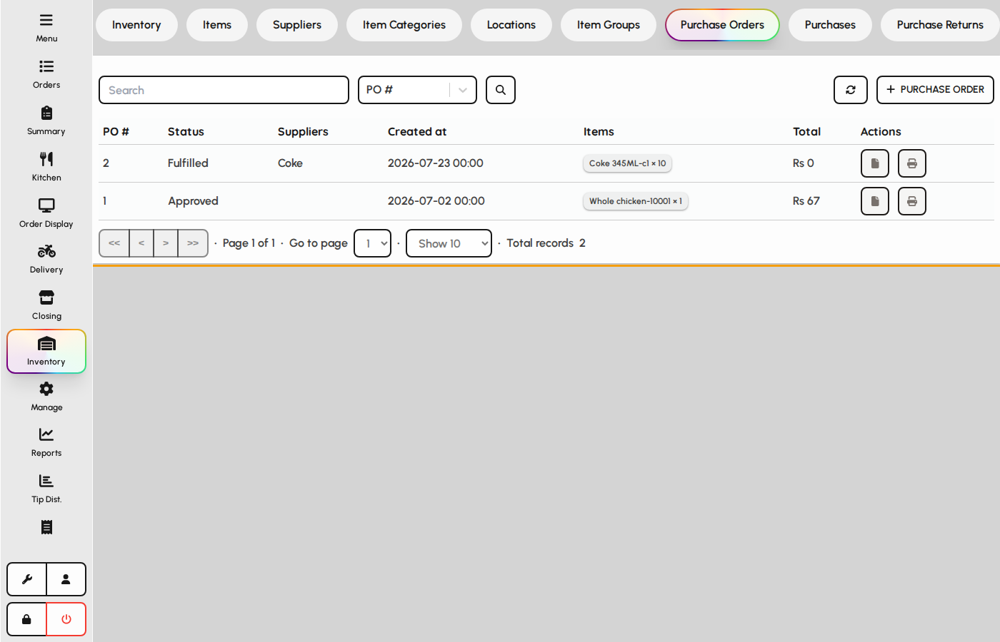
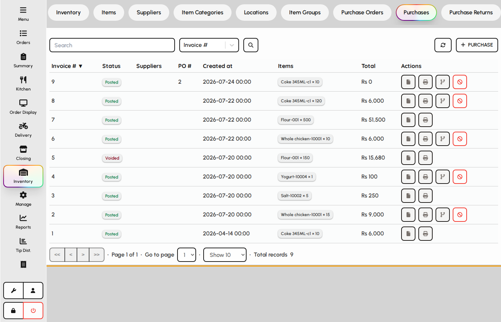
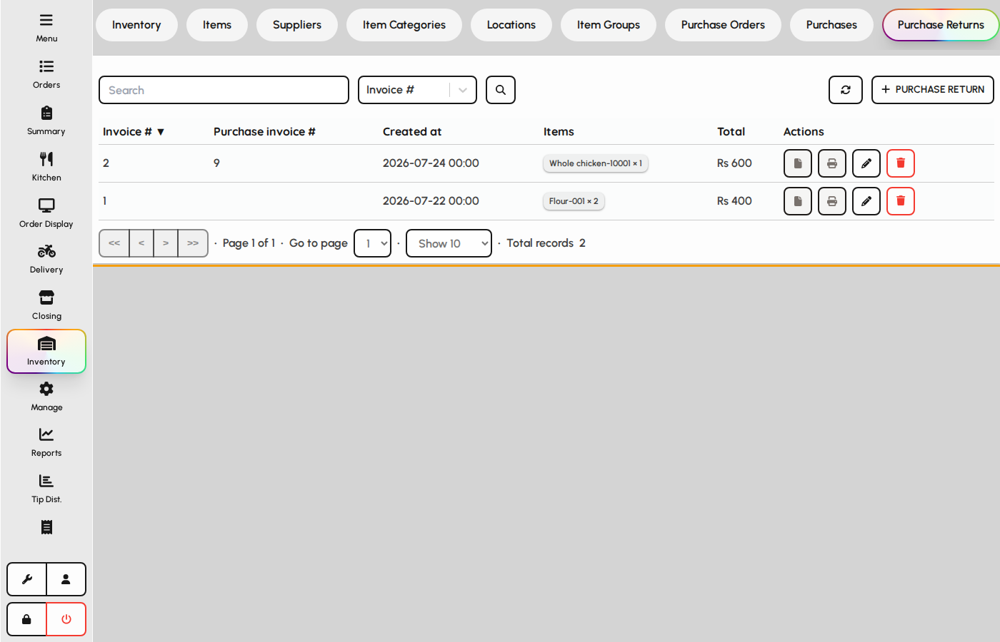

# Purchases

Bring stock in with purchase orders, receiving documents, and purchase returns to suppliers.

### Purchase orders

1. Open the Purchase Orders tab.
2. Create a PO against a supplier with expected lines and quantities.
3. Submit and approve according to your role before receiving goods.

*Purchase orders list.*

### Purchases (receiving)

Purchases post stock into a location and update average cost.

1. Open the Purchases tab.
2. Record the supplier invoice and received lines.
3. Link to a purchase order when one exists, then save to update inventory.

*Purchases list.*

### Purchase returns

1. Open the Purchase Returns tab.
2. Return damaged or incorrect goods to the supplier.
3. Saving a return reduces on-hand quantity at the location.

*Purchase returns tab.*
