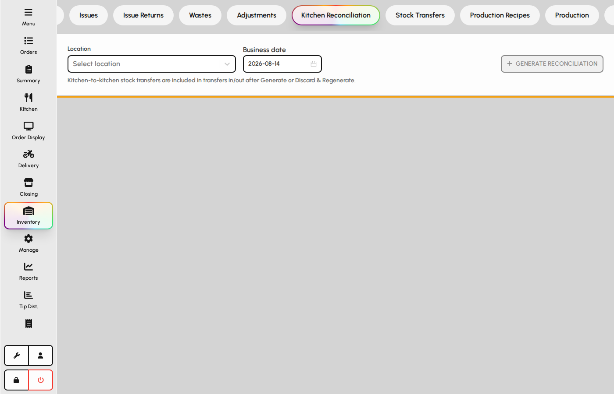

# Kitchen reconciliation

Compare theoretical kitchen usage (from sales and recipes) with physical counts by location and business date. Draft, verify, and lock reconciliations for inventory accuracy.

### Reconciliation tab

Generate a reconciliation grid from POS sales and recipe depletion, then enter or import actual counts.

1. Open Inventory and the Kitchen reconciliation tab.
2. Select inventory location and business date.
3. Click Generate to build theoretical usage lines.
4. Enter actual quantities in the grid or import a CSV.
5. Save draft, review variances, then Verify (manager PIN when required).

**Fields**

- **Location** — Kitchen or prep store whose stock is being reconciled.
- **Business date** — Trading day the theoretical usage and counts apply to.
- **Generate** — Creates or refreshes reconciliation lines from sales and recipes.
- **Actual quantity** — Physical count entered per item; drives variance vs. theoretical.
- **Verify** — Locks the reconciliation after manager approval; prevents casual edits.

*Kitchen reconciliation toolbar, grid, and variance panel.*

### Manual count entry

Inline grid editing and CSV import share the same line structure.

1. Click a cell in the Actual column to type a count.
2. Use Save draft to persist without verifying.
3. Open CSV import to bulk-load counts from a spreadsheet template.
4. Review the variance panel for outliers before verifying.

**Fields**

- **Item** — Inventory item on the reconciliation line.
- **Theoretical** — System-calculated usage from recipes and sales.
- **Actual** — Counted on-hand or usage quantity you enter.
- **Variance** — Difference between actual and theoretical; highlights shrink or data issues.
- **Notes** — Optional explanation stored on the line for audit.

*Reconciliation grid with actual quantity editing.*
