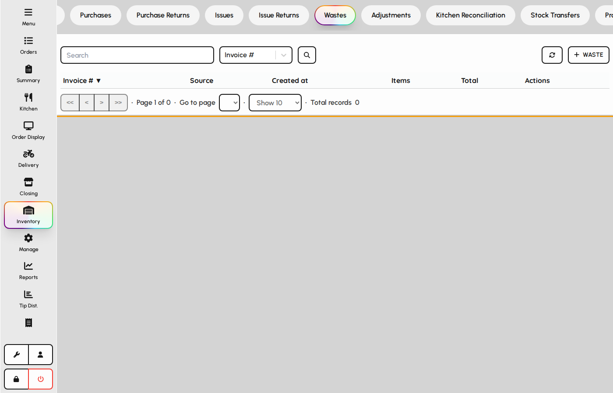

# Wastes

Record spoilage, breakage, and other losses so inventory and cost reports stay accurate.

### Waste documents

1. Open the Wastes tab.
2. Create a waste document with location, reason, and item quantities.
3. Saving reduces on-hand stock and posts waste cost for reporting.

*Wastes list.*
