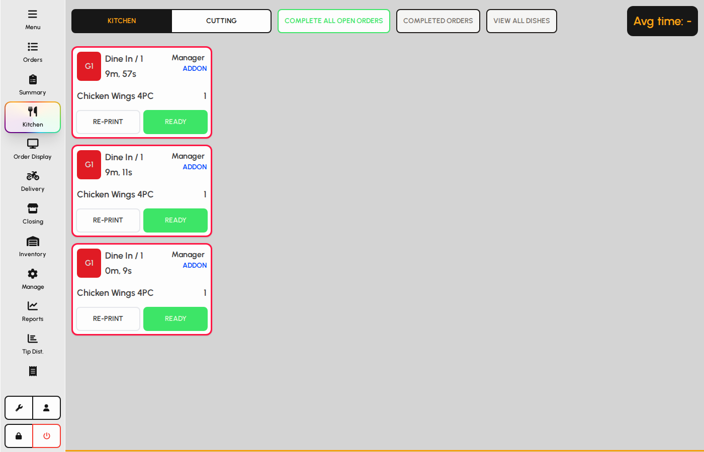
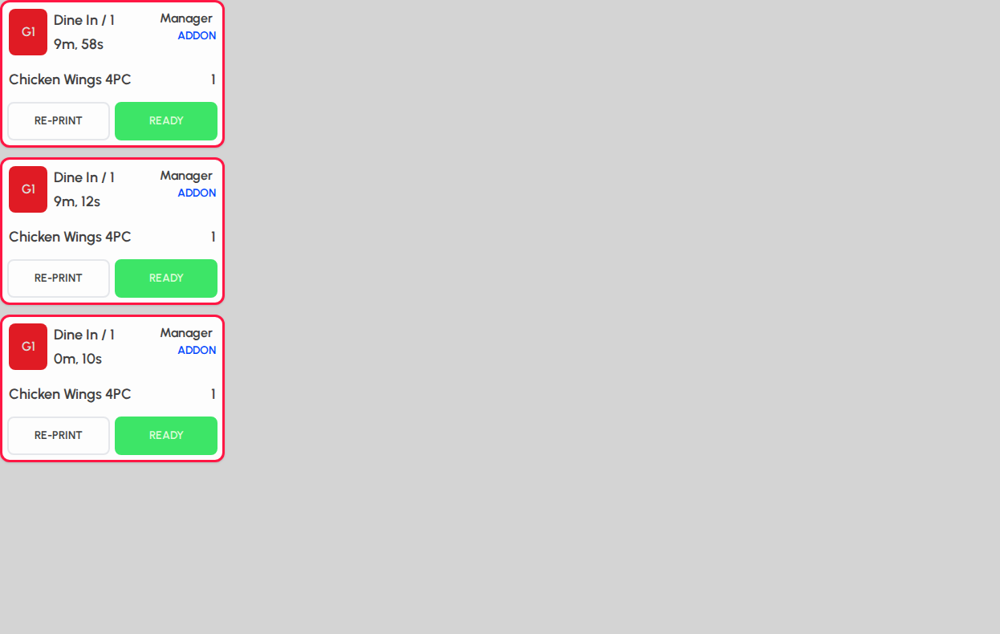

# Kitchen

The Kitchen board shows live tickets per kitchen station. Staff bump items through workflow stages and recall completed batches when needed.

### Kitchen board overview

1. Tap Kitchen in the sidebar.
2. Select a kitchen station at the top if you have more than one.
3. Tickets appear in columns as orders are sent To kitchen from the floor.

*Kitchen screen with station selector and board.*

### Toolbar actions

1. Complete all open marks every active ticket on this station as done.
2. Completed orders opens a list of finished batches with Recall.
3. View all dishes shows a running count of each dish still on the board.
4. Average time shows prep duration for completed items today.

*Kitchen toolbar and average prep time.*

### Ticket board

Each card is part of an order. Multi-part orders may use colored borders. Tap stages on a ticket to advance workflow.

1. Read table or order type, invoice number, and dish lines on each ticket.
2. Tap a stage button to complete that kitchen step for the line items.
3. Large orders may split across multiple cards on the board.

*Kitchen ticket board with order cards.*

> Send at least one order To kitchen before capture so tickets appear on the board.
