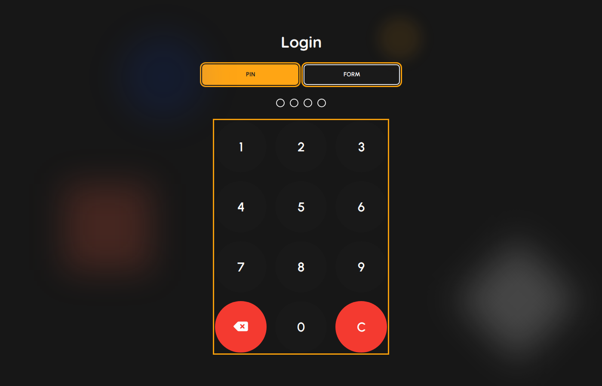
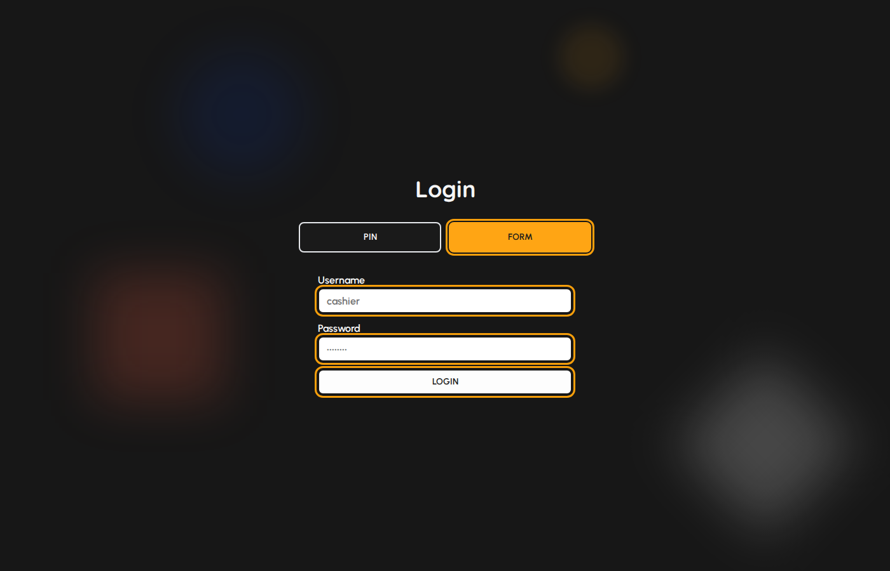

# Login

Open POSR in your browser. The login screen is the first screen you see when you are not signed in or when the terminal is locked.

### Choose a login method

You can sign in with a PIN pad or with a username and password form. Use the method your manager assigned to your user account.

1. On the login screen, choose Pin or Form at the top.
2. Pin is best for terminals that staff share on the floor.
3. Form is best when each person has a unique username and password.

*Login screen with Pin selected (method toggle and PIN pad highlighted).*

### Sign in with PIN

1. Select Pin.
2. Enter your 4-digit PIN using the on-screen keypad.
3. The system signs you in automatically when the fourth digit is entered.
4. Use the backspace key to correct a digit or C to clear the PIN.
5. If a Clock in required dialog appears, tap Clock in to start your shift on this device.

*Pin and Form method buttons.*

> Demo environments often use PINs such as 1234, 0000, or 5555 (super admin). Your live PIN is set by your manager.

### Sign in with username and password

1. Select Form.
2. Enter your username in the Username field.
3. Enter your password in the Password field.
4. Tap Login.
5. If prompted, complete Clock in to continue to the menu.

*Form login with username, password, and Login highlighted.*

### After a successful login

1. You land on the Menu unless you were redirected from another page.
2. Use the sidebar to open modules you have permission for.
3. Use Lock when stepping away so another person must sign in as the same user unlock path allows.
