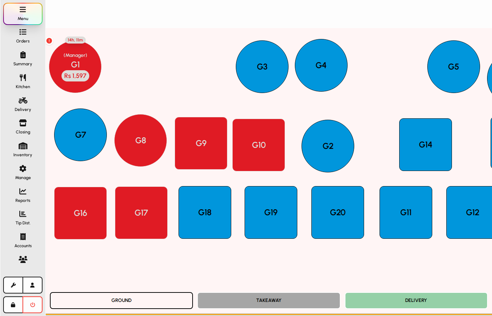
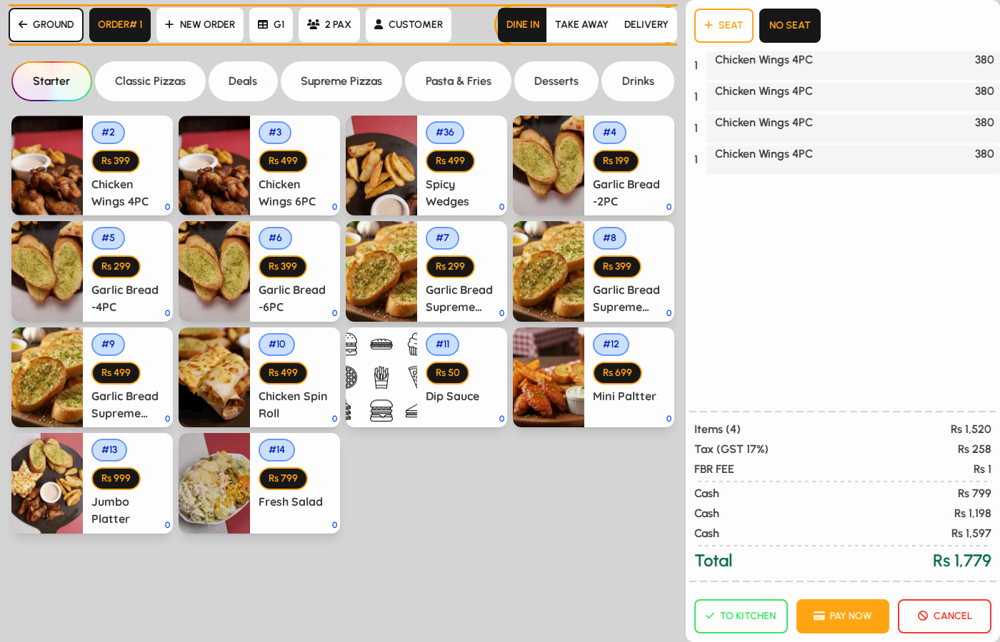
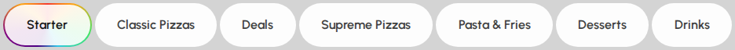
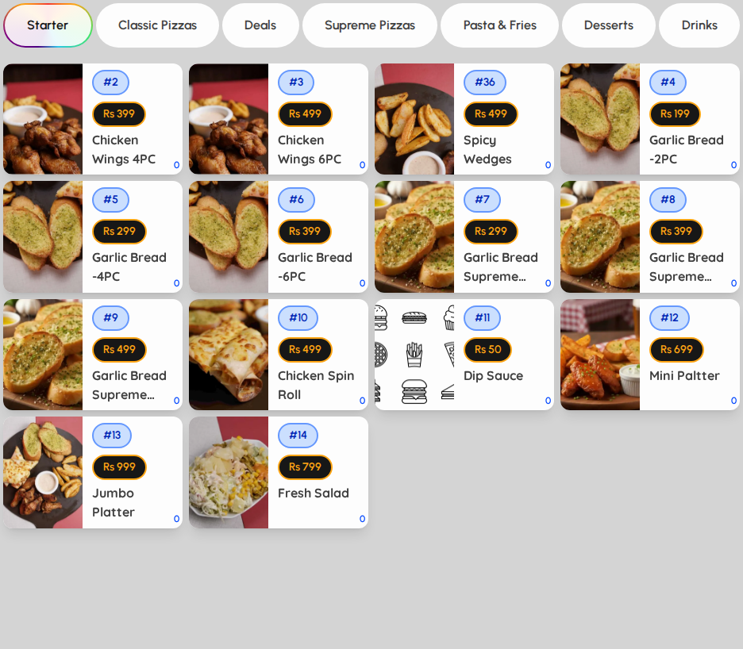
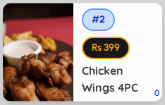

# Menu and order taking

Use Menu to seat guests on the floor plan, enter covers when asked, choose an order type, browse categories and dishes, and add items to the cart.

### Open a table from the floor plan

When table selection is enabled on this device, Menu opens on the floor plan first. Do not start an order without selecting a table unless your manager set up tableless mode.

1. From the left sidebar after login, open Menu (or land on it after sign-in).
2. Select a floor at the bottom if the venue has more than one floor.
3. Tap an available table on the floor plan to start or continue an order.

*Floor plan with tables.*

### Enter covers (party size)

Some tables ask for the number of guests before the menu appears.

1. Use the number pad to enter the party size.
2. Tap OK to continue to the dish menu.
3. Tap C if you need to clear and re-enter the number.

> _Screenshot pending: `menu-covers.png` (run `DOCS_GUIDE_LANG=en npm run docs:guide:capture`)_

### Menu ordering layout

The ordering screen shows a menu header and dishes on the left, and the cart on the right. The selected table appears in the header.

1. Use the header for table, covers, customer, and order type.
2. Choose categories, then tap dishes to add them.
3. Watch the cart fill on the right before kitchen or payment.

*Menu header and order types (highlighted).*

### Choose an order type

1. On the right side of the header, select Dine-in, Takeaway, Delivery, or other configured types.
2. The active order type applies to kitchen routing and pricing rules when configured.

*Order type buttons in the header.*

### Browse categories

1. Tap a category pill above the dish grid.
2. The dish grid updates to show items in that category.

*Category row.*

### Add a dish

1. Tap a dish tile to add it to the cart.
2. If the dish has required modifiers, complete the modifier dialog, then confirm.
3. Repeat for other items. Use Clear in the header only if you need to drop new (unsaved) lines.

*Dish grid with items.*

> Some devices enable dish number search from Settings → Items visibility.

### Dish tile

1. Each tile shows name, price, and optional dish number.
2. A badge may show how many of that dish are already in the current cart.

*Single dish tile (highlighted).*
