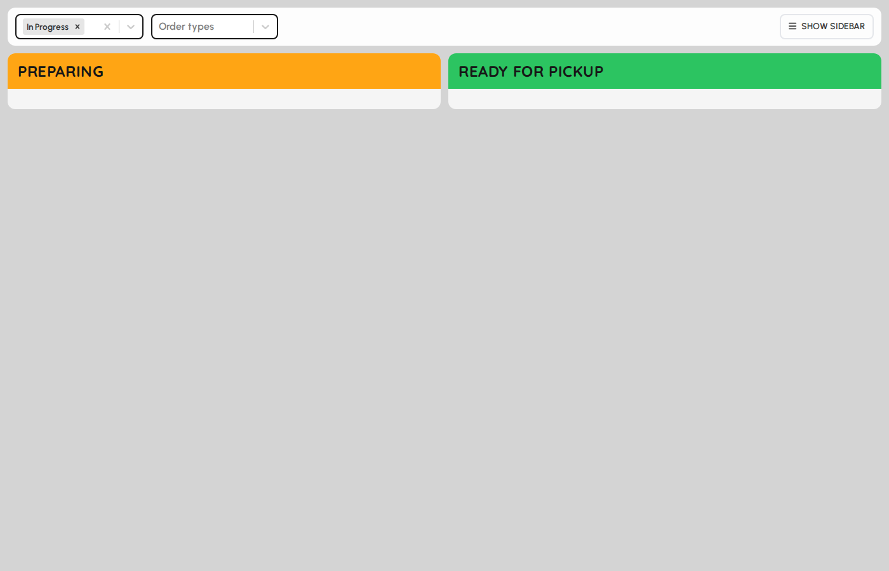
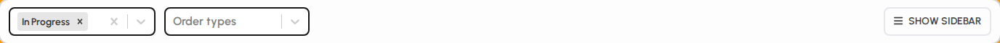

# Order display

Order display is a customer-facing board: orders in progress on one side and ready for pickup on the other. Filters control which statuses and order types appear.

### Order display layout

1. Tap Order display in the sidebar.
2. The top bar holds status and order-type filters.
3. The main area splits into Preparing (left) and Ready for pickup (right).

*Order display with preparing and ready columns.*

### Filters

1. Status filter is multi-select (defaults to In Progress).
2. Order type filter limits which service types appear (dine-in, delivery, etc.).
3. Toggle sidebar shows or hides the left navigation on this screen.

*Status and order-type filters.*

### Preparing and ready tiles

Orders move to Ready when kitchen workflow marks them complete. Ready orders may play a celebration when they first appear.

1. Preparing tiles show orders still being made.
2. Ready tiles show orders waiting for pickup or runner delivery.
3. Each tile shows order number and key header details.

*Preparing and ready order tile grids.*
