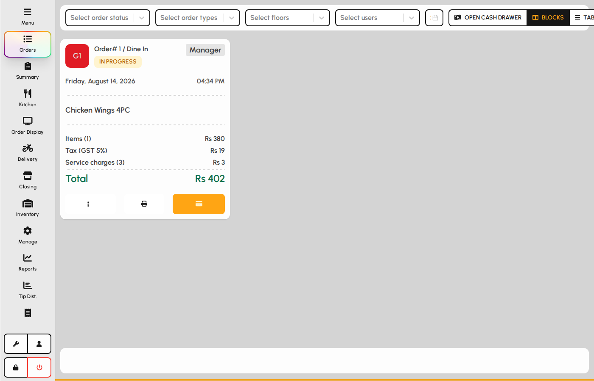
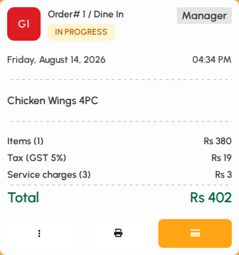
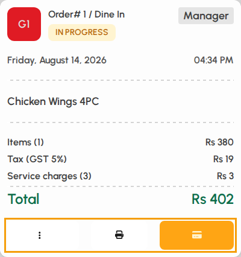
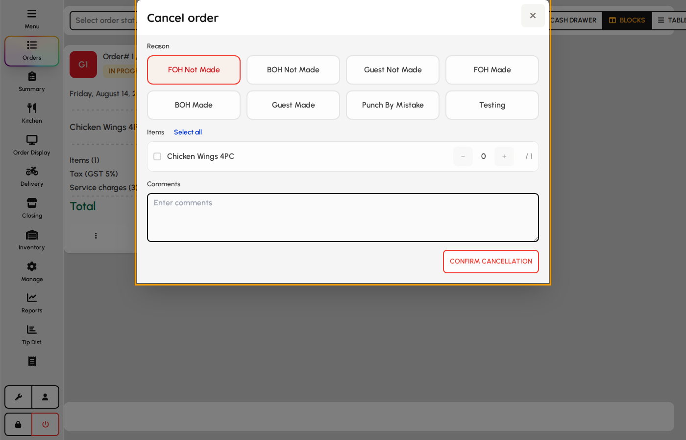
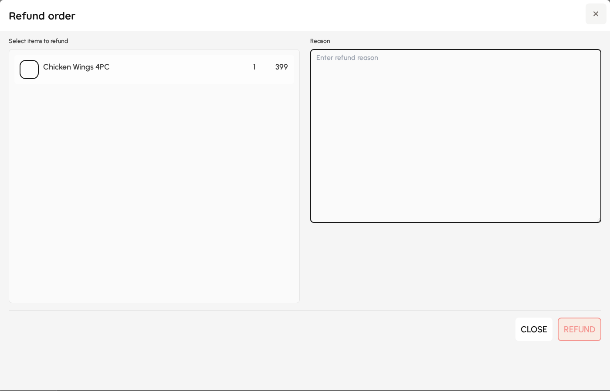
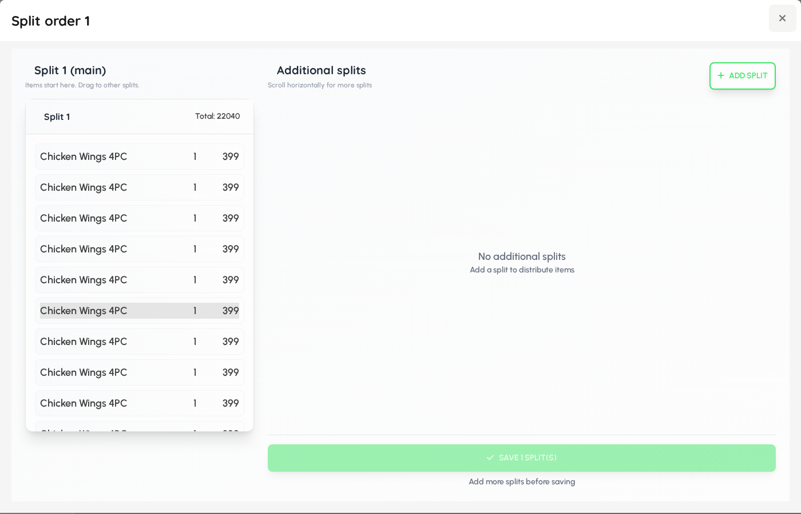
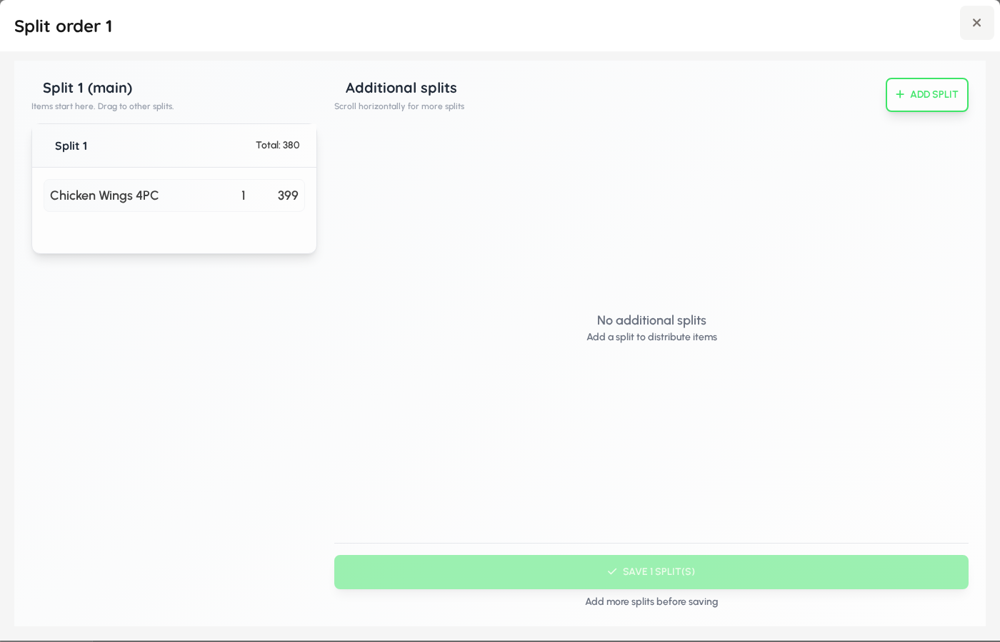
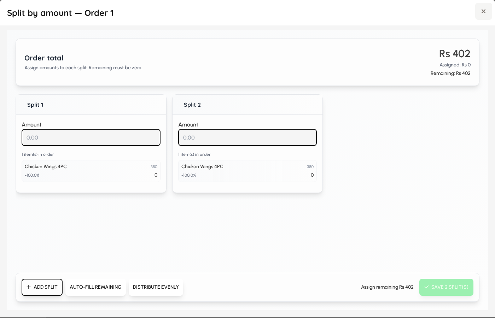
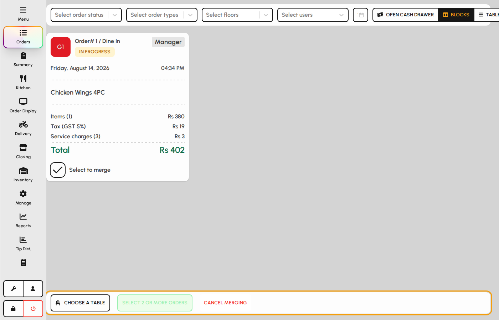

# Orders

The Orders screen lists open and recent checks so you can pay, print, split, merge, cancel, or refund without returning to the floor plan.

### Orders layout

Open Orders from the left sidebar. Filters sit at the top; order cards (or table rows) fill the main area.

1. Tap Orders in the sidebar.
2. Use filters to narrow by status, order type, floor, user, and date.
3. Switch between Blocks and Table views with the toolbar buttons.

*Orders screen with filters and cards.*

### Filters

1. Status: In Progress, Paid, Cancelled, Split, Merged (multi-select).
2. Order type, floor, and user filters limit who and where.
3. The date picker shows paid/historical checks for that day; In Progress still appears when relevant.

*Orders filter bar.*

### Toolbar

1. Open cash drawer pulses the cash drawer when printing and permissions allow it (may require manager PIN).
2. Blocks shows large order cards.
3. Table shows a compact list (tap an In Progress row to pay).

*Cash drawer and view toggles.*

### Order card

Each card shows header, times, line items, totals, and action buttons for In Progress checks.

1. Review invoice number, table, status, server, and items.
2. Temp bill (print) and Pay (card icon) appear for In Progress orders.
3. Use the ⋯ menu for cancel, split, merge, and kitchen print.

*Order card with items and actions.*

### Card actions

1. Temp bill prints a provisional check when allowed.
2. Pay opens the full payment screen for that order.
3. ⋯ opens more actions (see next section).

*Print, Pay, and more on a card.*

### More menu (In Progress)

Protected actions may ask for a manager PIN.

1. Cancel order voids the check through the cancel flow.
2. Split by seats, items, or amount divides one check into multiple.
3. Merge selects this order for multi-table merge (finish with Choose table on the bottom bar).
4. Print KOT copy re-fires kitchen tickets when needed.

*Order more-actions menu.*

### Table view

1. Switch to Table for a dense list of today’s matching orders.
2. Tap an In Progress row to open payment quickly.

*Orders table view.*

### Cancel or void order

Voids an In Progress check. Full void cancels every line; partial void removes selected items only. Manager PIN may be required.

1. Open ⋯ on an In Progress order card and choose Cancel order.
2. Pick a void reason from the list (required for reporting).
3. Leave Select all items checked for a full void, or uncheck and choose specific lines for a partial void.
4. Confirm to void the check and release the table when applicable.

**Fields**

- **Reason** — Required void reason recorded on the order for audit and reporting.
- **Select all items** — When checked, voids the entire check; when unchecked, enables per-line selection.
- **Partial void** — Check individual line items to void only those quantities while keeping the rest of the check open.

*Cancel order modal with reason and item selection.*

### Refund paid order

Issues a refund against a paid check, optionally for selected items only.

1. Open a Paid order and choose Refund from the actions menu.
2. Select the line items and quantities to refund.
3. Choose a refund reason and confirm.
4. The system posts the refund and updates payment totals.

**Fields**

- **Items to refund** — Choose which paid lines and quantities are returned to the customer.
- **Reason** — Documents why the refund was issued for manager review and reports.

*Refund modal with item picker and reason.*

### Split by seats

Divides one check into separate checks by seat number already assigned on line items.

1. From ⋯ choose Split by seats on an In Progress order.
2. Review how items group under each seat.
3. Confirm to create one child check per seat with shared table context.

*Split-by-seats preview before confirming.*

### Split by items

Manually assigns line items to new checks regardless of seat.

1. From ⋯ choose Split by items.
2. Move or assign each line to a new check column.
3. Confirm to create separate In Progress checks from the original.

*Split-by-items assignment grid.*

### Split by amount

Splits the check total into fixed or equal parts for separate payment.

1. From ⋯ choose Split by amount.
2. Enter the number of parts or custom amounts.
3. Confirm to generate child checks each owing a portion of the total.

*Split-by-amount dialog.*

### Merge orders

Combines multiple In Progress checks onto one table. Start from each order card, then finish on the bottom bar.

1. On the first order, open ⋯ and choose Merge (or tick Select on the merge bar).
2. Repeat for each additional order to include.
3. Tap Choose table and pick the destination table.
4. Tap Confirm merge to combine lines into one check.

**Fields**

- **Select orders checkbox** — Marks an order for inclusion in the pending merge set.
- **Choose table** — Sets the floor table that will host the merged check.
- **Confirm merge** — Combines all selected checks into one In Progress order on the chosen table.

*Merge bar with selected orders and table picker.*
