# Payment screen

Pay now opens a full-screen payment layout: order summary and adjustable totals on the left, an editor in the middle for tax/discount/coupon/service charge/tip/notes, and tender tools on the right.

### Payment layout

The screen is arranged in three zones so you can review the check, adjust charges, and collect money without leaving the dialog.

1. Left column: invoice header, line items, tax, discount, coupon, service charge, tip, extras, notes, and grand total.
2. Middle column: editor for the totals row you selected. Changes stay draft until you confirm with OK or Apply (except notes and extras).
3. Right two columns: tendered amount, remaining/change, quick amounts, payment types, keypad, temp bill, Complete, and listed payments.

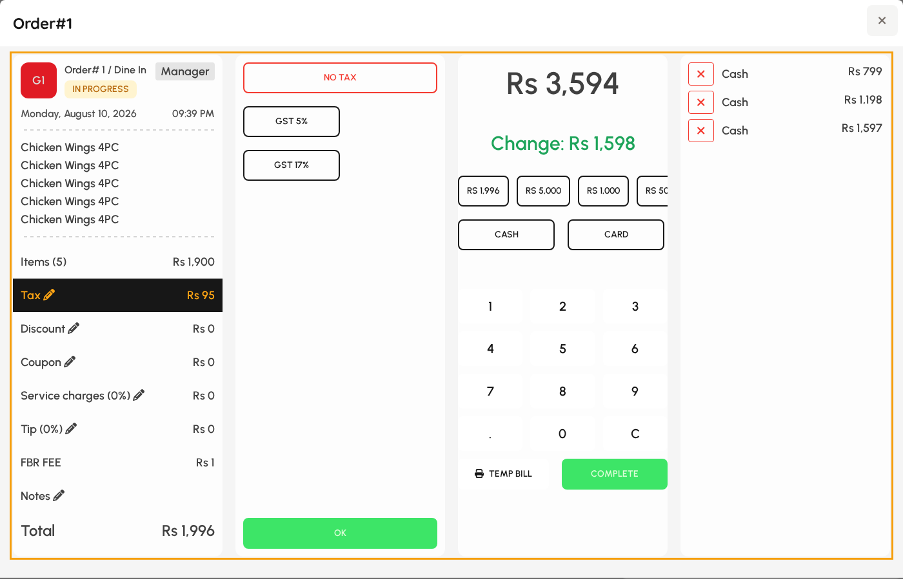

*Full payment screen.*

### Order summary

The left card shows who ordered, when, and which items are on the check.

1. Confirm table, covers, order type, and invoice number in the header.
2. Scroll the item list if the check is long.
3. Tap a totals row (pencil icon) to open its editor in the middle column.

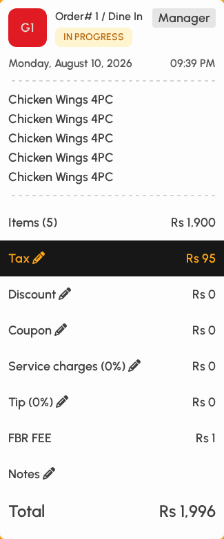

*Order summary column.*

### Totals breakdown

Each line under the items feeds the grand total used for tendering.

1. Items subtotal is shown first, then tax, discount, coupon, service charges, tip, extras (when configured), and notes.
2. Tap Tax, Discount, Coupon, Service charges, Tip, or Notes to open the middle editor.
3. Selecting a draft value alone does not change the bill — you must confirm with OK or Apply where shown.
4. Some rows may ask for a manager PIN if your security settings require it.

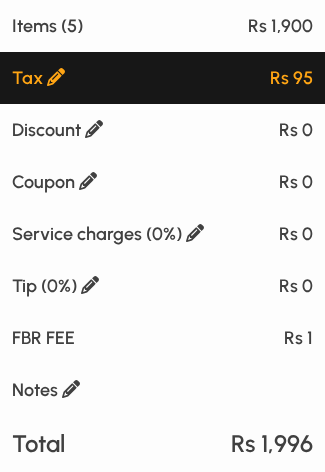

*Totals rows under the order lines.*

> Extras appear only when venue extras apply to this order; they toggle on the row itself (no middle panel).

### Adjust tax

Tax often opens by default. Pick no tax or a rate, then commit with OK — the left amount does not change until OK.

1. Tap the Tax row if the tax panel is not already open.
2. Select No tax or a configured tax rate (name and %). That choice is only a draft.
3. Tap OK at the bottom of the middle panel to apply the tax to the bill.
4. Closing without OK leaves the previous tax in effect.
5. Payment types can still attach their own tax when you tender.

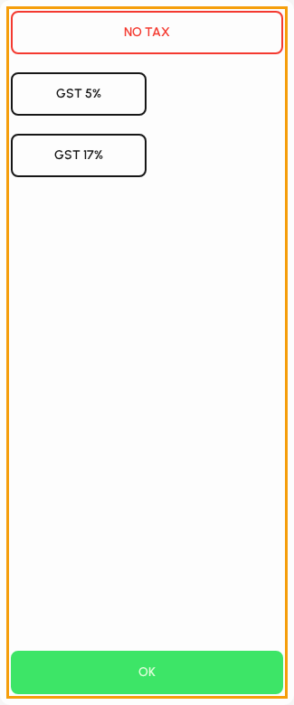

*Tax panel with OK to apply.*

### Apply discounts

Manual discounts use the middle panel: choose a discount, set amount when needed, then Apply.

1. Tap the Discount row (manager PIN may be required).
2. Optionally choose No discount to clear manual discounts.
3. Tap a configured discount. If a range is allowed, use the keypad for percent or fixed amount.
4. If the discount is item-scoped, select which lines it covers; if a reason is required, pick one.
5. Tap Apply so the discount appears on the left total. Draft selection alone does not update the total.

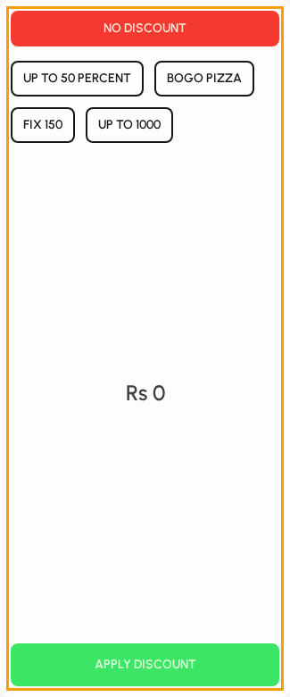

*Discount editor; confirm with Apply.*

### Coupons

Enter a coupon code and confirm with Apply (not OK).

1. Tap the Coupon row (manager PIN may be required).
2. Type the code in the field (on-screen keyboard available).
3. Tap Apply to validate and attach the coupon discount.
4. Use Clear to remove a coupon. Invalid codes show an error and leave the total unchanged.

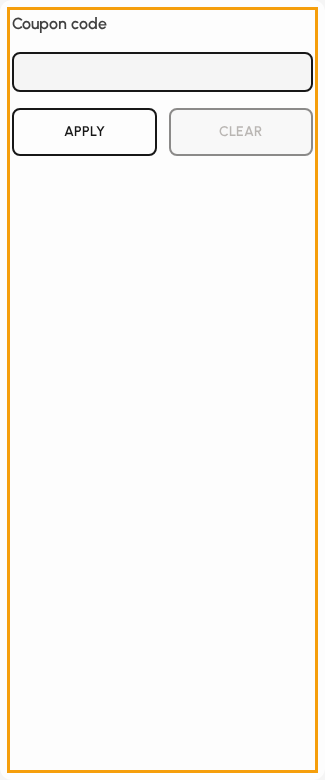

*Coupon code with Apply and Clear.*

### Service charges

Service charge is drafted with percent or fixed options, then applied with OK.

1. Tap the Service charges row (manager PIN may be required).
2. A banner may show the default from Manage settings; draft may start at that value when the order type allows service charges.
3. Choose No service charge, or Percent / Fixed, quick amounts, or the keypad.
4. Tap OK to put the charge on the left total — without OK the previous service charge stays.
5. If the order type does not allow service charges, the venue policy may keep this row at zero.

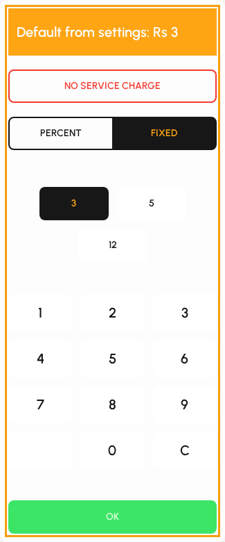

*Service charge panel; confirm with OK.*

### Tips

Tips use the same draft-then-OK pattern as tax and service charges.

1. Tap the Tip row (manager PIN may be required).
2. Choose No tip, or Percent vs Fixed amount.
3. Pick a quick tip (for example 10%, 15%) or type a value on the keypad.
4. Tap OK to apply. Leaving the panel without OK keeps the previous tip.
5. Tip increases the payable total used for tendering.

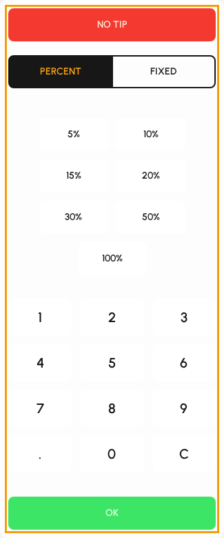

*Tip panel; confirm with OK.*

### Extras

Configured extras (for example delivery fees tied to tables or payment types) show as rows under tip. There is no middle editor.

1. If extras apply to this order, each extra name and amount appears in the totals list.
2. Tap an extra row to toggle it off (struck through / zero) or back on.
3. Manager PIN may be required for extras. Changes take effect when the toggle succeeds — no OK button.
4. If you see no extra rows, none are configured for this table, order type, or payment combination.

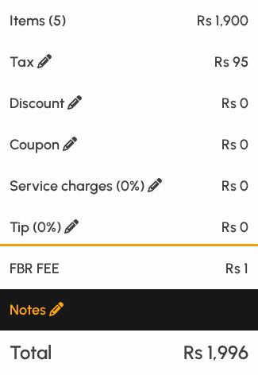

*Extras rows on the totals list (when configured).*

### Order notes

Notes are free text on the payment record. Typing updates the note immediately (no OK).

1. Tap Notes on the totals list.
2. Type in the middle panel (on-screen keyboard available).
3. The note appears on the Notes row and is saved when the order is completed.

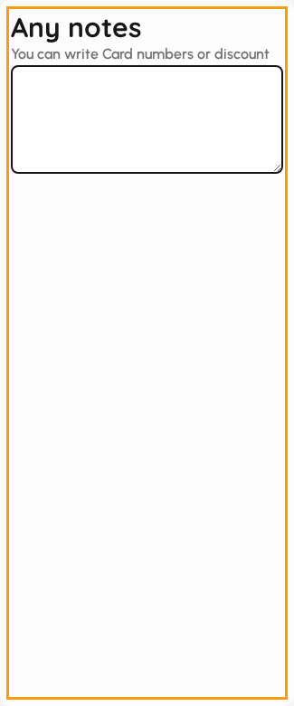

*Notes editor.*

### Receive payment

After totals are correct (including any applied tax, discount, coupon, service charge, tip, and extras), use the tender panel on the right.

1. Large figure at the top is total tendered so far.
2. Below it, remaining (red) or change (green) updates as you add payments.
3. Use quick amounts, the keypad, and payment type buttons to add tenders.

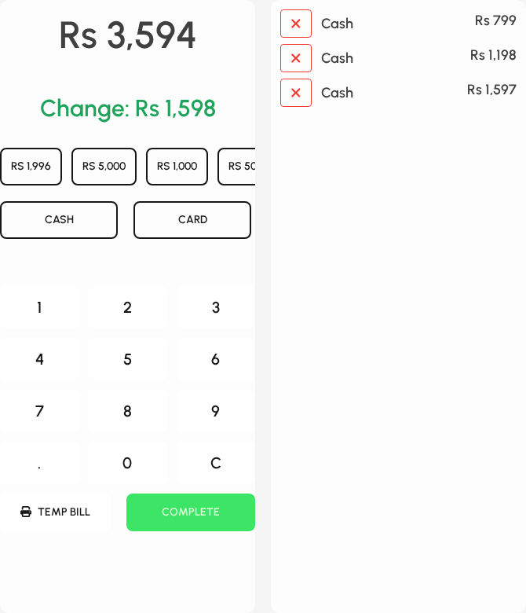

*Tender panel and payment lines.*

### Tendered and remaining

1. Tendered starts at zero until you add a payment line.
2. Remaining must reach zero (or change due ≥ 0) before Complete is enabled.
3. If you change tax, tip, or discounts after tendering, remaining updates — adjust payments as needed.
4. Split payments by adding more than one line with different types or amounts.

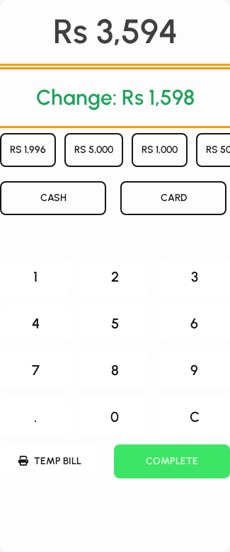

*Tendered amount and change/remaining.*

### Payment types

Payment types come from Manage (or from the table’s allowed list). Cash, card, and remote gateways each behave differently.

1. Tap a type to post the remaining balance, or enter an amount first then tap a type.
2. Quick amount chips (including the exact total) use the first available type.
3. Card usually cannot exceed remaining; overpayment may be blocked or clipped.

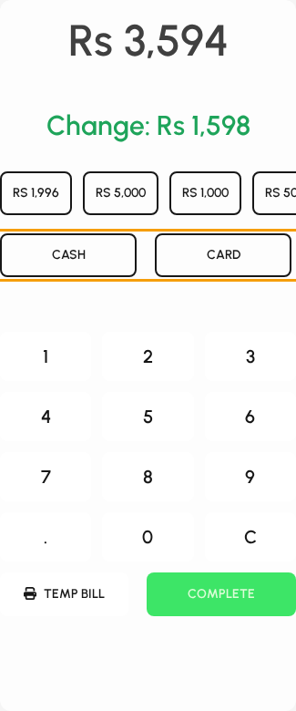

*Payment type buttons.*

> Remote types (Stripe, PayPal, M-Pesa, and similar) open their own flow instead of a simple cash line.

### Amount keypad

1. Type an amount on the keypad, then choose a payment type to post it.
2. Tap C to clear the entry.
3. Exact remaining can also be taken with the currency chip equal to the total.

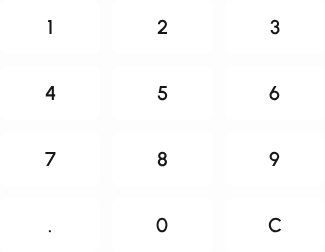

*Numeric keypad.*

### Temp bill and Complete

1. Temp bill prints a provisional check when printing and permissions allow it.
2. Complete finalizes the order as paid and closes the payment screen.
3. Complete stays disabled while remaining is still due or a remote payment is processing.

*Temp bill and Complete.*

> Closing the dialog with Escape or the modal close control leaves the check open if you have not completed payment.

### Payment lines

Each tender appears in the list on the far right of the receiving panel.

1. Review type and amount for every line.
2. Tap a line (×) to remove it if you need to retender.
3. When the balance is covered, Complete becomes available.

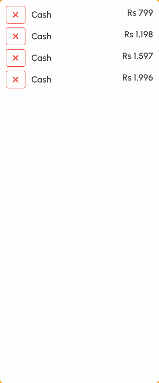

*Tender lines after posting an exact amount.*

### Ready to complete

1. Confirm remaining is zero or change is correct for cash.
2. Tap Complete (manager PIN may be required).
3. The order moves to paid status; do not close early if the printer must fire.

*Complete enabled after balance is covered.*
