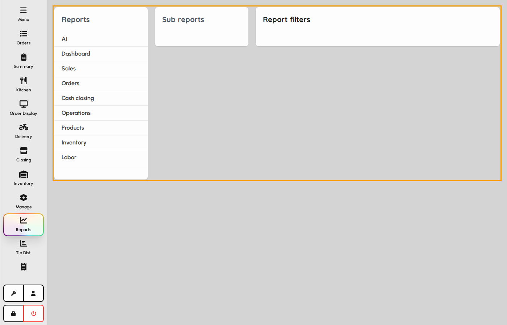
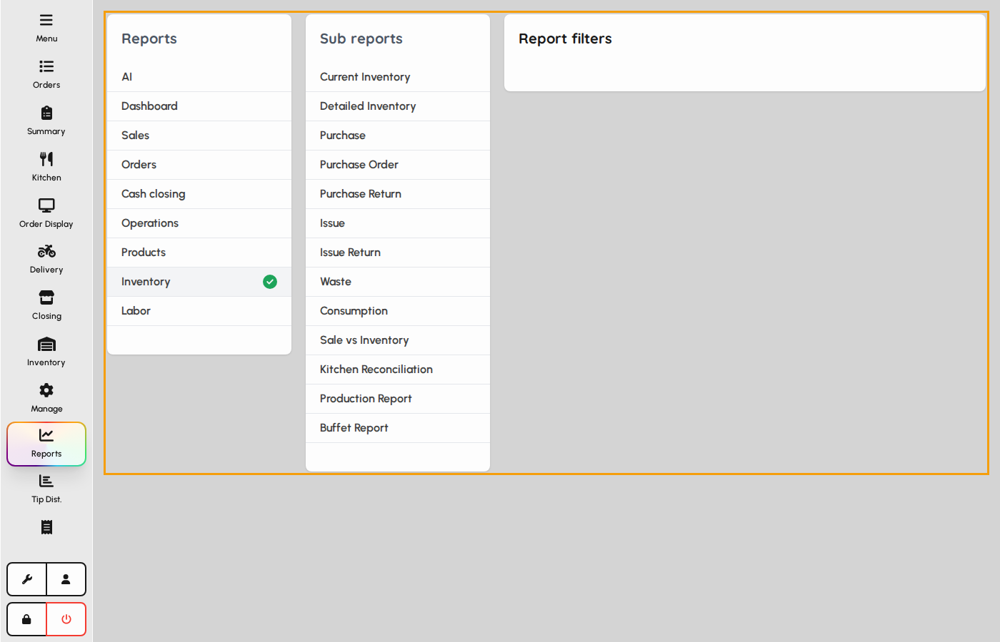
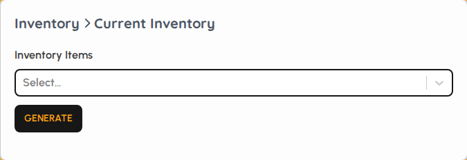
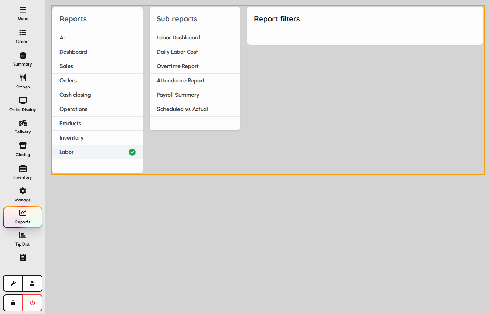
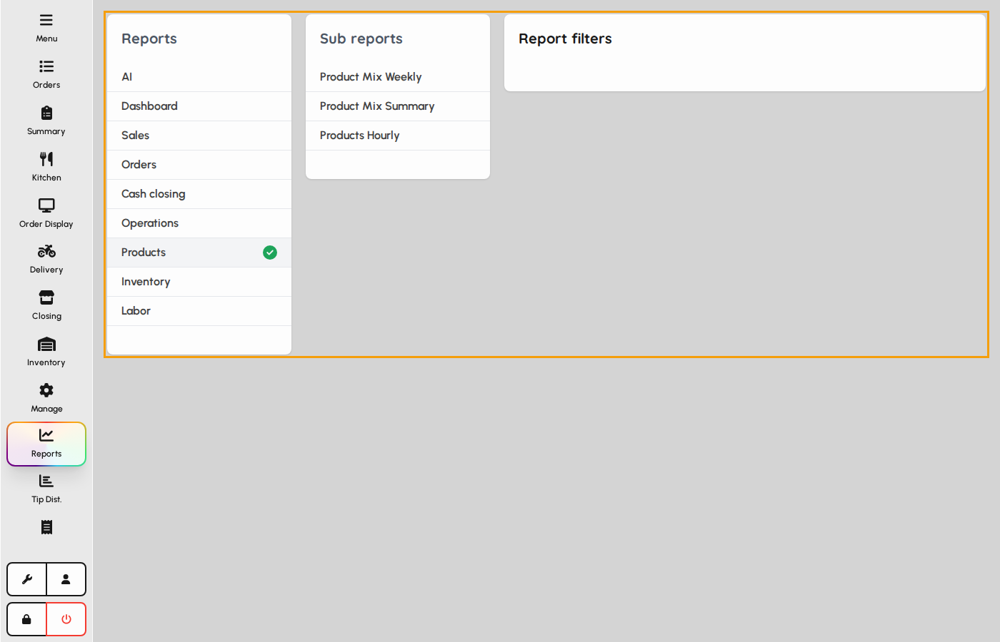
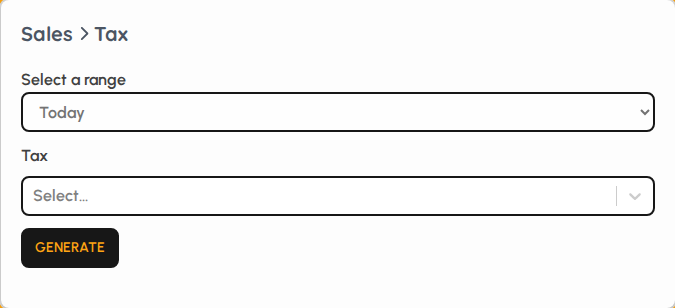

# Reports hub (administrator packs)

Administrators use the same Reports hub as managers, with access to deeper packs: inventory, labor, products, and tax. Open a category, pick a report, set filters, then run or export.

### Administrator reports layout

1. Tap Reports in the sidebar.
2. Categories on the left include Inventory, Labor, Products, Sales, and more.
3. The middle column lists reports in the selected pack; the right panel holds filters.

*Reports hub for administrator packs.*

### Inventory pack

Inventory reports cover stock on hand, purchases, issues, wastes, consumption, production, and buffet.

1. Select the Inventory category.
2. Choose a report such as Current inventory or Purchase.
3. Set location and date filters, then run the report.

*Inventory report pack.*

### Inventory filters

1. After choosing a report, the right panel shows its filters.
2. Adjust dates, locations, or item filters as needed.
3. Run or export when the filter set matches the question you need answered.

*Filter panel for an inventory report.*

### Labor pack

Labor reports summarize cost, overtime, attendance, payroll, and scheduled vs actual hours.

1. Select the Labor category.
2. Open Labor dashboard or Daily labor cost for high-level views.
3. Use Attendance or Payroll summary for people-cost detail.

*Labor report pack.*

### Products pack

1. Select the Products category.
2. Use Product mix summary or weekly mix for item performance.
3. Products hourly shows velocity by hour for staffing and prep planning.

*Products report pack.*

### Tax report filters

Tax sits under Sales. Administrators use it to reconcile collected tax by period.

1. Open Sales, then Tax.
2. Set the date range and any venue filters.
3. Run the report for filing or audit checks.

*Tax report filter panel.*
