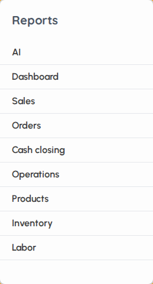
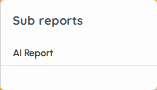

# Reports (operations)

The Reports hub lists operational and sales reports by category. Pick a category, choose a report, set filters, then run or export from the filter panel.

### Reports hub

1. Tap Reports in the sidebar.
2. The left column lists report categories (Sales, Operations, Orders, etc.).
3. The middle column lists reports inside the selected category.
4. The right panel shows filters for the chosen report.

*Reports hub three-column layout.*

### Categories

Categories group related reports: dashboards, sales, orders, cash closing, operations, products, inventory, labor, and AI.

1. Click a category to load its report list.
2. A check mark shows the active category.
3. Opening some reports may require manager PIN approval.

*Report category list.*

### Choose a report

1. After selecting a category, pick a report name in the middle column.
2. The filter panel on the right updates for that report.
3. Common operational reports include Sales dashboard, Activity, Expense, and Cash closing.

*Sub-report list and filter panel.*
