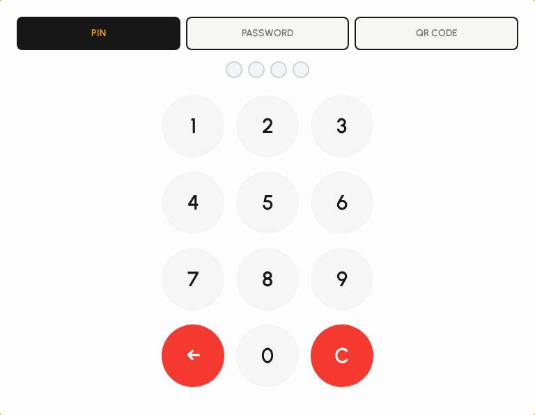
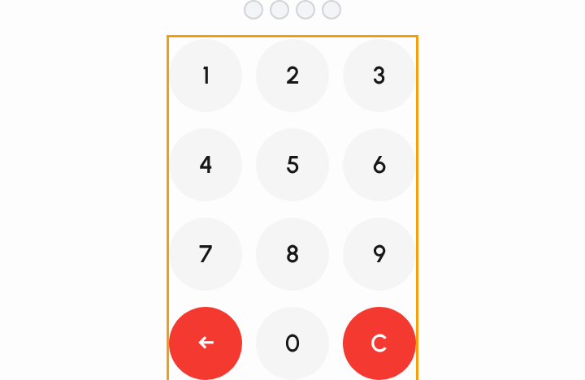

# Security re-authentication

Protected actions (voids, settings saves, restricted tabs, print overrides, and more) can require a manager to re-authenticate with PIN, password, or QR — even if you are already signed in.

### When re-auth appears

1. You attempt an action your role does not auto-allow, or the action always requires approval.
2. A modal opens with a short description of what is being approved.
3. Session security settings (idle lock) are separate — that locks the terminal; this modal approves one action.

*Session security settings (related but separate from action re-auth).*

### Approval modal

1. Read the action description in the modal title.
2. Choose PIN, password, or QR when multiple methods are available.
3. Complete authentication to continue, or cancel to abort the action.

*Manager approval (security) modal.*

### Auth method buttons

Venues can allow more than one manager auth method.

1. Tap PIN for the numeric pad.
2. Tap Password for username/password style entry when enabled.
3. Tap QR when a scanned manager badge is supported.

*PIN / password / QR method selector.*

### PIN entry

1. Enter the approving manager's 4-digit PIN on the pad.
2. Dots fill as digits are entered; validation runs when four digits are complete.
3. Invalid PIN shows an error — clear and try again, or cancel.

*Security PIN pad.*
