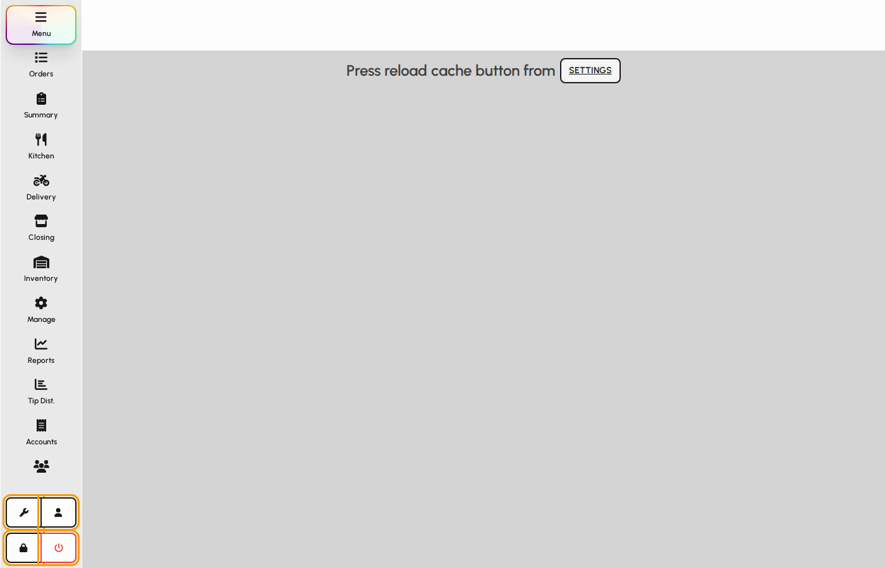
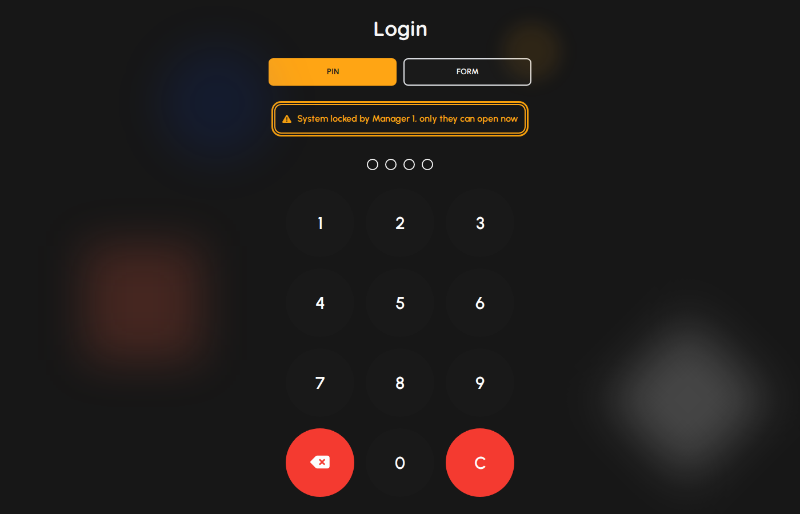
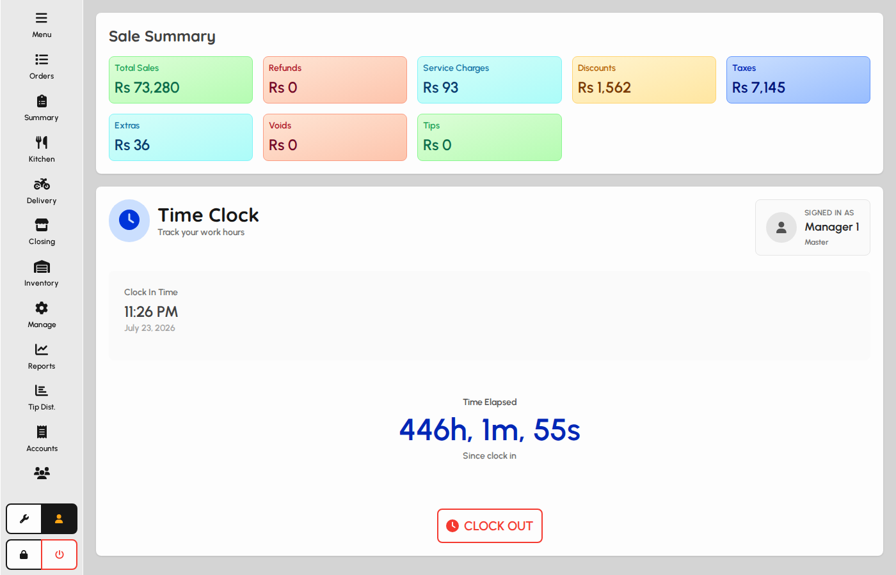
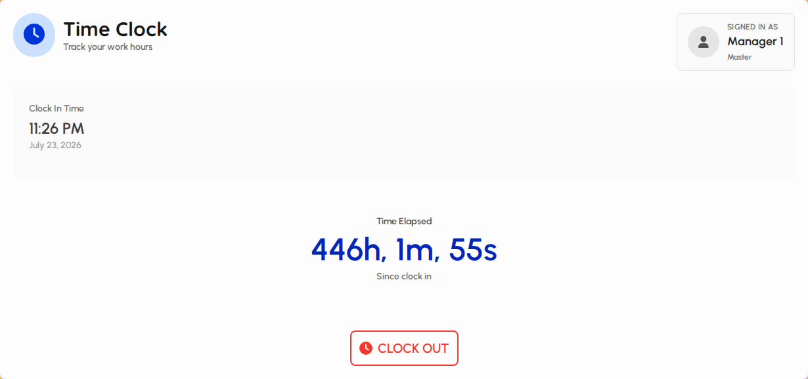
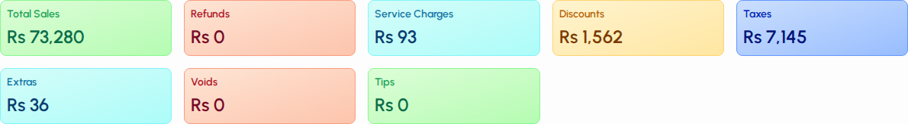

# Session lock, logout, and clock

Use the sidebar bottom controls to lock the terminal, log out, open your clock/session screen, or open Settings. Idle lock/logout can also run from session security settings.

### Sidebar session controls

1. Wrench opens Settings.
2. User icon opens Clock (session and sale summary).
3. Lock keeps your user but returns to the login screen.
4. Power logout ends the session and returns to open login.

*Settings, clock, lock, and logout on the sidebar.*

### Lock terminal

Lock is for short breaks so only the same user can unlock.

1. Tap Lock on the sidebar.
2. The login screen returns with a locked banner naming who locked it.
3. Enter the same user’s PIN or password to unlock.

*System locked banner on login.*

### Clock screen

Clock shows your active time entry, shift, elapsed time, and sale metrics for this session.

1. Open Clock from the user icon on the sidebar.
2. You need an open clock-in (some venues require clock-in after login).
3. Review sale summary widgets and clock-in time before clock-out.

*Clock screen overview.*

### User, shift, and clock-out

1. Confirm signed-in user and optional shift hours.
2. Watch live elapsed time since clock-in.
3. Tap Clock Out only when your shift work is finished — this signs you out of the POS.

*Session panel with Clock Out.*

### Session sale summary

1. Metrics cover sales, refunds, service charges, discounts, taxes, extras, voids, and tips for the current clock-in session.
2. Use this before clock-out for a quick performance check.

*Sale summary metrics.*

### Idle lock or logout (settings)

On Settings, Session security can automatically lock or log out after idle minutes.

1. Open Settings → Session security.
2. Enable the idle timer, set minutes, and choose Lock or Logout.
3. Save. When idle limit is hit, the POS locks or logs out and shows a toast.

*Session security card.*
