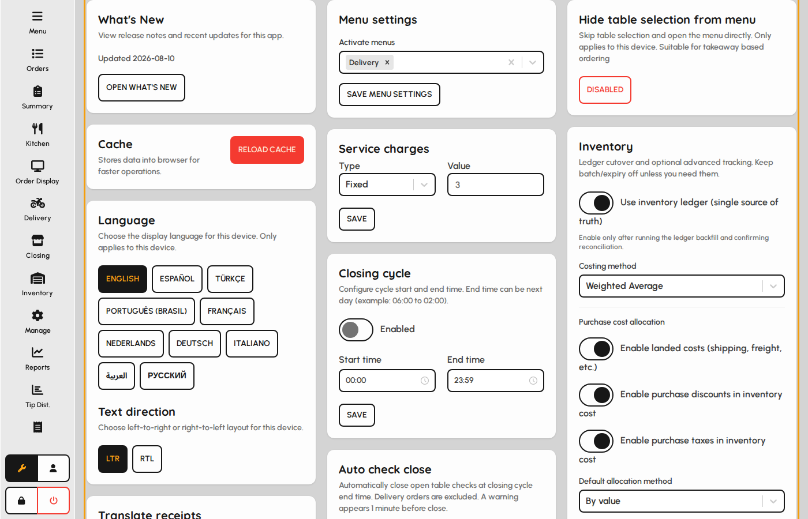
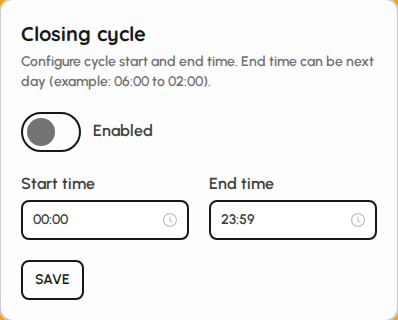
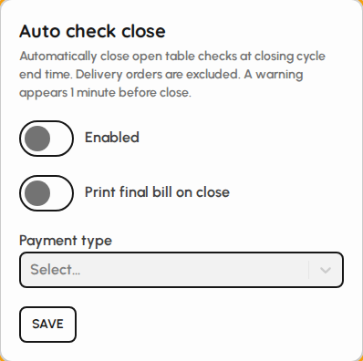
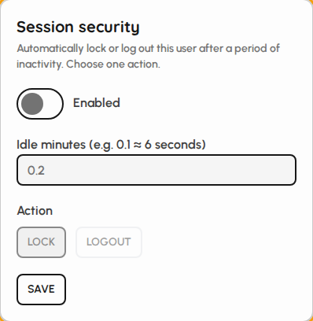
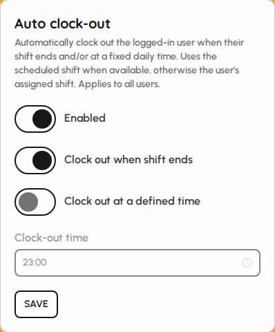
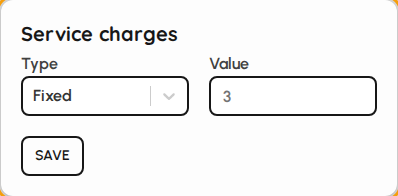
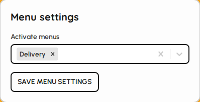
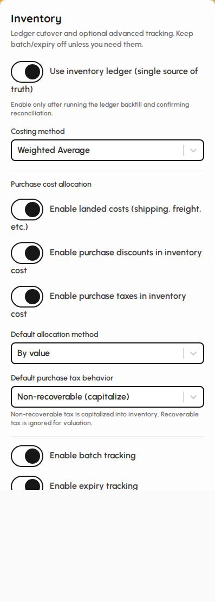
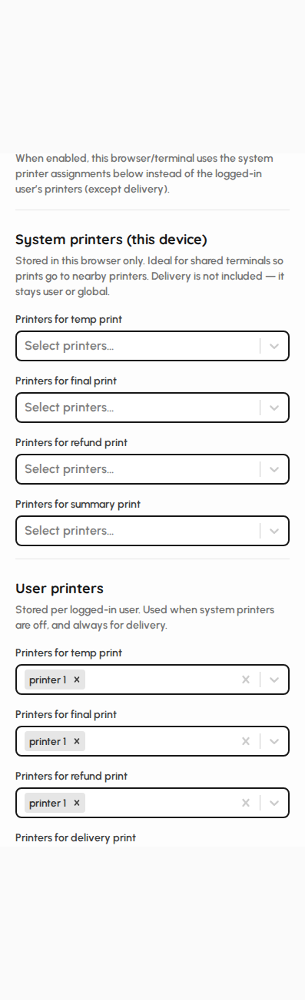

# Advanced device settings

Administrators use Settings for venue-wide operational controls: closing cycle, auto check close, session security, auto clock-out, service charges, active menus, inventory preferences, and printers. Open Settings with the wrench on the sidebar.

### Settings for administrators

1. Sign in with a user that can change venue settings.
2. Open Settings from the wrench control.
3. Focus on cards that affect the whole venue, not only this browser's language or touch preference.

*Settings page — advanced / venue cards.*

### Closing cycle

Defines the business-day window used for closing and day-range operations.

1. Enable a custom cycle when the venue runs overnight.
2. Set start and end times for the business day.
3. Save (manager approval may be required).

*Closing cycle card.*

### Auto check close

1. Enable automatic settlement of open checks at cycle end.
2. Choose whether to print and which payment type to use.
3. Save when finished.

*Auto check close card.*

### Session security

1. Enable idle lock or logout for unattended terminals.
2. Set idle minutes and the action (lock vs logout).
3. Save (manager approval may be required).

*Session security card.*

### Auto clock-out

1. Enable automatic clock-out for labor accuracy.
2. Choose triggers: shift end, defined time, or both.
3. Save when finished.

*Auto clock-out card.*

### Service charges

1. Set default service charge type (percent or fixed) and value.
2. These defaults apply when service charge is used on payment.
3. Save (manager approval may be required).

*Service charges card.*

### Active menus

1. Select which menus this terminal can sell from.
2. Save so floor staff see the correct categories and dishes.
3. Combine with Manage → Menus for full menu maintenance.

*Menus card.*

### Inventory settings

1. Configure inventory-related device preferences used by stock flows.
2. Save when finished.
3. Deep inventory documents live under the Inventory sidebar.

*Inventory settings card.*

### Printers

1. Assign receipt, kitchen, and other printers for this device.
2. Save so tickets and receipts print to the correct hardware.
3. Print options on neighboring cards control what is printed.

*Printers card.*
