# Settings

Device and venue operational preferences live on Settings. Open Settings with the wrench button at the bottom of the left sidebar after you sign in. Some cards apply only to this browser; others are global and may require manager PIN approval when saving.

### Open Settings

1. Sign in with a user who can access Settings.
2. On the left sidebar, tap the wrench button.
3. The Settings page shows configuration cards in a multi-column layout.

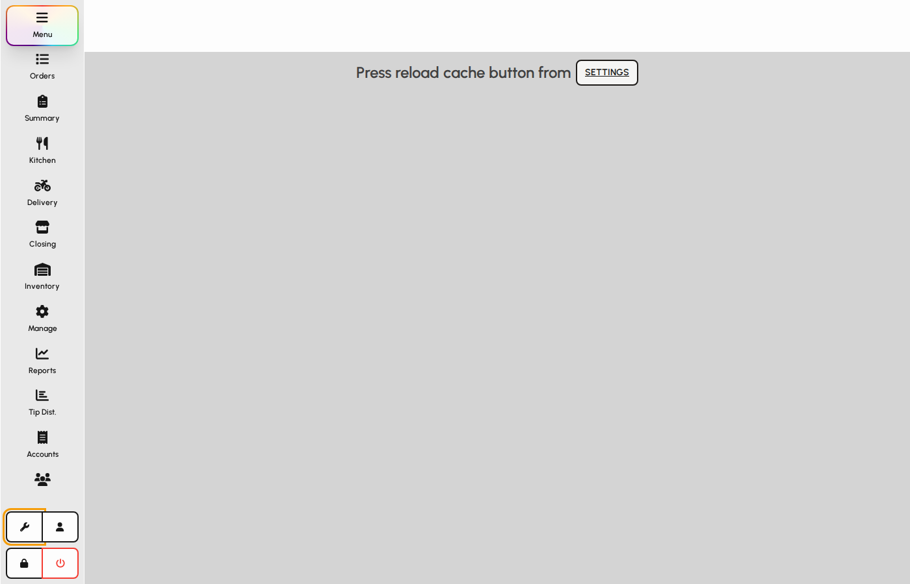

*Wrench control that opens Settings (highlighted).*

### Settings overview

Each card controls one area. Cards may be empty or restricted based on your role permissions.

1. Scroll through the page to find the card you need.
2. Change values on a card, then save when the card provides a Save action.
3. Some cards apply only to this browser or device; others apply globally or to your user profile.

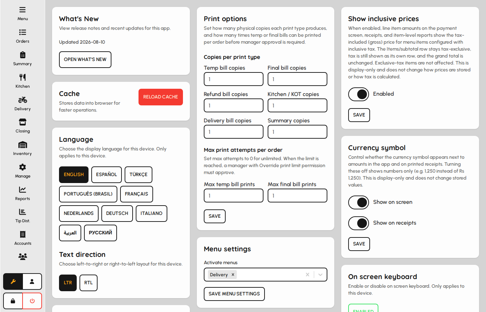

*Settings page with configuration cards.*

### What's new

1. Open the What's new card to see the latest release date in the app.
2. Tap Open to show the full product update notes again (useful after dismissing them at login).

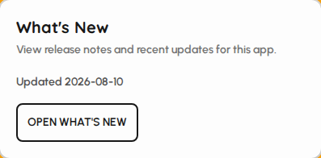

*What's new card — re-open release notes.*

### Cache

1. Open the Cache card if menus or related data look stale.
2. Tap Reload cache to refresh cached catalog data from the database.

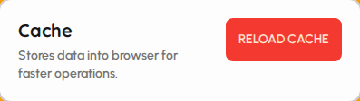

*Cache reload card.*

### Language and text direction

1. Open the Language card.
2. Select the display language for this device.
3. Choose LTR or RTL text direction when needed (for example Arabic).
4. The change applies immediately for this terminal.

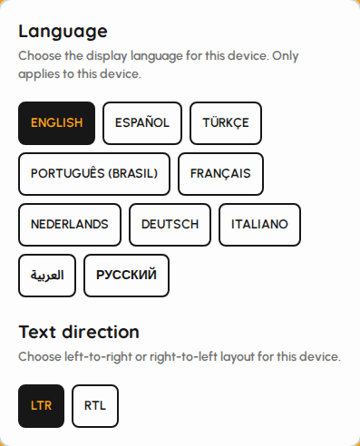

*Language and direction card.*

### Translate receipts

When enabled, printed receipt text follows the terminal language settings where supported.

1. Open the Translate receipts card.
2. Toggle Enabled on or off.
3. Save (manager approval may be required).

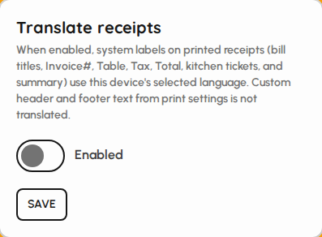

*Translate receipts card.*

### Default printers

1. Open the Default printers card.
2. Optionally enable system printers for this browser/terminal.
3. Assign printers for temp, final, refund, delivery, and summary prints.
4. Save printer settings when finished.

*Default printers configuration card.*

### Print options

1. Open the Print options card.
2. Set how many physical copies each print type should produce.
3. Set max temp/final print attempts per order (0 means unlimited).
4. Save print options when finished.

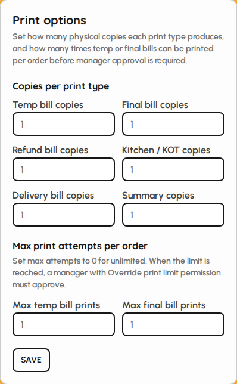

*Print copies and max attempts card.*

### Active menus

Choose which menus this venue/device can sell from. Only selected menus appear while taking orders.

1. Open the Menus card.
2. Select one or more active menus from the multi-select list.
3. Save (manager approval may be required).

*Menus available for ordering.*

### Service charges

Default service charge applied in payment when service is used (percent or fixed).

1. Open the Service charges card.
2. Choose type (Percent or Fixed) and enter the value.
3. Save (manager approval may be required).

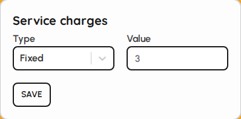

*Service charge default type and value.*

### Closing cycle

Defines the business day window used for closing and day-range operations (for example overnight venues that run past midnight).

1. Open the Closing cycle card.
2. Enable or disable the custom cycle.
3. Set start time and end time of the business day.
4. Save (manager approval may be required).

*Closing cycle time window.*

### Auto check close

Automatically settle open checks at the end of a cycle using a default payment type.

1. Open the Auto check close card.
2. Enable the feature and choose whether to print on close.
3. Select the payment type used when auto-closing.
4. Save (manager approval may be required).

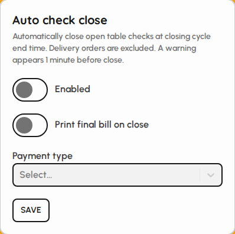

*Auto check close options.*

### Session security

1. Open the Session security card.
2. Enable idle protection if the terminal should lock or log out after inactivity.
3. Set idle minutes and whether the action is lock or logout.
4. Save the settings (manager approval may be required).

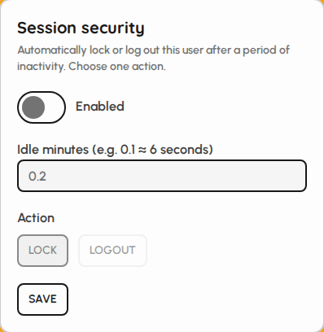

*Session security (idle lock/logout) card.*

### Auto clock-out

Automatically clocks out staff when the shift ends and/or at a defined clock time.

1. Open the Auto clock-out card.
2. Enable automatic clock-out.
3. Choose triggers: on shift end, at a defined time, or both.
4. If using a defined time, set the time of day.
5. Save (manager approval may be required).

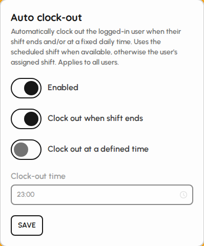

*Auto clock-out triggers.*

### Show inclusive prices

When enabled, menu and order UI can display tax-inclusive prices according to venue tax configuration.

1. Open the Show inclusive prices card.
2. Toggle Enabled on or off.
3. Save (manager approval may be required).

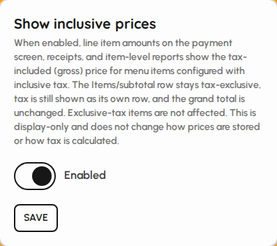

*Inclusive price display toggle.*

### Currency symbol

Control whether the currency symbol is shown on screen and on printed receipts.

1. Open the Currency symbol card.
2. Toggle show in UI and/or show on receipts.
3. Save (manager approval may be required).

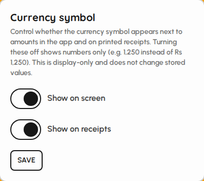

*Currency symbol on UI and receipts.*

### On-screen keyboard

1. Open the On screen keyboard card.
2. Toggle enabled/disabled for the virtual keyboard on this device.

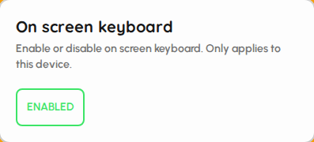

*On-screen keyboard toggle card.*

### Table selection

When table selection is enabled, staff pick a floor table before ordering (dine-in). When disabled, the floor step is hidden on this terminal (useful for quick service).

1. Open the Table selection card.
2. Tap the button to enable or disable table selection for this device.
3. The change applies immediately on this browser.

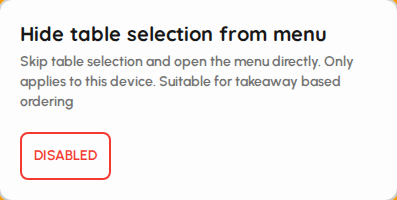

*Table selection hide/show for this terminal.*

> Documentation capture requires table selection enabled (visible floors and tables).

### Inventory settings

Global inventory behavior: ledger, batch/expiry, costing method, purchase discounts/taxes, and allocation defaults. Mostly used when inventory modules are active.

1. Open the Inventory settings card.
2. Toggle ledger, batch tracking, expiry, manufacturing dates, and purchase options as needed.
3. Choose costing method and default allocation / tax behavior.
4. Save (manager approval may be required).

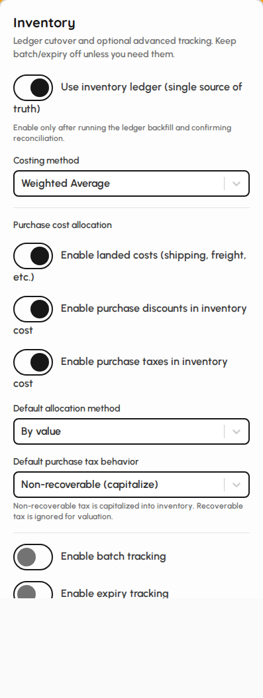

*Inventory configuration card.*

### Items visibility

Per-terminal display options for menu search, cart totals, and order cards. Changes apply immediately on this device.

1. Open the Items visibility card.
2. Under Menu: enable dish search, search type (number vs both), and show dish numbers.
3. Under Cart: show or hide totals in the cart.
4. Under Orders: show or hide totals and other order-card fields as listed.

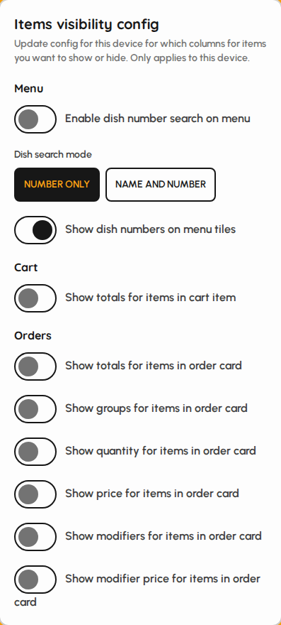

*Menu, cart, and orders visibility toggles.*
