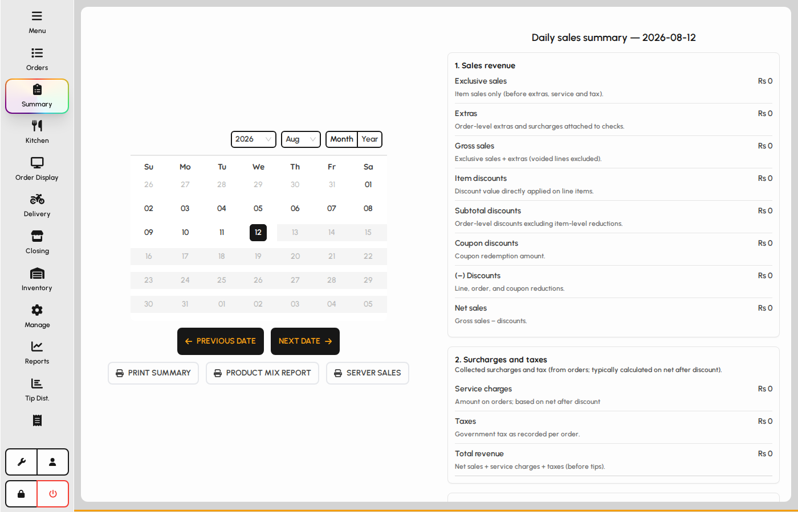
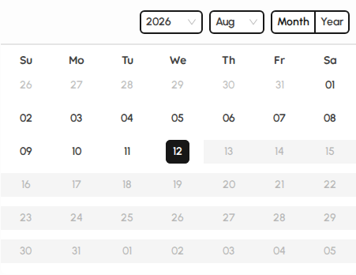
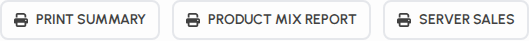
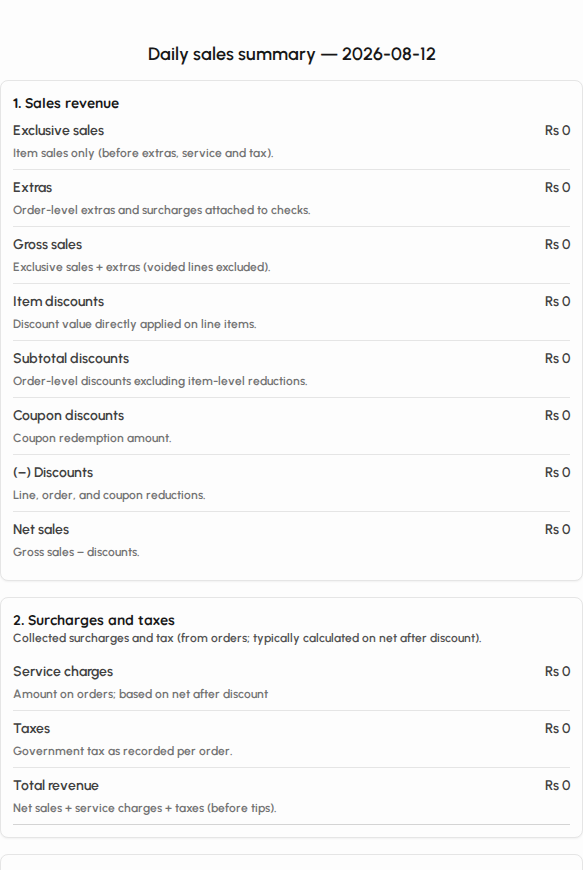

# Summary

The Summary screen shows paid sales for a chosen business day: totals, payment mix, and quick print actions for shift leaders.

### Open Summary

1. Tap Summary in the left sidebar (manager access).
2. The page shows a date calendar on the left and the daily sales report on the right.
3. Paid orders for the selected date drive all figures.

*Summary screen with calendar and daily report.*

### Pick a business date

1. Use the calendar to select the day you want to review.
2. Previous date and Next date jump one day backward or forward.
3. You cannot select future dates.

*Date calendar and day navigation.*

### Print actions

Print buttons may require manager PIN approval depending on your role.

1. Print summary sends the full daily sales summary to the configured printer.
2. Product mix report lists items sold with quantity and share of sales.
3. Server sales breaks down checks, guests, time on floor, and sales per server.

*Print summary, product mix, and server sales.*

### Daily sales report

The scrollable report panel shows net sales, taxes, discounts, payment types, and other day totals.

1. Scroll the right panel to review all sections.
2. Figures update when you change the selected date.
3. If the day has no paid orders yet, sections may show zeros or empty lists.

*Daily sales summary report panel.*
