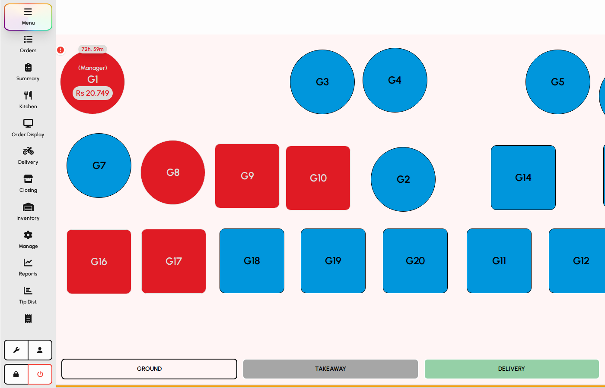
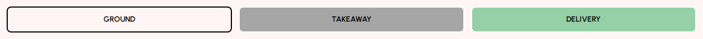
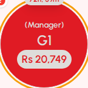
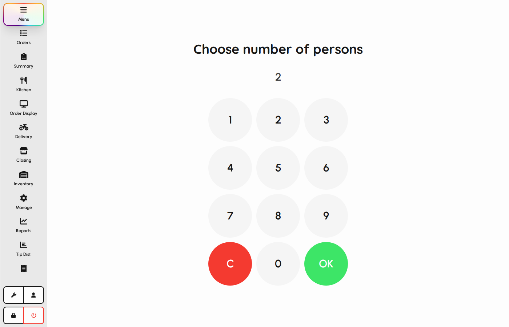

# Tables and dine-in

Dine-in service starts on the floor plan: pick a floor, select a table, optionally enter covers, then take the order. This chapter walks through that flow in detail.

### Floor plan

1. Open Menu from the sidebar (floor mode must be enabled in Settings → Table selection).
2. The floor plan shows tables for the active floor.
3. Occupied or locked tables may look different from free tables.

*Floor plan with table tiles.*

### Switch floors

Venues with multiple dining areas use floor buttons at the bottom of the plan.

1. Tap a floor button to show that area's tables.
2. The active floor uses the primary highlight.
3. Each floor can have its own background and table layout.

*Floor switcher buttons.*

### Select a table

1. Tap a free table tile to start or resume service at that table.
2. If the table is locked by another user, you may need manager approval or wait.
3. Selecting a table moves you toward covers and the ordering screen.

*A table tile on the floor plan.*

### Covers (guests)

When covers are required, enter how many guests are seated before ordering.

1. Use the number pad to set the guest count.
2. Tap OK to continue to the menu.
3. Covers can appear later on checks and kitchen tickets.

*Covers / persons screen.*

### Active table on the menu

1. After selection, the menu header shows the active table.
2. Use the table or covers controls in the header to review or change when allowed.
3. Orders and kitchen tickets stay linked to this table until the check is closed.

> _Screenshot pending: `tables-active-table.png` (run `DOCS_GUIDE_LANG=en npm run docs:guide:capture`)_

### Return to the floor

1. Tap the floor name / back control in the menu header to leave the table view.
2. You return to the floor plan to pick another table or switch floors.
3. Open checks remain available from Orders if you left an unfinished table.

> _Screenshot pending: `tables-back-floor.png` (run `DOCS_GUIDE_LANG=en npm run docs:guide:capture`)_
