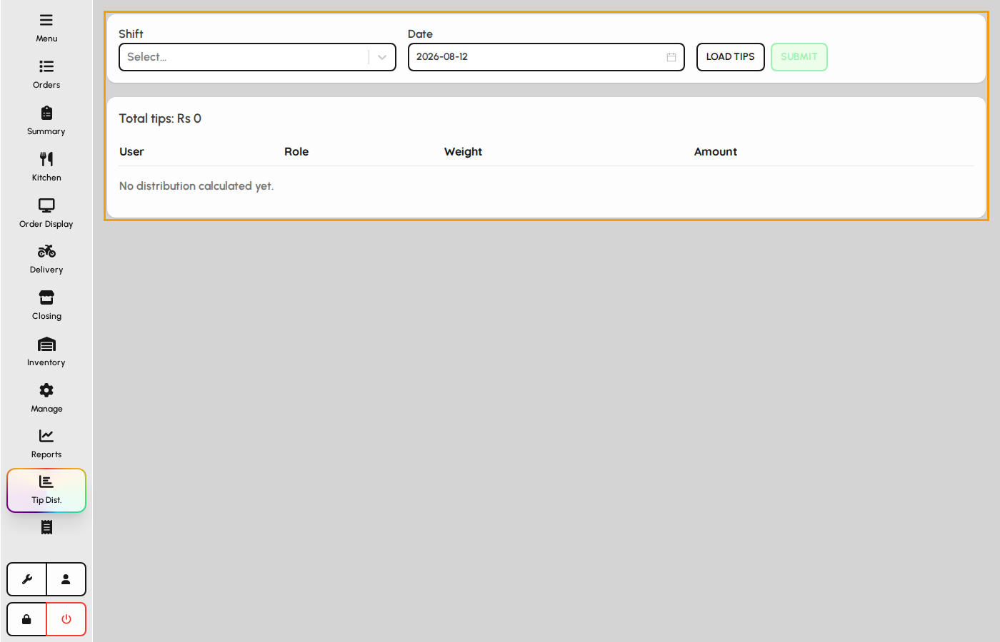
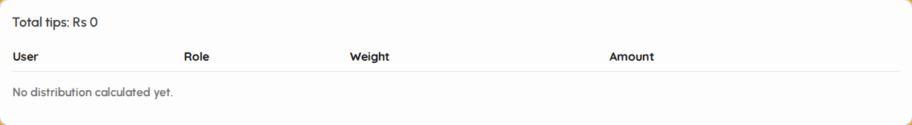

# Tip oversight

Tip distribution calculates how pooled tips for a shift should be split across staff using configured weights, then saves an official distribution record.

### Tip distribution screen

1. Tap Tip distribution in the sidebar.
2. Select a shift and business date at the top.
3. Load tips calculates totals from paid orders in that shift window.

*Tip distribution screen.*

### Shift and date

1. Choose the shift (morning, evening, etc.) from the dropdown.
2. Pick the date — cannot be in the future.
3. Tap Load tips to fetch tip totals and build the distribution table.

*Shift, date, and load controls.*

### Distribution table

1. Total tips shows the pooled amount for the shift window.
2. Each row lists a user, role, weight, and calculated share.
3. Submit saves the distribution after you review amounts (weights come from global tip settings).

*Tip totals and per-user distribution table.*
